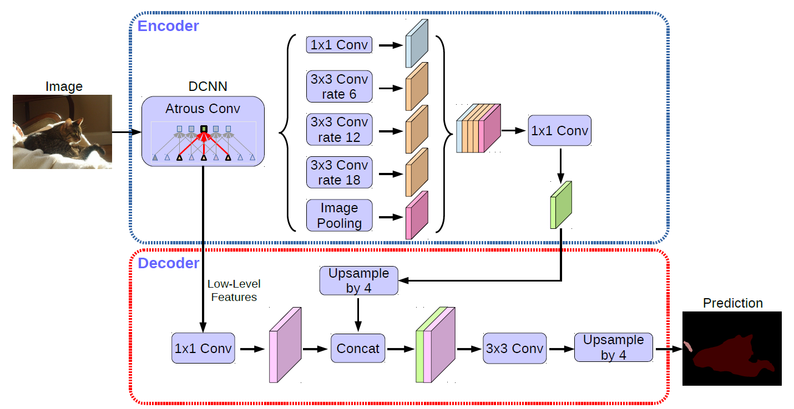

https://github.com/srihari-humbarwadi/DeepLabV3_Plus-Tensorflow2.0

# DCNN(backbone) Resnet52

# ASPP

# loss

真实标签(height, width, 1), 类别为稀疏id
预测输出(height, width, num_classes)， logit输出

使用SparseCategoricalCrossentropy