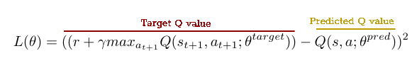
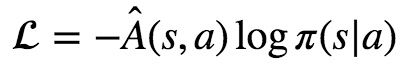

- [Reinforcement learning 强化学习](#reinforcement-learning-强化学习)
- [environment](#environment)
  - [CartPole](#cartpole)
  - [CartPole in colab](#cartpole-in-colab)
  - [CartPole](#cartpole-1)
- [policy](#policy)
  - [on-policy and off-policy](#on-policy-and-off-policy)
- [rewards](#rewards)
- [policy gradient, value-based, actor-critic](#policy-gradient-value-based-actor-critic)
- [强化学习分类](#强化学习分类)
  - [model-based vs model-free](#model-based-vs-model-free)
  - [value-based vs policy-based vs AC](#value-based-vs-policy-based-vs-ac)
  - [DP vs TD vs MC](#dp-vs-td-vs-mc)
  - [on-policy vs off-policy](#on-policy-vs-off-policy)
  - [Q-Learning](#q-learning)
  - [Deep Q-Learning](#deep-q-learning)
  - [策略梯度policy gradient](#策略梯度policy-gradient)
- [actor-critic](#actor-critic)
  - [Advantage Actor-Critic (A2C)](#advantage-actor-critic-a2c)
  - [Asynchronous Advantage Actor-Critic (A3C)](#asynchronous-advantage-actor-critic-a3c)
  - [Resource](#resource)
- [Monte Carlo](#monte-carlo)

# Reinforcement learning 强化学习

- environment
- agent
- state： 系统的状态
- observation：agent可见的状态
- action
- reward
- policy: a function that maps states to actions
- episode
- trajectory: 一个episode中s,a,r构成的序列
- returns: discounted sum of future rewards

# environment

## CartPole

- value-based DQN (预测未来收益的期望)
https://levelup.gitconnected.com/dqn-from-scratch-with-tensorflow-2-eb0541151049


DQN 损失函数


样本： 在状态s时执行动作a， 得到奖赏r, 下一个状态为$s_{t+1}$
网络： 
  - q_net 网络， 输入状态s， 输出所有动作下对应的Q值， 选择动作a对应的Q(s, a)作为预测值
  - target_q_net网络，输入下一个状态$s_{t+1}$, 输出所有动作下对应的Q值， 选择最大的Q值
  - 使用r + $max_{a_{t+1}} Q(s_{t+1}, a_{t+1})$作为状态s， 执行动作a的真实Q值

损失：最小化target Q value 和 predict Q value

DQN loss
https://medium.com/intro-to-artificial-intelligence/deep-q-network-dqn-applying-neural-network-as-a-functional-approximation-in-q-learning-6ffe3b0a9062


- policy-based 
https://towardsdatascience.com/reinforce-policy-gradient-with-tensorflow2-x-be1dea695f24


CartPole https://github.com/openai/gym/wiki/CartPole-v0
```python
import gym
env = gym.make('CartPole-v0')

# 获取初始状态
init_state = env.reset()
```


## CartPole in colab 
```
!apt-get install -y xvfb python-opengl
!pip install pyglet
!pip install pyvirtualdisplay
```

colab 动态刷新显示
```python
import pyvirtualdisplay
# Set up a virtual display for rendering OpenAI gym environments.
display = pyvirtualdisplay.Display(visible=0, size=(1400, 900)).start()

import gym
import numpy as np
import matplotlib.pyplot as plt
from IPython import display as ipythondisplay

env = gym.make("CartPole-v0")
env.reset()
prev_screen = env.render(mode='rgb_array')
plt.imshow(prev_screen)

def show_image(img):
  plt.imshow(img)
  ipythondisplay.clear_output(wait=True)
  ipythondisplay.display(plt.gcf())

for i in range(50):
  action = env.action_space.sample()
  obs, reward, done, info = env.step(action)
  screen = env.render(mode='rgb_array')

  show_image(screen)

  if done:
    break

ipythondisplay.clear_output(wait=True)
env.close()
```

tf-agents 环境
```python
import PIL.Image
from tf_agents.environments import suite_gym
from tf_agents.environments import tf_py_environment

# 加载环境
env = suite_gym.load(env_name)

# 可视化环境
PIL.Image.fromarray(env.render())

# 环境规格信息，action_spec()可以获得可执行的动作
env.action_spec()
env.time_step_spec()
```
例如，如下的BoundedArraySpec，表示可执行动作的取值为0或1， 调用env.step(action)时，有效参数为0或1
```
BoundedArraySpec(shape=(), dtype=dtype('int64'), name=None, minimum=0, maximum=1)
```

## CartPole


# policy
policy: map an observation from the environment to an action or a distribution over actions

$\pi(a_t|s_t)$ 在t时刻，系统状态为$s_t$，选择执行动作$a_t$的函数

## on-policy and off-policy
on-policy 收集数据的同时更新模型， off-policy 收集数据后， 离线批量数据更新模型， 一般policy-base的方法是on-policy方式更新模型


# rewards
maximize the sum of rewards $\sum^{T}_{t=0} \gamma^{t}r_{t}$, 

$\gamma$ - discount factor, [0,1]

# policy gradient, value-based, actor-critic


# 强化学习分类
## model-based vs model-free

是否需要环境信息， 即转移概率p(s|a),   model-based方法能基于转移概率计算得到所有可能情况，对奖赏进行精确计算， 


## value-based vs policy-based vs AC
value-based - 输入为状态， 输出为动作的值估计，评估在状态（state)下采取动作（action)获得的收益(reward)，
学习的是值函数 
缺点：
1. 一般只能处理离散动作，无法处理连续动作
2. Q值的更新收敛速度慢

policy gradient - 输入为状态， 输出为动作的概率， 通过调整策略的参数，优化策略， 通过monte-carlo方法估计策略的梯度来优化策略, 策略的梯度使用采样估计方差大

AC - 即学习值函数也学习策略


https://github.com/abhisheksuran/Reinforcement_Learning

https://towardsdatascience.com/reinforce-policy-gradient-with-tensorflow2-x-be1dea695f24


## DP vs TD vs MC
DP：动态规划使用转移概率进行精确建模
TD: 使用连续两个时刻预测值的差值来更新模型
MC：使用完整的交互信息


## on-policy vs off-policy

off-policy一般有两个策略：行为策略和目标策略，当要评估目标策略的值函数时，需要使用到历史交互样本，但是这些样本都是用行为策略得到的，所以得到的结果必然存在偏差。一般要使用重要性采样


（按照损失函数划分）
- `Temporal-Difference` : 例如`Q-learning`, 减少预测的Q值和真实Q值的误差， Q值是关于state和action的函数，表示在系统状态s下采取动作a能够获得的期望收益， 
- `Policy Gradients` ： 
- `actor-critic`: value-based 和 Policy Gradients 方法的混合， actor为policy， critic为Q值


## Q-Learning
Q-function (state-action value function)

optimal Q-function $Q^{*}(s, a)$: maximum return that can be obtained starting from observation $s$

Bellman optimality equation

$Q^{*}(s, a) = E [ r + \gamma max_{a'}Q^*(s', a')]$

```
s - current state
a - current action
r - immediate reward
s' - next state after a
a' - next action after a
E - expectation 
```

当前收益，和下一步所处状态可能收益的期望


## Deep Q-Learning

optimal Q-function $Q^{*}(s, a; \theta)$ 用神经网络模拟Q值函数

$L(\theta) = E_{s,a,r,s' ~p(.)}[(y_i - Q(s,a;\theta_i))^2]$ 

$y_i = r + \gamma max_{a'}Q(s', a';\theta_{i-1})$

$y_i$ - TD (temporal difference) target

p(.) -  behaviour distribution

## 策略梯度policy gradient

轮次奖励 - 一个轮次中依次动作产生的奖励的总和

在一轮的学习中使用同一个策略直到该轮结束

每个策略会求多个轮次奖励的平均值



> Intuitively, this loss function allows us to increase the weight for actions that yielded a positive reward, and decrease them for actions that yielded a negative reward.

https://towardsdatascience.com/an-intuitive-explanation-of-policy-gradient-part-1-reinforce-aa4392cbfd3c

loss函数理解，
-  当奖赏是正的时， 为了最小化loss， 会增加产生该奖赏行为的概率， 当奖赏是负数时， 会降低产生该奖赏行为的概率
- 为什么需要log， 没有log时参数更新为： $\theta_{t+1} = \theta_t + \gamma * \nabla \pi(s|a)$ ，  对策略的损失进行归一化， 防止高概率的action， 损失学习过强


# actor-critic

## Advantage Actor-Critic (A2C)
## Asynchronous Advantage Actor-Critic (A3C)

gradients are weighted with `returns`: a discounted sum of future rewards

advantage function 优势函数

advantages = returns - values()

entropy maximization

class Model
输入为observation， 输出为action


episode 样本收集
episode需要包括，
- observations[step]： 第step步时的系统状态
- actions[step]，values[step] : 模型第step步采取的动作, 模型对回报收益的预测
- rewards[step], dones[step]: 执行动作后的奖赏，是否结束标识

使用`_returns_advantages`函数计算一次episode在每个step时的回报`returns[step]`，
第step步的return回报 = 第step步的reward奖赏 + gamma * 第step+1步的回报
```python
    def _returns_advantages(self, rewards, dones, values, next_value):
        # next_value is the bootstrap value estimate of a future state (the critic)
        returns = np.append(np.zeros_like(rewards), next_value, axis=-1)
        # returns are calculated as discounted sum of future rewards
        for t in reversed(range(rewards.shape[0])):
            returns[t] = rewards[t] + self.params['gamma'] * returns[t+1] * (1-dones[t])
        returns = returns[:-1]
        # advantages are returns - baseline, value estimates in our case
        advantages = returns - values
        return returns, advantages
```

模型采取的动作就是策略网络的标签， 使用advantage作为SparseCategoricalCrossentropy损失计算时的权重，
`advantages = returns - values` advantage值越大，表示现在模型输出action的实际回报越大或者是模型预测的回报偏小

```python
   def train(self, env, batch_sz=32, updates=1000):
        # storage helpers for a single batch of data
        actions = np.empty((batch_sz,), dtype=np.int32)
        rewards, dones, values = np.empty((3, batch_sz))
        observations = np.empty((batch_sz,) + env.observation_space.shape)
        # training loop: collect samples, send to optimizer, repeat updates times
        ep_rews = [0.0]
        next_obs = env.reset()
        for update in range(updates):
            for step in range(batch_sz):
                observations[step] = next_obs.copy()
                actions[step], values[step] = self.model.action_value(next_obs[None, :])
                next_obs, rewards[step], dones[step], _ = env.step(actions[step])

                ep_rews[-1] += rewards[step]
                if dones[step]:
                    ep_rews.append(0.0)
                    next_obs = env.reset()

            _, next_value = self.model.action_value(next_obs[None, :])
            returns, advs = self._returns_advantages(rewards, dones, values, next_value)
            # a trick to input actions and advantages through same API
            acts_and_advs = np.concatenate([actions[:, None], advs[:, None]], axis=-1)
            # performs a full training step on the collected batch
            # note: no need to mess around with gradients, Keras API handles it
            losses = self.model.train_on_batch(observations, [acts_and_advs, returns])
        return ep_rews
```


## Resource
http://spinningup.openai.com/en/latest/

tensorflow2.0 actor-critic
http://inoryy.com/post/tensorflow2-deep-reinforcement-learning/


# Monte Carlo
https://www.analyticsvidhya.com/blog/2018/11/reinforcement-learning-introduction-monte-carlo-learning-openai-gym/

随机概率算法， 通过采样得到episode， 一次完整的episode称为一条经验， 从经验中进行学习

- Model-Based : 对环境有建模信息， 可以得到状态转移概率
- Model-Free : 无模型的强化学习， 使用episode得到经验， 计算每个状态下所有采样样本的平均收益

使用Monte Carlo 计算平均回报returns
- First Visit Monte Carlo: Average returns only for first time s is visited in an episode
- Every visit Monte Carlo: Average returns for every time s is visited in an episode.

