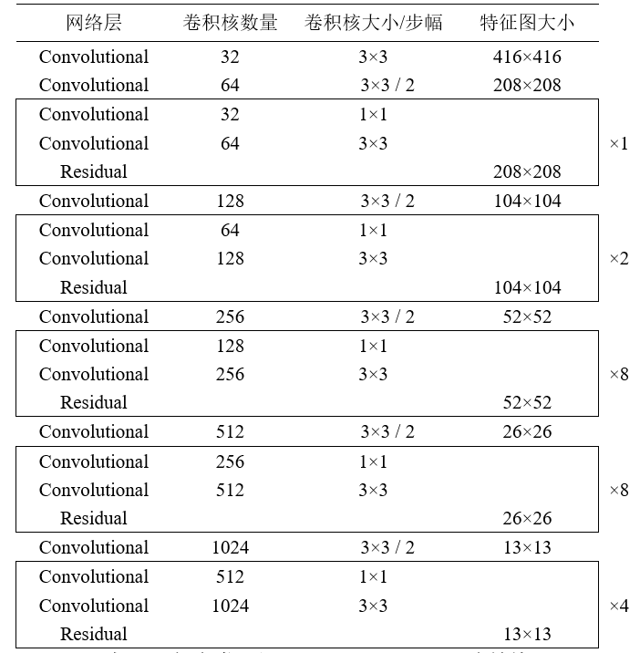
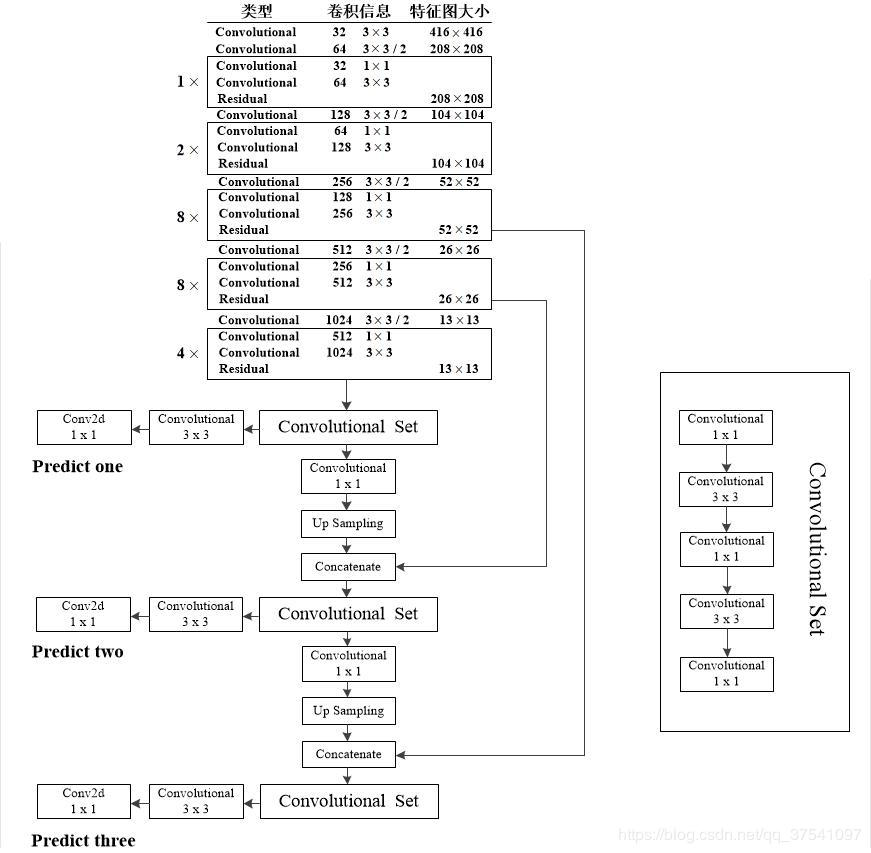
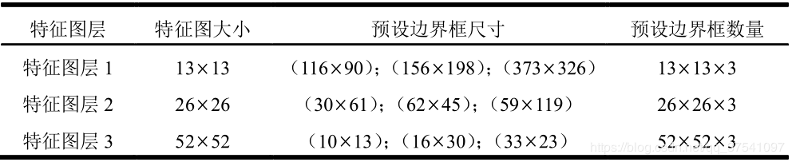
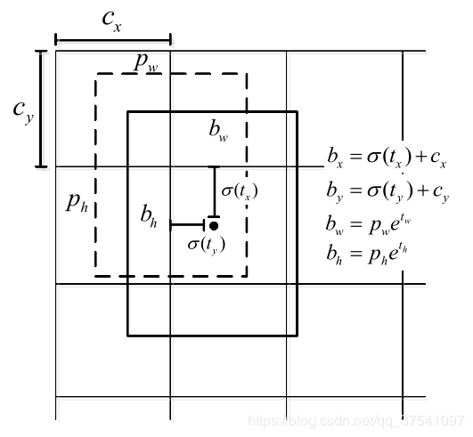

# yolov3


# 数据集
- pascal voc

# 标注工具
- labelImg https://github.com/tzutalin/labelImg
- VoTT https://github.com/Microsoft/VoTT


# pascal voc => tfrecord
https://github.com/tensorflow/models/blob/master/research/object_detection/dataset_tools/create_pascal_tf_record.py


# yolov3 tensorflow 2.0
https://github.com/zzh8829/yolov3-tf2


# data
tfrecord格式，每个样本的格式如下
```
  example = tf.train.Example(features=tf.train.Features(feature={
      'image/height': dataset_util.int64_feature(height),
      'image/width': dataset_util.int64_feature(width),
      'image/filename': dataset_util.bytes_feature(
          data['filename'].encode('utf8')),
      'image/source_id': dataset_util.bytes_feature(
          data['filename'].encode('utf8')),
      'image/key/sha256': dataset_util.bytes_feature(key.encode('utf8')),
      'image/encoded': dataset_util.bytes_feature(encoded_jpg),
      'image/format': dataset_util.bytes_feature('jpeg'.encode('utf8')),
      'image/object/bbox/xmin': dataset_util.float_list_feature(xmin),
      'image/object/bbox/xmax': dataset_util.float_list_feature(xmax),
      'image/object/bbox/ymin': dataset_util.float_list_feature(ymin),
      'image/object/bbox/ymax': dataset_util.float_list_feature(ymax),
      'image/object/class/text': dataset_util.bytes_list_feature(classes_text),
      'image/object/class/label': dataset_util.int64_list_feature(classes),
      'image/object/difficult': dataset_util.int64_list_feature(difficult_obj),
      'image/object/truncated': dataset_util.int64_list_feature(truncated),
      'image/object/view': dataset_util.bytes_list_feature(poses),
  }))
```

训练数据解析,每个样本最多包含100个目标， 不足100个目标的样本进行padding
```
def parse_tfrecord(tfrecord, class_table):
    x = tf.io.parse_single_example(tfrecord, IMAGE_FEATURE_MAP)
    x_train = tf.image.decode_jpeg(x['image/encoded'], channels=3)
    x_train = tf.image.resize(x_train, (416, 416))

    class_text = tf.sparse.to_dense(
        x['image/object/class/text'], default_value='')
    labels = tf.cast(class_table.lookup(class_text), tf.float32)
    y_train = tf.stack([tf.sparse.to_dense(x['image/object/bbox/xmin']),
                        tf.sparse.to_dense(x['image/object/bbox/ymin']),
                        tf.sparse.to_dense(x['image/object/bbox/xmax']),
                        tf.sparse.to_dense(x['image/object/bbox/ymax']),
                        labels], axis=1)

    paddings = [[0, 100 - tf.shape(y_train)[0]], [0, 0]]
    y_train = tf.pad(y_train, paddings)

    return x_train, y_train
```
最终transform_targets函数参数y_train的shape为(batch_size, 100, 5)

由真实标签的bbox计算所属anchor


```
def transform_targets(y_train, anchors, anchor_masks, classes):
    # y_train: shape=(batch_size, boxes, 5)
    y_outs = []
    grid_size = 13

    # calculate anchor index for true boxes
    anchors = tf.cast(anchors, tf.float32)  # shape=(9, 2)
    anchor_area = anchors[..., 0] * anchors[..., 1] # shape=(9,)
    box_wh = y_train[..., 2:4] - y_train[..., 0:2] # shape=(batch_size, boxes, 2)
    # box_wh shape=(batch_size, boxes, anchors=9, 2)
    box_wh = tf.tile(tf.expand_dims(box_wh, -2),
                     (1, 1, tf.shape(anchors)[0], 1)) 
    box_area = box_wh[..., 0] * box_wh[..., 1] # shape=(batch_size, boxes, anchors=9)
    # intersection shape=(batch_size, boxes, anchors=9)
    intersection = tf.minimum(box_wh[..., 0], anchors[..., 0]) * \
        tf.minimum(box_wh[..., 1], anchors[..., 1])
    iou = intersection / (box_area + anchor_area - intersection)
    # anchor_idx shape=(batch_size, boxes)
    anchor_idx = tf.cast(tf.argmax(iou, axis=-1), tf.float32)
    # anchor_idx shape=(batch_size, boxes, 1)
    anchor_idx = tf.expand_dims(anchor_idx, axis=-1)

    y_train = tf.concat([y_train, anchor_idx], axis=-1)

    for anchor_idxs in anchor_masks:
        y_outs.append(transform_targets_for_output(
            y_train, grid_size, anchor_idxs, classes))
        grid_size *= 2

    return tuple(y_outs)
```
transform_targets函数最终返回一个tuple， 这个tuple的size为3，对应三个尺度
```
[TensorShape([batch_size, 13, 13, 3, 6]),
 TensorShape([batch_size, 26, 26, 3, 6]),
 TensorShape([batch_size, 52, 52, 3, 6])]
```


`transform_targets`的anchors参数和anchor_masks参数
```
    yolo_anchors = np.array([(10, 13), (16, 30), (33, 23), (30, 61), (62, 45),
                            (59, 119), (116, 90), (156, 198), (373, 326)],
                            np.float32) / 416
    yolo_anchor_masks = np.array([[6, 7, 8], [3, 4, 5], [0, 1, 2]])
```
`transform_targets`的y_train参数shape可解释为(batch_size, boxes, (xmin, ymin, xmax, ymax, label))

```
    box_wh = y_train[..., 2:4] - y_train[..., 0:2]
```
box_wh的shape可解释为(batch_size, boxes, (w, h))
```
    box_wh = tf.tile(tf.expand_dims(box_wh, -2),
                     (1, 1, tf.shape(anchors)[0], 1))
```
box_wh的shape可解释为(batch_size, boxes, anchors, (w, h)), anchors表示预设框的个数=9

box_area为目标框的面积shape可解释为(batch_size, boxes, anchors)

anchor_area为预设框的面积，(9，2)

anchor_idx最终的shape为(batch_size, boxes, 1)， 表示的是每个目标框与哪个预设框iou最大

transform_targets_for_output函数负责将(N, boxes, (x1, y1, x2, y2, class, best_anchor))转换为(N, grid, grid, anchors, [x, y, w, h, obj, class]), 由于使用了for和if控制流, 因此需要使用tf.function，
```
@tf.function
def transform_targets_for_output(y_true, grid_size, anchor_idxs, classes):
    # y_true: (N, boxes, (x1, y1, x2, y2, class, best_anchor))
    N = tf.shape(y_true)[0]

    # y_true_out: (N, grid, grid, anchors, [x, y, w, h, obj, class])
    y_true_out = tf.zeros(
        (N, grid_size, grid_size, tf.shape(anchor_idxs)[0], 6))

    # anchor_idxs 为3维向量，表示某个特定尺度的3个预设框索引
    anchor_idxs = tf.cast(anchor_idxs, tf.int32)

    indexes = tf.TensorArray(tf.int32, 1, dynamic_size=True)
    updates = tf.TensorArray(tf.float32, 1, dynamic_size=True)
    idx = 0
    
    for i in tf.range(N):
        # i表示第几个样本
        for j in tf.range(tf.shape(y_true)[1]):
            # j表示第几个目标框
            if tf.equal(y_true[i][j][2], 0):
                continue
            anchor_eq = tf.equal(
                anchor_idxs, tf.cast(y_true[i][j][5], tf.int32))

            # 目标框的最佳anchor命中检测尺度
            if tf.reduce_any(anchor_eq):
                box = y_true[i][j][0:4]
                # 目标框的中心位置坐标
                box_xy = (y_true[i][j][0:2] + y_true[i][j][2:4]) / 2

                # anchor_idx表示该尺度下的哪个预设框
                anchor_idx = tf.cast(tf.where(anchor_eq), tf.int32)
                # 根据目标框的中心位置计算目标框属于哪个grid
                grid_xy = tf.cast(box_xy // (1/grid_size), tf.int32)

                # grid[y][x][anchor] = (tx, ty, bw, bh, obj, class)
                indexes = indexes.write(
                    idx, [i, grid_xy[1], grid_xy[0], anchor_idx[0][0]])
                updates = updates.write(
                    idx, [box[0], box[1], box[2], box[3], 1, y_true[i][j][4]])
                idx += 1

    # tf.print(indexes.stack())
    # tf.print(updates.stack())

    return tf.tensor_scatter_nd_update(
        y_true_out, indexes.stack(), updates.stack())
```

# darknet-53
darknet-53共包含53个卷积层，由此得名



```python
    x = inputs = Input([size, size, channels])
    x_36, x_61, x = Darknet(name='yolo_darknet')(x)
```
darknet-53
- 输入为(416, 416, 3)大小的图片， 
- 输出为3个tensor，表示不同尺度的特征
    - x_36 为(52, 52, 256)
    - x_61 为(26, 26, 512)
    - x    为(13, 13, 1024)

```python
def Darknet(name=None):
    x = inputs = Input([None, None, 3])
    x = DarknetConv(x, 32, 3)
    x = DarknetBlock(x, 64, 1)
    x = DarknetBlock(x, 128, 2)  # skip connection
    x = x_36 = DarknetBlock(x, 256, 8)  # skip connection
    x = x_61 = DarknetBlock(x, 512, 8)
    x = DarknetBlock(x, 1024, 4)
    return tf.keras.Model(inputs, (x_36, x_61, x), name=name)
```

每个DarknetBlock由一个DarknetConv和多个DarknetResidual构成

```
def DarknetResidual(x, filters):
    prev = x
    x = DarknetConv(x, filters // 2, 1)
    x = DarknetConv(x, filters, 3)
    x = Add()([prev, x])
    return x


def DarknetBlock(x, filters, blocks):
    x = DarknetConv(x, filters, 3, strides=2)
    for _ in range(blocks):
        x = DarknetResidual(x, filters)
    return x
```

# YoloConv and YoloOutput
使用darknet-53输出的三个不同尺度的特征图，得到三个尺度的预测结果



对应代码如下：
```python
    x = YoloConv(512, name='yolo_conv_0')(x)
    output_0 = YoloOutput(512, len(masks[0]), classes, name='yolo_output_0')(x)

    x = YoloConv(256, name='yolo_conv_1')((x, x_61))
    output_1 = YoloOutput(256, len(masks[1]), classes, name='yolo_output_1')(x)

    x = YoloConv(128, name='yolo_conv_2')((x, x_36))
    output_2 = YoloOutput(128, len(masks[2]), classes, name='yolo_output_2')(x)
```

YoloConv 和 YoloOutput的代码如下
```python
def YoloConv(filters, name=None):
    def yolo_conv(x_in):
        if isinstance(x_in, tuple):
            inputs = Input(x_in[0].shape[1:]), Input(x_in[1].shape[1:])
            x, x_skip = inputs

            # concat with skip connection
            x = DarknetConv(x, filters, 1)
            x = UpSampling2D(2)(x)
            x = Concatenate()([x, x_skip])
        else:
            x = inputs = Input(x_in.shape[1:])

        x = DarknetConv(x, filters, 1)
        x = DarknetConv(x, filters * 2, 3)
        x = DarknetConv(x, filters, 1)
        x = DarknetConv(x, filters * 2, 3)
        x = DarknetConv(x, filters, 1)
        return Model(inputs, x, name=name)(x_in)
    return yolo_conv

def YoloOutput(filters, anchors, classes, name=None):
    def yolo_output(x_in):
        x = inputs = Input(x_in.shape[1:])
        x = DarknetConv(x, filters * 2, 3)
        x = DarknetConv(x, anchors * (classes + 5), 1, batch_norm=False)
        x = Lambda(lambda x: tf.reshape(x, (-1, tf.shape(x)[1], tf.shape(x)[2],
                                            anchors, classes + 5)))(x)
        return tf.keras.Model(inputs, x, name=name)(x_in)
    return yolo_output
```

三个不同尺度的特征图都会进行目标边框的预测, 每个特征图的一个像素可以视为对应三个预设框和三个预测框



每个预测框由$(t_x, t_y, t_w, t_h, obj_{logit}, class_{logit})$来描述,
这些数值再经过计算变换为$(b_x, b_y, b_w, b_h, obj, class)$
- $b_x$表示预测框相对于预设框中心的x轴偏移量
- $b_y$表示预测框相对于预设框中心的y轴偏移量
- $p_w, p_h$表示预测框的宽和高
- obj表示预测框中是否包含目标
- class为num_class长度，表示每个目标类别的概率



# loss and train

```python
    yolo_anchors = np.array([(10, 13), (16, 30), (33, 23), (30, 61), (62, 45),
                            (59, 119), (116, 90), (156, 198), (373, 326)],
                            np.float32) / 416
    yolo_anchor_masks = np.array([[6, 7, 8], [3, 4, 5], [0, 1, 2]])

    optimizer = tf.keras.optimizers.Adam(lr=FLAGS.learning_rate)
    loss = [YoloLoss(anchors[mask], classes=FLAGS.num_classes)
            for mask in anchor_masks]
    model.compile(optimizer=optimizer, loss=loss,
                    run_eagerly=(FLAGS.mode == 'eager_fit'))
```
使用YoloLoss构建了三个损失，分别对应三个不同尺度的特征图
- 特征图(13,13,1024), 预设框anchors=(116, 90), (156, 198), (373, 326), 
- 特征图(26,26,512),  预设框anchors=(30, 61), (62, 45), (59, 119)
- 特征图(52,52,256),  预设框anchors=(10, 13), (16, 30), (33, 23)

y_true 的shape为(batch_size, grid, grid, anchors, (x1, y1, x2, y2, obj, cls))
- anchors表示预设框的数量3
- cls表示目标类别标签，大小为1， 
- 每个目标只后落到$grid*grid*anchors$中的一个cell上
- 每个目标由一个(5+num_classes)维的向量(x1, y1, x2, y2, obj, cls)表示

```
def YoloLoss(anchors, classes=80, ignore_thresh=0.5):
    def yolo_loss(y_true, y_pred):
        # 1. transform all pred outputs
        # y_pred: (batch_size, grid, grid, anchors, (x, y, w, h, obj, ...cls))
        pred_box, pred_obj, pred_class, pred_xywh = yolo_boxes(
            y_pred, anchors, classes)
        pred_xy = pred_xywh[..., 0:2]
        pred_wh = pred_xywh[..., 2:4]

        # 2. transform all true outputs
        # y_true: (batch_size, grid, grid, anchors, (x1, y1, x2, y2, obj, cls))
        true_box, true_obj, true_class_idx = tf.split(
            y_true, (4, 1, 1), axis=-1)
        true_xy = (true_box[..., 0:2] + true_box[..., 2:4]) / 2
        true_wh = true_box[..., 2:4] - true_box[..., 0:2]

        # give higher weights to small boxes
        box_loss_scale = 2 - true_wh[..., 0] * true_wh[..., 1]

        # 3. inverting the pred box equations
        grid_size = tf.shape(y_true)[1]
        grid = tf.meshgrid(tf.range(grid_size), tf.range(grid_size))
        grid = tf.expand_dims(tf.stack(grid, axis=-1), axis=2)
        true_xy = true_xy * tf.cast(grid_size, tf.float32) - \
            tf.cast(grid, tf.float32)
        true_wh = tf.math.log(true_wh / anchors)
        true_wh = tf.where(tf.math.is_inf(true_wh),
                           tf.zeros_like(true_wh), true_wh)

        # 4. calculate all masks
        obj_mask = tf.squeeze(true_obj, -1)
        # ignore false positive when iou is over threshold
        true_box_flat = tf.boolean_mask(true_box, tf.cast(obj_mask, tf.bool))
        best_iou = tf.reduce_max(broadcast_iou(
            pred_box, true_box_flat), axis=-1)
        ignore_mask = tf.cast(best_iou < ignore_thresh, tf.float32)

        # 5. calculate all losses
        xy_loss = obj_mask * box_loss_scale * \
            tf.reduce_sum(tf.square(true_xy - pred_xy), axis=-1)
        wh_loss = obj_mask * box_loss_scale * \
            tf.reduce_sum(tf.square(true_wh - pred_wh), axis=-1)
        obj_loss = binary_crossentropy(true_obj, pred_obj)
        obj_loss = obj_mask * obj_loss + \
            (1 - obj_mask) * ignore_mask * obj_loss
        # TODO: use binary_crossentropy instead
        class_loss = obj_mask * sparse_categorical_crossentropy(
            true_class_idx, pred_class)

        # 6. sum over (batch, gridx, gridy, anchors) => (batch, 1)
        xy_loss = tf.reduce_sum(xy_loss, axis=(1, 2, 3))
        wh_loss = tf.reduce_sum(wh_loss, axis=(1, 2, 3))
        obj_loss = tf.reduce_sum(obj_loss, axis=(1, 2, 3))
        class_loss = tf.reduce_sum(class_loss, axis=(1, 2, 3))

        return xy_loss + wh_loss + obj_loss + class_loss
    return yolo_loss
```

yolo_boxes负责将由$(t_x, t_y, t_w, t_h, obj_{logit}, class_{logit})$变换为$(b_x, b_y, b_w, b_h, obj, class)$， 变换时和预设框anchors的大小相关

```
def yolo_boxes(pred, anchors, classes):
    # pred: (batch_size, grid, grid, anchors, (x, y, w, h, obj, ...classes))
    grid_size = tf.shape(pred)[1]
    box_xy, box_wh, objectness, class_probs = tf.split(
        pred, (2, 2, 1, classes), axis=-1)

    box_xy = tf.sigmoid(box_xy)
    objectness = tf.sigmoid(objectness)
    class_probs = tf.sigmoid(class_probs)
    pred_box = tf.concat((box_xy, box_wh), axis=-1)  # original xywh for loss

    # !!! grid[x][y] == (y, x)
    grid = tf.meshgrid(tf.range(grid_size), tf.range(grid_size))
    grid = tf.expand_dims(tf.stack(grid, axis=-1), axis=2)  # [gx, gy, 1, 2]

    box_xy = (box_xy + tf.cast(grid, tf.float32)) / \
        tf.cast(grid_size, tf.float32)
    box_wh = tf.exp(box_wh) * anchors

    box_x1y1 = box_xy - box_wh / 2
    box_x2y2 = box_xy + box_wh / 2
    bbox = tf.concat([box_x1y1, box_x2y2], axis=-1)

    return bbox, objectness, class_probs, pred_box
```


# 相关文档
https://hugsy.top/2019/06/18/cnn_yolov3/