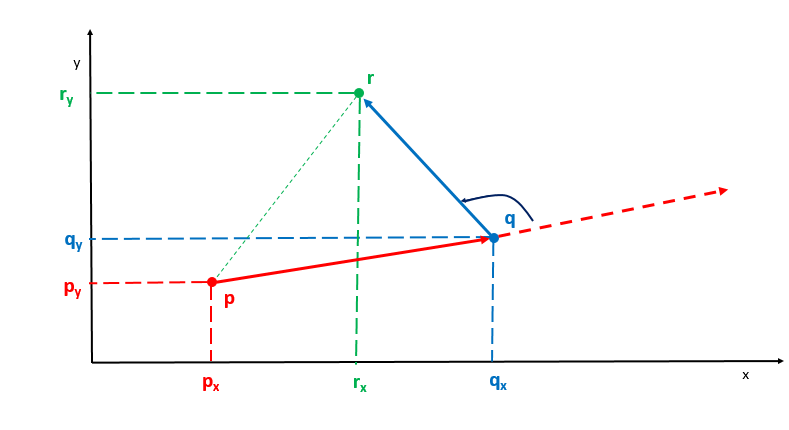

- [leetcode](#leetcode)
- [二分法](#二分法)
  - [按索引进行二分](#按索引进行二分)
  - [按值进行二分](#按值进行二分)
- [链表类](#链表类)
- [字符串类](#字符串类)
  - [字符串前缀hash](#字符串前缀hash)
  - [双指针滑动窗口](#双指针滑动窗口)
  - [kmp](#kmp)
- [排列， 组合， 子集](#排列-组合-子集)
  - [下一个排列](#下一个排列)
  - [全排列， 子集](#全排列-子集)
- [排序](#排序)
- [位运算](#位运算)
- [单调栈](#单调栈)
- [数学](#数学)
  - [最大公约数gcd](#最大公约数gcd)
  - [最小公倍数lcm](#最小公倍数lcm)
  - [序列最大公约数](#序列最大公约数)
  - [向量运算](#向量运算)
  - [信息论](#信息论)
  - [约瑟夫环](#约瑟夫环)
  - [序列和](#序列和)
- [图算法](#图算法)
  - [floyd算法](#floyd算法)
- [区间算法](#区间算法)
  - [区间合并](#区间合并)
- [博弈论](#博弈论)


# leetcode


# c++ 

```c++
#include <limits.h>

INT_MAX

INT_MIN
```

# 二分法

技巧
- 取mid防止溢出 int mid = left + (right - left) / 2
- left, right取闭区间
- 按照索引进行二分，还是按照值进行二分

## 按索引进行二分
旋转数组和二分法
- 求最小，最大（while使用left < right比较，返回left）
- 搜索特定值存在 （while 使用left <= right比较， while中等于时return）
- 搜索特定值的最小索引
- 旋转数组是否有重复元素

旋转数组最小值
153. 寻找旋转排序数组中的最小值 https://leetcode-cn.com/problems/find-minimum-in-rotated-sorted-array/
154. 寻找旋转排序数组中的最小值 II https://leetcode-cn.com/problems/find-minimum-in-rotated-sorted-array-ii/

旋转数组搜索， 判断存在

旋转数组搜索， 返回索引
面试题 10.03. 搜索旋转数组 https://leetcode-cn.com/problems/search-rotate-array-lcci/

```c++
class Solution {
public:
    int search(vector<int>& arr, int target) {
        int left = 0;
        int right = arr.size() - 1;

        while (left <= right) {
            
            if (arr[left] == target) {
                return left;
            }

            // 去除两端的重复值后， 才能保证arr[mid] >= arr[0]时， [0:mid]是有序的
            while(left + 1 <= right && arr[left + 1] == arr[left]) left++;
            while(right - 1 >= left && arr[right - 1] == arr[right]) right--;

            int mid = left + (right - left) / 2;

            if (arr[mid] == target) {
                right = mid;
            } else if (arr[mid] >= arr[0]) {
                if (target >= arr[0] && target < arr[mid]) {
                    right = mid - 1;
                } else {
                    left = mid + 1;
                }
            } else {
                if (target > arr[mid] && target <= arr[arr.size() - 1]) {
                    left = mid + 1;
                } else {
                    right = mid - 1;
                }
            }
        }

        return -1;
    }
};
```

## 按值进行二分
668. 乘法表中第k小的数 https://leetcode.cn/problems/kth-smallest-number-in-multiplication-table/


# 链表类

技巧
- 设置辅助头节点： 头节点会被破坏的场景
- 快慢指针


# 字符串类

技巧
- 字符串前缀hash
- 字母异位词， 排序后字母相同，可以作为map的key
- 双指针滑动窗口
- 字符串翻倍


## 字符串前缀hash

```c++
string s;

int mod = 1e9 + 7;
int base = 31;
vector<int> prefix(n + 1);
vector<int> pow(n + 1);
pow[0] = 1;

for (int i = 1; i <= n; i++) {
    pow[i] = pow[i-1] * base % mod;
    prefix[i] = (prefix[i-1]*base + s[i-1] - 'a') % mod;
}

// 字符串s[i:j], 闭区间[i, j]的hash值为 
prefix[j + 1] - prefix[i] * pow[j - i + 1]

// pow[j - i + 1]中（j-i+1)的含义为字符串长度
// s[0:j] 对应的是 prefix[j + 1]
// s[0:i-1] 对应的是 prefix[i]
// s[i:j] 对应的是 prefix[j + 1] - prefix[i] * pow[j - i + 1]


((prefix[j + 1] - prefix[i] * pow[j - i + 1]) % mod + mod) % mod
```

## 双指针滑动窗口
- 给定窗口长度求解符合要求的窗口， 求解最大/小连续时一般滑动窗口
- [left, right] 闭区间维护窗口， while (right < n) 窗口向右移动
当right - left + 1 大于窗口长度时， 收缩左侧窗口
- 窗口还原

- 窗口限制条件
  - 限制最多操作k次
    - （2024. 考试的最大困扰度 https://leetcode-cn.com/problems/maximize-the-confusion-of-an-exam/）
  - 最小覆盖字串
    - （76. 最小覆盖子串 https://leetcode-cn.com/problems/minimum-window-substring/）
    - （1234. 替换子串得到平衡字符串 https://leetcode-cn.com/problems/replace-the-substring-for-balanced-string/）
    -  窗口还原（992. K 个不同整数的子数组 https://leetcode-cn.com/problems/subarrays-with-k-different-integers/） 

```c++
int find(string& s, unordered_map<char, int>& tlb, int total) {
    // 找到s中满足tlb计数的最小子串, total为tlb中次数的和
    int n = s.size();
    int left = 0;
    int right = 0;
    int match_len = 0;
    int ans = INT_MAX;

    while (right < n) {
        tlb[s[right]]--;
        if (tlb[s[right]] >= 0) match_len++;

        while (match_len == total) {
            ans = min(ans, right - left + 1);
            tlb[s[left]]++;
            if (tlb[s[left]] > 0) match_len--;
            left++;
        }

        right++;
    }
    return ans;
}
```

## kmp
- PMT部分匹配表(Partial Match Table)： 字符串的前缀集合与后缀集合的交集中最长元素的长度  -> next数组
PMT右移一位

1392. 最长快乐前缀 https://leetcode-cn.com/problems/longest-happy-prefix/
```c++
class Solution {
public:
    string longestPrefix(string s) {
        int n = s.size();
        vector<int> next(n+1);

        int j = 0, k = -1;
        next[0] = -1;
        while (j < n){
            if (k == -1 || s[j] == s[k]) {
                j++;
                k++;
                next[j] = k;
            } else {
                k = next[k];
            }
        }

        return s.substr(0, next[n]);
    }
};
```

# 排列， 组合， 子集

技巧
- 子集问题， 可以用回溯法和枚举法， 
- 排列问题回溯时使用for循环， 子集问题不用for循环， 子集问题回溯两次， 放入和不放入

- 回文数的生成
  - （564. 寻找最近的回文数 https://leetcode-cn.com/problems/find-the-closest-palindrome/）


## 下一个排列 


下一个大的排列 eg:  47632
- 双指针
- 从右往左找到升序nums[left]（eg. 47632中的4）， 从右往左找第一个大于nums[left]的数（eg.47632中的6）， 交换nums[left]和nums[right], 对left+1之后进行逆序

题目
- 556. 下一个更大元素 III https://leetcode-cn.com/problems/next-greater-element-iii/


## 全排列， 子集

- 回溯法， 返回结果， for循环模拟树层， 递归模拟树深， 
- 全排列的一条结果是根节点到叶子节点， 子集的一条结果是根节点到叶子节点的前缀
- 有重复元素
  - for循环都从start开始， 
    - 全排列需要swap， 下一次从start+1开始
    - 子集从i+1开始， 需要提前排序
  - for循环时使用unordered_set进行树层去重

1.  全排列 https://leetcode-cn.com/problems/permutations/
2.  全排列 II https://leetcode-cn.com/problems/permutations-ii/

```c++
// 全排列 II （有重复元素）
class Solution {
public:
    vector<vector<int>> permuteUnique(vector<int>& nums) {
        vector<vector<int>> ans;
        vector<int> path;

        backtrace(nums, 0, path, ans);
        return ans;
    }

    void backtrace(vector<int>& nums, int start, vector<int>& path, vector<vector<int>>& ans) {
        if (nums.size() == path.size()) {
            ans.push_back(path);
            return;
        }

        unordered_set<int> uniq;
        for (int i = start; i < nums.size(); i++) {
            // 树层去重
            if (uniq.count(nums[i])) continue;
            uniq.insert(nums[i]);

            // swap后，始终放入第start位置上的数
            // note1: swap
            swap(nums[start], nums[i]);
            path.push_back(nums[start]);
            // note2: start + 1 开始
            backtrace(nums, start + 1, path, ans);
            path.pop_back();
            swap(nums[start], nums[i]);
        }
    }
};
```


90. 子集 II https://leetcode-cn.com/problems/subsets-ii/

```c++
// 子集 II （有重复元素）
class Solution {
public:
    vector<vector<int>> subsetsWithDup(vector<int>& nums) {
        // note1: 预排序
        sort(nums.begin(), nums.end());
        vector<vector<int>> ans;
        vector<int> path;
        backtrace(nums, 0, path, ans);
        return ans;
    }

    void backtrace(vector<int>& nums, int start, vector<int>& path, vector<vector<int>>& ans) {
        ans.push_back(path);

        unordered_set<int> uniq;
        for (int i = start; i < nums.size(); i++) {
            if (uniq.count(nums[i])) continue;
            uniq.insert(nums[i]);

            path.push_back(nums[i]);
            // note2: 从i+1开始
            backtrace(nums, i+1, path, ans);
            path.pop_back();
        }
    }
};
```


# 排序

技巧
- 逆序对的数量， 归并排序， 当合并有序左区间和有序右区间时， 从左区间选择最小元素时， 该元素对应的逆序对数量为p2 - (mid + 1) （mid+1为右区间的起始索引， p2为右区间下一个待归并元素的索引）
- 临位交换的最小次数等于逆序对数量


题目
- 剑指 Offer 51. 数组中的逆序对 https://leetcode-cn.com/problems/shu-zu-zhong-de-ni-xu-dui-lcof/


# 位运算

技巧
- 取最低位: `n & 1`
- 移除最低位的1: `n & (n - 1)`
- __builtin_popcount(val) 统计val的二进制中1的个数
- 长度为m， 从中选取n个进行判断， 可以进行枚举


```c++
for (int mask = 0;  mask < (1 << m); mask++) {
    for (int i = 0; i < m; i++) {
        if (mask & (1 << i)) {

        }
    }
}
```

剑指 Offer 56 - II. 数组中数字出现的次数 II https://leetcode-cn.com/problems/shu-zu-zhong-shu-zi-chu-xian-de-ci-shu-ii-lcof/


# 单调栈

技巧
- 在一维数组中对每一个数找到第一个比自己小/大的元素


# 数学

## 质数
质数是指在大于1的自然数中，除了1和它本身以外不再有其他因数的自然数。

## 最大公约数gcd
```c++
// 辗转相除法
int gcd(int a, int b) {
    while (b != 0) {
        int t = b;
        b = a % b;
        a = t;
    }
    return a;
}
```
gcd(a,0)=a
gcd(a,1)=1
因此当两个数中有一个为0时，gcd是不为0的那个整数

## 最小公倍数lcm
```
int lcm(int a, int b) {
    return a * b / gcd(a, b);
}
```

## 序列最大公约数

gcd（a，b，c）=gcd（a，gcd（b，c））

https://leetcode.cn/problems/number-of-different-subsequences-gcds/solution/kao-lu-mei-yi-ge-shu-shi-fou-ke-yi-cheng-2sb2/


## 向量运算

向量叉积
$$
\begin{aligned} 
\vec{pq}  \times \vec{qr} 
&= (q_x - p_x, q_y - p_y) \times (r_x - q_x, r_y - q_y)\\
&= (q_x - p_x) * (r_y - p_y) - (q_y - p_y) * (r_x - q_x)\\
\end{aligned}
$$

- $ \vec{pq} $ x $ \vec {qr} $ > 0, 点r位于直线pq的左侧
- $ \vec{pq} $ x $ \vec {qr} $ < 0, 点r位于直线pq的右侧
​
  


- 凸包问题
  - （587. 安装栅栏 https://leetcode-cn.com/problems/erect-the-fence/）

## 信息论

n轮实验， 每个对象能测出的信息量为base（例如base=n+1）， 则m个对象能测出的最大信息量为$ m^{base}$

实验方案：
    1. 可以将m个对象分别视为m维空间的一个轴
    2. 每个对象每轮实验对base个混合物进行测量 

- （458. 可怜的小猪 https://leetcode-cn.com/problems/poor-pigs/）
  - 题解： https://leetcode-cn.com/problems/poor-pigs/solution/hua-jie-suan-fa-458-ke-lian-de-xiao-zhu-by-guanpen/


## 约瑟夫环

1823. 找出游戏的获胜者 https://leetcode-cn.com/problems/find-the-winner-of-the-circular-game/

```c++
class Solution {
public:
    int findTheWinner(int n, int k) {
        // 最后剩一人时， 索引为0
        int idx = 0;

        for(int i = 2; i <= n; i++) {
            idx = ((idx + k) % i);
        }

        // 人的编号为索引idx+1
        return idx + 1;
    }
};
```

## 序列和

[start, end]的长度为len = end - start + 1
[start, end]的和为 (start + end) * len / 2

# 图算法

## floyd算法

- dp[i][j] 的关系由dp[i][mid]和dp[mid][j]确定， mid的循环放在外层

```c++
for (int mid = 0; mid < numCourses; mid++) {
    for (int i = 0; i < numCourses; i++) {
        for (int j = 0; j < numCourses; j++) {
            dp[i][j] = dp[i][j] || (dp[i][mid] && dp[mid][j]);
        }
    }
}
```
1.    课程表 IV （https://leetcode-cn.com/problems/course-schedule-iv/）


# 区间算法

## 区间合并

- 通过map或者set来存储区间， 存储[r, l]格式的区间
- 添加新区间[left, right]
  - lower_bound(left - 1) 寻找到第一个可能有交集的区间
  - 循环合并区间， 计算区间的并集， 擦除已经被合并的区间

```c++
class CountIntervals {
public:
    CountIntervals() {

    }
    
    void add(int left, int right) {
        // 可能存在交集的区间
        auto it = range.lower_bound(left - 1);

        // 存储等待合并的区间[l, r]
        int l = left;
        int r = right;
        while (it != range.end()) {
            // Note： [it->first, it->second] 为[右边界, 左边界]格式
            if (r + 1 < it->second) {
                // it表示的区间 与[l, r] 无法合并或拼接
                break;
            }

            // 当前区间it 与[l, r] 合并或拼接
            l = min(l, it->second);
            r = max(r, it->first);
            
            cnt -= it->first - it->second + 1;
            //range.erase(it++);
            it = range.erase(it);
        }

        range[r] = l;
        cnt += r - l + 1;
    }
    
    int count() {
        return cnt;
    }

    map<int, int> range;    // 存储[right, left]格式
    int cnt = 0;
};

```


# 博弈论

464. 我能赢吗 https://leetcode.cn/problems/can-i-win/
