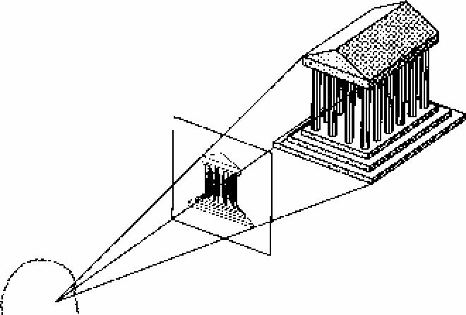
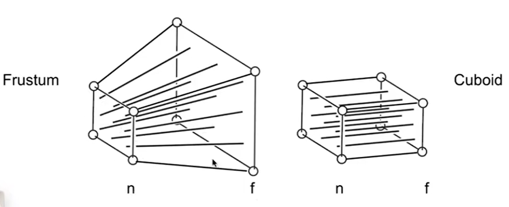

# 线性代数

- 矩阵
    - 结合律 ABC = (AB)C

# 计算机图形学


- 点积（dot product）： 判断两个向量的夹角，碰撞
- 叉积（cross product）：判断两个向量的左右， 判断点在图形的内外

- 两条直线的两个向量的叉积为直线的交点


- 模型坐标系 Local Coordinates
    - 模型是如何存储的， 
        - 模型的各个顶点数据

- 相机坐标系
    - 相机是如何存储的， 
        - 相机的方向向量
        - 视野FOV
        - frustum（相机要观测的空间）

- 世界坐标系 World Coordinates
    - 世界坐标系使用右手系
    - 模型放入到世界坐标系中，平移和旋转模型后，得到模型在世界坐标系中的位置
    - 相机放入到世界坐标系中，相机的位置和姿态，


# 视图变换（view transform) 和 视图

世界坐标系变换到相机坐标系
https://www.cnblogs.com/graphics/archive/2012/07/12/2476413.html

相机坐标系
    - 相机看的方向为Z轴
    - 相机向上的方向为Y轴
    - 相机向右的方向为X轴

视图变换矩阵V： V的作用就是将摄像机（和世界上的所有物体）移动到原点，并将摄像机的三个向量分别与世界坐标轴对齐

view transform中，所有位于world space中的models都随着camera一起变换，所以视野并未发生变化， 因此世界坐标系中的顶点坐标经过视图变换后得到的就是在相机坐标系中的坐标

three.js 中的变换关系, 假设object都直接位于scene中，那么position就是object在世界坐标系中的坐标

Object3D中的matrixWorld描述了物体的坐标和姿态

$$ 
\begin{aligned}
object.position = object.matrixWorld * 
\left(
    \begin{array}
    {}
    0 \\
    0 \\
    0 \\
    1
    \end{array}
\right)
\end{aligned}
$$

```js
var base = new THREE.Vector3(0, 0, 0)

// camera.position == 
base.applyMatrix4(camera.matrixWorld) 
```

$$ \left(
    \begin{array}
    {}
    0 \\
    0 \\
    0 \\
    1
    \end{array}
\right) = object.matrixWorldInverse * object.position $$


# 投影变换
透视投影： 将三维点投影到相机成像平面上

- 计算机视觉中的透视投影
    - 投影结果为照相机的虚像平面

$$ 
\left(
    \begin{array}
    {}
    x' \\
    y' \\
    z  \\
    \end{array}
\right)

=

\left(
    \begin{matrix}
    {}
    \alpha & -\alpha cot(\theta) & width/2 & 0 \\
    0 & \beta/sin(\theta) & height/2 & 0 \\
    0 & 0 & 1 & 0 \\
    \end{matrix}
\right)


\left(
    \begin{array}
    {}
    x \\
    y \\
    z \\
    1
    \end{array}
\right)

$$




- 计算机图形学中的透视投影： 分两步进行
    - frustum -> cuboid(n->n, f->f)
    - orthographic projection（投影结果为$[-1, 1]^3$的立方体）



$M_{persp->ortho}$完成frustum -> cuboid(n->n, f->f)的变换
$$
M_{persp->ortho}=

\left(
    \begin{matrix}
    {}
    n & 0 & 0 & 0 \\
    0 & n & 0 & 0 \\
    0 & 0 & n+f & -nf \\
    0 & 0 & 1 & 0 \\
    \end{matrix}
\right)
$$

$M_{ortho}$ 需要先平移后缩放
$$
M_{ortho}=

\left(
    \begin{matrix}
    {}
    2/(r-l) & 0 & 0 & 0 \\
    0 & 2/(t-b) & 0 & 0 \\
    0 & 0 & 2/(n-f) & 0 \\
    0 & 0 & 0 & 1 \\
    \end{matrix}
\right)

\left(
    \begin{matrix}
    {}
    1 & 0 & 0 & -(r+l)/2 \\
    0 & 1 & 0 & -(t+b)/2 \\
    0 & 0 & 1 & -(n+f)/2 \\
    0 & 0 & 0 & 1 \\
    \end{matrix}
\right)
$$


# 视口变换 （viewport transform)

canonical cube $[-1, 1]^3$ -> screen

像素坐标系： 左下角为原点， 向右为x轴，向上为y轴

$$ 
\left(
    \begin{array}
    {}
    x' \\
    y' \\
    z' \\
    1
    \end{array}
\right)

=

\left(
    \begin{matrix}
    {}
    width/2 & 0 & 0 & width/2 \\
    0 & height/2 & 0 & height/2 \\
    0 & 0 & 1 & 0 \\
    0 & 0 & 0 & 1 \\
    \end{matrix}
\right)

\left(
    \begin{array}
    {}
    x \\
    y \\
    z \\
    1
    \end{array}
\right)

$$


