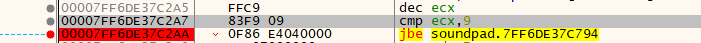
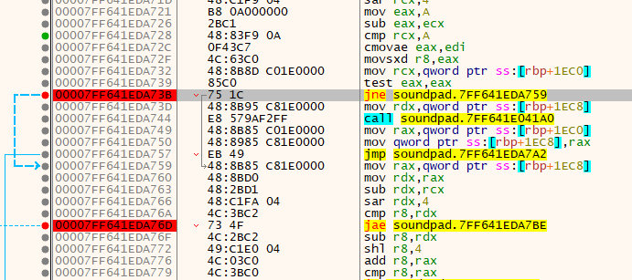
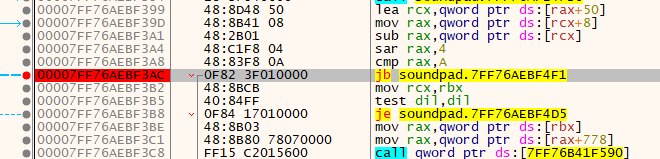

# soundpad

https://www.leppsoft.com/soundpad/en/help/manual/complete/


> Folder languages: Contains translations.
Folder logs: Contains driver logs and crash dumps.
Folder sounds: Contains some demo and notification sounds.
File Soundpad.exe: The main executable with the graphical user interface.
File SoundpadService.exe: Handles hotkeys and auto keys. Is automatically launched and closed by Soundpad.
File UniteFx.dll: The driver extension component.
File UniteFxUpdate.dll: Only Steam edition. New versions of the driver extension component. As the original UniteFx.dll may be locked while updating, this one is used. Soundpad handles the installation on startup automatically.
File license.dat: Upon registering a full version of Soundpad this file removes the trial limitations.
File UniteFxControl.dll (obsolete): Removed as of version 3.2.14. The communication to the driver extension was packed in this library.


## 播放次数限制
soundpad试用版只能播放十次音频，达到限制后需要重启


```
mov ecx,dword ptr ds:[rdx+rax*4]
dec ecx
cmp ecx,9
jbe soundpad.7FF6DE37C794
```

`cmp ecx,9`就是判断是否达到10次限制，jbe进行跳转是正常播放流程，jbe不进行跳转则会运行限制弹窗， 将jbe修改为jmp指令就可以进行绕过。

## 音频数量限制
soundpad试用版最多添加十个音频


```
cmp rcx,A
cmovae eax,edi
movsxd r8,eax
mov rcx,qword ptr ss:[rbp+1EC0]
test eax,eax
jne soundpad.7FF641EDA759
mov rdx,qword ptr ss:[rbp+1EC8]
call soundpad.7FF641E041A0
mov rax,qword ptr ss:[rbp+1EC0]
mov qword ptr ss:[rbp+1EC8],rax
jmp soundpad.7FF641EDA7A2
mov rax,qword ptr ss:[rbp+1EC8]
mov rdx,rax
sub rdx,rcx
sar rdx,4
cmp r8,rdx
jae soundpad.7FF641EDA7BE
sub r8,rdx
shl r8,4
add r8,rax
cmp r8,rax
```
`jne soundpad.7FF641EDA759`和`jae soundpad.7FF641EDA7BE`指令不进行跳转时会弹出限制窗口, 修改为jmp指令可以进行绕过。

## 录音限制


```
lea rcx,qword ptr ds:[rax+50]
mov rax,qword ptr ds:[rcx+8]
sub rax,qword ptr ds:[rcx]
sar rax,4
cmp rax,A
jb soundpad.7FF76AEBF4F1
mov rcx,rbx
test dil,dil
```
`jb soundpad.7FF76AEBF4F1`录音正常会进行跳转，录音限制不会进行跳转，修改为jmp进行绕过。


## 全局按键监听
soundpad全局监听键盘按键使用的是SetWindowsHookExA，WH_KEYBOARD

## apo（Audio Processing Objects） 驱动

## UniteFx.dll

File UniteFx.dll: The driver extension component.

使用`regsvr32 UniteFx.dll`命令向系统注册COM组件, 注册后组件会放到C:\Windows\System32\UniteFx.dll