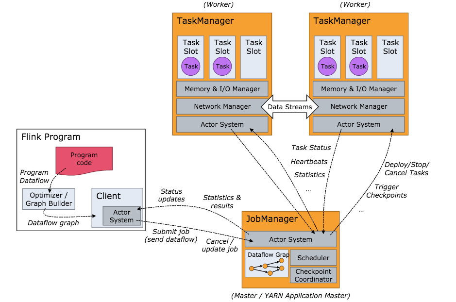

https://training.ververica.com/lessons/stateless.html

# Flink

```
# local flink cluster
bin/start-cluster.sh
bin/stop-cluster.sh
```

# sbt idea
https://ci.apache.org/projects/flink/flink-docs-master/zh/dev/projectsetup/scala_api_quickstart.html
```
# windows git-bash 显示存在问题，使用windows cmd
# 新建工程
sbt new tillrohrmann/flink-project.g8

# 编译
sbt clean assembly

# 运行
sbt run
# 带参数的sbt run
sbt "run -f application.conf"
```

## flink特点
- window机制
- checkpoint机制

## flink on yarn
- 启动一个YARN session(Start a long-running Flink cluster on YARN)
- 直接在YARN上提交运行Flink作业(Run a Flink job on YARN)



- JobManager : ApplicationMaster
- TaskManager : Container

一个TaskManager有多个slot， 多个slot均分这个TaskManager占有的内存
一个TaskManager只启动一个JVM， slot以线程的方式运行task

## flink任务
```
# 任务提交和恢复， -s指定savepoint路径， -c指定入口主类
flink run 


# 手动保存savepoint
flink savepoint <job_id>
```
# flink 可视化
获取执行计划json
```
System.out.println(env.getExecutionPlan());
```
https://flink.apache.org/visualizer/

# flink shell

本地模式启动交互式shell
```
bin/start-scala-shell.sh local
```

```
val dataSet = benv.fromElements((1,2), (2,3), (3,5), (4,6))
dataSet.maxBy(0).print()
```


# flink time
- EventTime: 消息携带的时间戳, 需要指定如何从DataSource中抽取时间戳
- IngestionTime
- ProcessingTime

```scala
import org.apache.flink.streaming.api.scala._
import org.apache.flink.streaming.api.TimeCharacteristic

// get an ExecutionEnvironment
val env = StreamExecutionEnvironment.getExecutionEnvironment
// configure event-time processing
env.setStreamTimeCharacteristic(TimeCharacteristic.EventTime)
```

## flink DataSource


> from
```
val env = StreamExecutionEnvironment.getExecutionEnvironment
```

> kafka

build.sbt
```
libraryDependencies += "org.apache.flink" %% "flink-connector-kafka-0.8" % "1.7.2"
//libraryDependencies += "org.apache.flink" %% "flink-connector-kafka" % "1.7.2"
```

```scala
import java.util.Properties
import org.apache.flink.streaming.api.scala._
import org.apache.flink.api.common.serialization.SimpleStringSchema;
//import org.apache.flink.streaming.connectors.kafka.{FlinkKafkaConsumer08, FlinkKafkaProducer08}
import org.apache.flink.streaming.connectors.kafka.{FlinkKafkaConsumer, FlinkKafkaProducer}


object Job {
  def main(args: Array[String]): Unit = {
    val env = StreamExecutionEnvironment.getExecutionEnvironment

    val properties = new Properties()
    properties.setProperty("bootstrap.servers", "ip1:9092,ip2:9092")
    // only required for Kafka 0.8
    //properties.setProperty("zookeeper.connect", "ip:2181")
    properties.setProperty("group.id", "test")

    // val input_stream = env
    //     .addSource(new FlinkKafkaConsumer08[String]("topic_name", new SimpleStringSchema(), properties))

    val input_stream = env.addSource(new FlinkKafkaConsumer[String]("topic_name", new SimpleStringSchema(), properties))

    var data_stream = input_stream.map()

    data_stream.print()

    // execute program
    env.execute("Flink Scala API Skeleton")
```

同时读取多个topic
```scala
// 多个topic List[String] 需要
import scala.collection.JavaConversions._

val topic_list = "topic1,topic2,topic3".split(",").toList
val stream = env.addSource(new FlinkKafkaConsumer08[String](topic_list, new SimpleStringSchema(), properties))
```

> file

```scala
val env = StreamExecutionEnvironment.getExecutionEnvironment
env.setStreamTimeCharacteristic(TimeCharacteristic.EventTime)

val stream: DataStream[MyEvent] = env.readFile(
         myFormat, myFilePath, FileProcessingMode.PROCESS_CONTINUOUSLY, 100,
         FilePathFilter.createDefaultFilter())
```

> createInput


## timestamp watermark
使用EventTime时，需要指定数据中的哪个字段为timestamp
- Source Functions with Timestamps and Watermarks
```scala
override def run(ctx: SourceContext[MyType]): Unit = {
    while (/* condition */) {
        val next: MyType = getNext()
        ctx.collectWithTimestamp(next, next.eventTimestamp)

        if (next.hasWatermarkTime) {
            ctx.emitWatermark(new Watermark(next.getWatermarkTime))
        }
    }
}
```
- Timestamp Assigners / Watermark Generators
```scala
import org.apache.flink.streaming.api.functions.timestamps.AscendingTimestampExtractor;

val env = StreamExecutionEnvironment.getExecutionEnvironment
env.setStreamTimeCharacteristic(TimeCharacteristic.EventTime)

val timedData = csvInput.assignTimestampsAndWatermarks(new AscendingTimestampExtractor[UserBehavior]() {
    override def extractAscendingTimestamp(ub: UserBehavior):Long = {
        ub.timestamp * 1000
    }
})
```

# 基础操作
## 过滤


## keyBy

KeyedStreams

https://ci.apache.org/projects/flink/flink-docs-release-1.8/dev/api_concepts.html#specifying-keys
- field postion: (Specifying keys via field positions is only valid for tuple data types)
-  field expression:


# 在window上执行的算子
- aggregate
- process


## aggregator functions
> 内置api
  - maxBy

> AggregateFunction

https://ci.apache.org/projects/flink/flink-docs-release-1.3/api/java/org/apache/flink/api/common/functions/AggregateFunction.html
```
Interface AggregateFunction<IN,ACC,OUT>
Type Parameters:
IN - The type of the values that are aggregated (input values)
ACC - The type of the accumulator (intermediate aggregate state).
OUT - The type of the aggregated result
```

覆盖三个实现, IN表示输入类型， ACC表示聚合类型， OUT表示输出类型
- def createAccumulator() 负责创建初始值
- override def add((value: IN, accumulator: ACC):ACC 负责将输入数据和已聚合数据进行聚合
- override def merge(a: ACC, b: ACC):ACC 负责合并不同分区的数据
- override def getResult(accumulator: ACC): OUT 负责从迭代类型得到聚合后的返回结果
```scala
import org.apache.flink.api.common.functions.AggregateFunction

class MyAggFunc(k: String) extends AggregateFunction[IN, ACC, OUT] {
  override def createAccumulator() = ACC()
  override def add((value: IN, accumulator: ACC) = {
    // add value and accumulator
    return ACC()
  }
  override def merge(a: ACC, b: ACC) = {
  }

  override def getResult(accumulator: ACC): OUT = {
  }
}
```

- reduce()

## Window

- Keyed Windows vs Non-Keyed Windows
- window assigner
- window function
    - ReduceFunction (输入：两个输入元素， 输出：同类型的元素) .reduce
    - FoldFunction (输入： 一个输入元素和一个累加元素，输出: 累加元素) .fold(<acc_init>){}
    - WindowFunction 
    - ProcessWindowFunction
    - AggregateFunction
    - 

Incremental Window Aggregation with AggregateFunction
同时使用AggregateFunction和WindowFunction时， AggregateFunction的最终聚合输出结果会作为WindowFunction的输入， 可以使用WindowFunction提供的上下文信息进一步处理得到输出结果

https://ci.apache.org/projects/flink/flink-docs-master/api/java/org/apache/flink/streaming/api/functions/windowing/WindowFunction.html
```java
Interface WindowFunction<IN,OUT,KEY,W extends Window>
Type Parameters:
IN - The type of the input value.
OUT - The type of the output value.
KEY - The type of the key.
W - The type of Window that this window function can be applied on.

void apply(KEY key,
           W window,
           Iterable<IN> input,
           Collector<OUT> out)
    throws Exception
Parameters:
key - The key for which this window is evaluated.
window - The window that is being evaluated.
input - The elements in the window being evaluated.
out - A collector for emitting elements.
```

```scala
import org.apache.flink.streaming.api.scala.function.WindowFunction
import org.apache.flink.streaming.api.windowing.windows.TimeWindow;
import org.apache.flink.util.Collector
import org.apache.flink.api.java.tuple.Tuple;
import org.apache.flink.api.java.tuple.Tuple1;

class WindowResultFunction extends WindowFunction[Long, ItemViewCount, Tuple, TimeWindow] {
  override def apply(key: Tuple, window: TimeWindow, aggregateResult: Iterable[Long], collector: Collector[ItemViewCount]) = {
    val itemId: Long = key.asInstanceOf[Tuple1[Long]].f0
    val count: Long = aggregateResult.iterator.next()
    collector.collect(ItemViewCount(itemId, window.getEnd(), count))
  }
}
```

# KeyedProcessFunction
https://ci.apache.org/projects/flink/flink-docs-master/api/java/org/apache/flink/streaming/api/functions/KeyedProcessFunction.html


### timeWindow
Batch 是 Streaming 的一个特例, 使用timeWindow可以统一batch和stream任务的处理
- Tumbling Time Window
```
# 翻滚时间窗口, 1分钟
.timeWindow(Time.minutes(1))

# 滑动时间窗口, 窗口1分钟，滑动30秒
.timeWindow(Time.minutes(1), Time.seconds(30))
```
### countWindow
### Session Window


## Trigger
- ContinuousProcessingTimeTrigger
- CountTrigger

## Evictor


# flink sink

保存到文本文件， 按照
```
val textSink: StreamingFileSink[String] = StreamingFileSink
    .forRowFormat(new Path("tmp"), new SimpleStringEncoder[String]("UTF-8"))
    .build()
stream.addSink(textSink)
```

## savepoint

- 对stateful operators，使用uid(), name() 

# state

- Keyed State
  - Managed Keyed State
    - ValueState<T>
    - ListState<T>
- Operator State


# flink parallelism
- 命令行参数设置 
```
flink run -p 10
```
- StreamExecutionEnvironment设置
```
StreamExecutionEnvironment env = StreamExecutionEnvironment.getExecutionEnvironment();
env.setParallelism(10);
```


