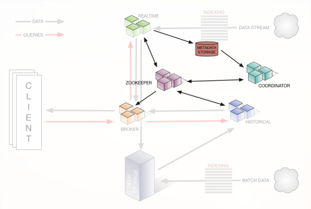

<!--
 * @Description: In User Settings Edit
 * @Author: your name
 * @Date: 2019-07-02 17:59:54
 * @LastEditTime: 2019-08-09 10:33:51
 * @LastEditors: Please set LastEditors
 -->
---
layout:     post
title:      "����"
subtitle:   "project"
date:       2019-04-18 16:00:48
author:     "soaringsoul"
header-img: "img/posts/default_post.jpg"
catalog: true
tags:
    - ѧϰ�ʼ�
---

# enum 和 enum class
enum class 带有作用域， 转换为int时需要使用static_cast<int>()


# cast

- dynamic_cast

使用场景： 将基类指针转为派生类指针，便于调用派生类特有方法

dynamic_cast 使用了虚表里的type info
在运行时去做转换而非编译时, 转换不成功则返回NULL

```c++
Base* b = new Derived();
b->Func();
// 安全转换
Derived* d = dynamic_cast<Derived*>(b);
if (d != NULL) {
    d->NewFunc();
}
```
- static_cast

使用场景： void指针转为其他类型指针， 派生类指针转换为基类指针

避免使用static_cast将基类指针转换为派生类指针，因为无运行时类型检查，不安全
```c++
static_cast < type-id > ( expression )
```

- const_cast

使用场景： 移除const属性

```c++
std::string value;
char* name = const_cast<char*>(value.c_str()),
```


# malloc
malloc (multi-threaded heap uses critical sections)
new
scalable_malloc

https://andylin02.iteye.com/blog/724095
缓存边界对齐，防止多线程频繁导致的缓存刷新

# new 和 new (std::nothrow)
new 在内存分配失败时，会抛出异常类型std::bad_alloc。
new (std::nothrow) 在内存分配失败时，不会抛出异常，而是返回NULL
Task * ptask = new (std::nothrow) Task;

# 虚函数和纯虚函数
纯虚函数， 基类不能实例化
虚函数， 基类指针多态

派生类调用基类的虚函数，在派生类中使用基类的域访问符号即可调用基类的虚函数 


# 移动构造和拷贝构造
https://zh.cppreference.com/w/cpp/language/move_constructor

编译器自动生成移动构造函数的条件：
```
没有用户声明的复制构造函数；
没有用户声明的复制赋值运算符；
没有用户声明的移动赋值运算符；
没有用户声明的析构函数；
```

编译器没有自动生成移动构造函数时， 参数为右值时或使用std::move转换参数，仍然会调用拷贝构造

# 
RVO和NRVO

RVO（返回值优化）

NRVO(具名返回值优化)

返回值会优先匹配移动构造进行返回

# 函数重载

函数名

返回值

参数列表

const

仅当const参数是一个引用或指针时，C++才允许基于const类型进行函数重载
```
#include<iostream>
using namespace std;
 
void fun(const int i)
{
    cout << "fun(const int) called ";
}
void fun(int i)
{
    cout << "fun(int ) called " ;
}
int main()
{
    const int i = 10;
    fun(i);
    return 0;
}
```

```
error: redefinition of ‘void fun(int)’
```

# json

JSON String Escape

https://www.freeformatter.com/json-escape.html#ad-output

Json Parser Online

http://json.parser.online.fr/

# redis

```shell
# --raw 显示中文问题
redis-cli -h <ip> -p <port> -a <password> --raw
```

```
# 查看redis信息 
info


```

## 哈希表
key 表示一个哈希表

```
# 写操作： HSET写入单个域， HMSET写入多个域
HSET key field value
HMSET key field value [field value …]

# 读操作：HGET读出单个域， HMGET读出多个域， HGETALL读出所有域
HGET key field
HMGET key field [field …]
HGETALL key


# 哈希表key中域的个数
HLEN key
```

# protobuf
```
# --python_out设置输出目录， -I设置输入目录
protoc --python_out=. -Ipb AccountCPAParams.proto

# --proto_path设置*.proto的根目录(import语法的搜索目录） 
protoc --proto_path=/path/proto_root --java_out=/path/output/ /path/proto_root/proto/my.proto
```

## redis 模式
主从模式

Redis Sentinel (哨兵模式)

Redis Sentinel 本身也是redis， 可以通过redis-cli进行连接， 但其上存储的是redis主从配置信息，一般不存储生产数据

```
# 获取sentinel有多少个master， 及每个master的名称， 每个master对应一个redis主从服务
INFO Sentinel

# 获取master_name对应的redis主从服务的master主机ip和端口
SENTINEL get-master-addr-by-name <master_name>

# 获取master_name对应的redis主从服务的slaves的从机ip和端口(可能有多个)
SENTINEL slaves <master_name>
```

# kafka
topic(主题)

partition(分区) 
一个broker上可以存储多个分区的数据， 每个分区对应一个文件夹， 
每个partition上存在多个segment， 每个segment对应两个文件（数据文件和索引文件）

consumer group(消费组)
每个消费组能

consumer(消费者)
一个消费组里消费者合作消费信息
一个消费者可以消费多个分区
消费者的数目需要小于等于分区数，否则会有消费者空闲
一个线程只能有一个消费者， 消费者不是线程安全的

- zookeeper 旧版kafka， 信息保存在zookeeper中
- broker
- bootstrap-server: 新版kafka命令行工具使用的参数， 即kafka broker, 信息保存在broker中

NOTE：选择匹配版本的kafka命令行工具
```shell
# 列出topic
bin/kafka-topics.sh --zookeeper localhost:2181 --list
bin/kafka-topics.sh --bootstrap-server localhost:9092 --list

# 查看topic信息
bin/kafka-topics.sh --bootstrap-server localhost:9092 --describe --topic my-replicated-topic

bin/kafka-topics.sh --zookeeper localhost:2181 --describe --topic Demo1

# 查看消费组
bin/kafka-consumer-groups.sh --bootstrap-server localhost:9092 --describe --group test-group

# 消费kafka
bin/kafka-console-consumer.sh --zookeeper localhost:2181 --from-beginning --topic topic_test

./kafka-console-consumer.sh --bootstrap-server=localhost:9092 --topic test --consumer-property group.id=test_group
```

## kafka offset
- auto.offset.reset
  - kafka-0.10.1.X之前(offest保存在zk中)
    - smallest
    - largest
  - kafka-0.10.1.X之后(offest保存在kafka的一个特殊的topic名为:__consumer_offsets里面)
    - earliest：当各分区下有已提交的offset时，从提交的offset开始消费；无提交的offset时，从头开始消费
    - latest：当各分区下有已提交的offset时，从提交的offset开始消费；无提交的offset时，消费新产生的该分区下的数据
    - none：topic各分区都存在已提交的offset时，从offset后开始消费；只要有一个分区不存在已提交的offset，则抛出异常

# druid



## druidrole
> coordinator

segment management and distribution

https://druid.apache.org/docs/latest/design/coordinator.html


- historical
- overlord
- broker

```
Coordinator	    8081    通过zookeeper通知historical下载segments
Broker	        8082    数据查询(面向用户)
Historical	    8083
Realtime	    8084
Overlord	    8090    数据摄取(batch IndexService)， 存储到Deep storage(如hdfs)
MiddleManager	8091
Router	        8888
```


每个druidrole对应一个进程

- datasources 与数据库的table概念相似

## 数据摄取（Ingestion)


Ingestion Spec: https://druid.apache.org/docs/latest/ingestion/ingestion-spec.html
```
{
  "dataSchema" : {...},
  "ioConfig" : {...},
  "tuningConfig" : {...}
}
```
- ioConfig 配置数据来源
- dataSchema 配置数据格式

提交任务, -d参数指定的json文件内容即为Ingestion Spec文件
```
curl -X 'POST' -H 'Content-Type:application/json' -d @ingest-multi-value-dimension.json http://localhost:8090/druid/indexer/v1/task
```

可视化界面： http://<ip>:<port>/console.html

> hdfs数据摄取
- 定时（如每小时)准备好hdfs数据， hdfs数据以json的格式存储
- 配置json请求文件，类型为index_hadoop，该配置中可以指定dataSource和数据的schema
- post请求提交index任务


Multi-value dimensions
- https://cleanprogrammer.net/ingesting-and-querying-multi-value-dimensions-in-druid/
- flattenSpec

## 可视化web
```

# 查看数据源，切片
http://<coordinator_host>:8081/#/

# 查看数据批量导入Druid的任务执情况
http://<overlord_host>:8090/#/
```


## 数据查询

> druid 查询所有dataSource

这些信息存储在zookeeper中，可以通过coordinator或者broker提供的http接口来获取
```
# GET请求
curl http://<broker>:8082/druid/v2/datasources
curl http://<broker>:8082/druid/v2/datasources/{dataSourceName}/dimensions
curl http://<broker>:8082/druid/v2/datasources/{dataSourceName}/metrics

curl http://<coordinator>:8081/druid/coordinator/v1/datasources/
curl http://<coordinator>:8081/druid/coordinator/v1/datasources/<datasource>
```

> druid 查询集群所有节点
```
# GET请求
curl http://<coordinator>:8081/druid/coordinator/v1/servers?simple
```


> broker节点
```
curl -X POST '<broker_host>:8082/druid/v2/?pretty' -H 'Content-Type:application/json' -d @<query_json_file>
```


# 版本管理， 配置重加载
tensorflow_serving/core/source.h
Source<T> 数据新版本监控