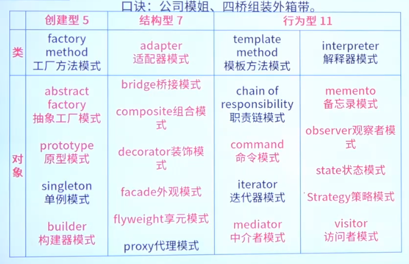

# 简单工厂模式

```c++
#include <iostream>
#include <memory>

// 抽象产品
class AbstractProduct {
public:
    virtual ~AbstractProduct() {}
    virtual std::string Operation() const = 0;
};

// 具体产品A
class ConcreteProductA : public AbstractProduct {
public:
    std::string Operation() const override {
        return "{Result of the ConcreteProductA}";
    }
};

// 具体产品B
class ConcreteProductB : public AbstractProduct {
public:
    std::string Operation() const override {
        return "{Result of the ConcreteProductB}";
    }
};

// 简单工厂
class SimpleFactory {
public:
    std::unique_ptr<AbstractProduct> CreateProduct(const std::string& productType) const {
        if (productType == "ProductA") {
            return std::make_unique<ConcreteProductA>();
        } else if (productType == "ProductB") {
            return std::make_unique<ConcreteProductB>();
        }
        return nullptr;
    }
};

int main() {
    SimpleFactory factory;

    std::unique_ptr<AbstractProduct> productA = factory.CreateProduct("ProductA");
    if (productA) {
        std::cout << "Product A: " << productA->Operation() << std::endl;
    }

    std::unique_ptr<AbstractProduct> productB = factory.CreateProduct("ProductB");
    if (productB) {
        std::cout << "Product B: " << productB->Operation() << std::endl;
    }

    return 0;
}

```


#  抽象工厂模式

```c++
#include <iostream>
#include <string>

// 抽象产品A
class AbstractProductA {
public:
 virtual ~AbstractProductA(){};
 virtual std::string UsefulFunctionA() const = 0;
};

// 具体产品A1
class ConcreteProductA1 : public AbstractProductA {
public:
 std::string UsefulFunctionA() const override {
    return "The result of the product A1.";
 }
};

// 具体产品A2
class ConcreteProductA2 : public AbstractProductA {
public:
 std::string UsefulFunctionA() const override {
    return "The result of the product A2.";
 }
};

// 抽象产品B
class AbstractProductB {
public:
 virtual ~AbstractProductB(){};
 virtual std::string UsefulFunctionB() const = 0;
 virtual std::string AnotherUsefulFunctionB(const AbstractProductA &collaborator) const = 0;
};

// 具体产品B1
class ConcreteProductB1 : public AbstractProductB {
public:
 std::string UsefulFunctionB() const override {
    return "The result of the product B1.";
 }
 std::string AnotherUsefulFunctionB(const AbstractProductA &collaborator) const override {
    const std::string result = collaborator.UsefulFunctionA();
    return "The result of the B1 collaborating with ( " + result + " )";
 }
};

// 具体产品B2
class ConcreteProductB2 : public AbstractProductB {
public:
 std::string UsefulFunctionB() const override {
    return "The result of the product B2.";
 }
 std::string AnotherUsefulFunctionB(const AbstractProductA &collaborator) const override {
    const std::string result = collaborator.UsefulFunctionA();
    return "The result of the B2 collaborating with ( " + result + " )";
 }
};

// 抽象工厂
class AbstractFactory {
public:
 virtual AbstractProductA *CreateProductA() const = 0;
 virtual AbstractProductB *CreateProductB() const = 0;
};

// 具体工厂1
class ConcreteFactory1 : public AbstractFactory {
public:
 AbstractProductA *CreateProductA() const override {
    return new ConcreteProductA1();
 }
 AbstractProductB *CreateProductB() const override {
    return new ConcreteProductB1();
 }
};

// 具体工厂2
class ConcreteFactory2 : public AbstractFactory {
public:
 AbstractProductA *CreateProductA() const override {
    return new ConcreteProductA2();
 }
 AbstractProductB *CreateProductB() const override {
    return new ConcreteProductB2();
 }
};

void ClientCode(const AbstractFactory &factory) {
 const AbstractProductA *product_a = factory.CreateProductA();
 const AbstractProductB *product_b = factory.CreateProductB();
 std::cout << product_b->UsefulFunctionB() << "\n";
 std::cout << product_b->AnotherUsefulFunctionB(*product_a) << "\n";
 delete product_a;
 delete product_b;
}

int main() {
 std::cout << "Client: Testing client code with the first factory type:\n";
 ConcreteFactory1 *f1 = new ConcreteFactory1();
 ClientCode(*f1);
 delete f1;
 std::cout << std::endl;
 std::cout << "Client: Testing the same client code with the second factory type:\n";
 ConcreteFactory2 *f2 = new ConcreteFactory2();
 ClientCode(*f2);
 delete f2;
 return 0;
}

```


# 原型模式 Prototype

```c++
#include <iostream>
#include <memory>

// 原型类
class Prototype {
public:
    virtual ~Prototype() {}
    virtual std::unique_ptr<Prototype> Clone() const = 0;
};

// 具体原型类
class ConcretePrototype : public Prototype {
public:
    std::unique_ptr<Prototype> Clone() const override {
        return std::make_unique<ConcretePrototype>(*this);
    }

    void Display() const {
        std::cout << "Displaying Prototype" << std::endl;
    }
};

int main() {
    std::unique_ptr<Prototype> prototype = std::make_unique<ConcretePrototype>();
    prototype->Display();

    std::unique_ptr<Prototype> clone = prototype->Clone();
    clone->Display();

    return 0;
}

```

# 单例模式 Singleton

```c++
#include <iostream>

class Singleton {
private:
    Singleton() {
        std::cout << "Singleton instance created" << std::endl;
    }
    // 删除复制构造函数和赋值操作符
    Singleton(const Singleton&) = delete;
    Singleton& operator=(const Singleton&) = delete;

    // 单例实例
    static Singleton instance;

public:
    // 获取单例实例的引用
    static Singleton& getInstance() {
        return instance;
    }

    void someMethod() {
        std::cout << "Singleton method called" << std::endl;
    }
};

// 初始化静态成员
Singleton Singleton::instance;

int main() {
    Singleton& singleton = Singleton::getInstance();
    singleton.someMethod();

    return 0;
}

```


# 生成器模式 Builder


```c++
#include <iostream>
#include <string>

using namespace std;

const int MAXSITE = 4;

class Site {
public:
    Site(string str) : _mName(str) {}
    string _mName;
};

class Wall : public Site {
public:
    Wall() : Site("wall") {}
};

class Wood : public Site {
public:
    Wood() : Site("wood") {}
};

class Grass : public Site {
public:
    Grass() : Site("grass") {}
};

class Door : public Site {
public:
    Door() : Site("door") {}
};

class Window : public Site {
public:
    Window() : Site("window") {}
};

class Room {
public:
    Room() {
        for (int i = 0; i < MAXSITE; i++)
            _mSite[i] = NULL;
    }
    void Printf() {
        for (int i = 0; i < MAXSITE; i++) {
            if (_mSite[i] != NULL)
                cout << _mSite[i]->_mName << endl;
        }
    }
    Site* _mSite[MAXSITE];
};

class RoomBuilder {
public:
    RoomBuilder() : _room(new Room()) {}
    RoomBuilder& setWall() {
        _room->_mSite[0] = new Wall();
        return *this;
    }
    RoomBuilder& setWood() {
        _room->_mSite[1] = new Wood();
        return *this;
    }
    RoomBuilder& setGrass() {
        _room->_mSite[2] = new Grass();
        return *this;
    }
    RoomBuilder& setDoor() {
        _room->_mSite[3] = new Door();
        return *this;
    }
    RoomBuilder& setWindow() {
        _room->_mSite[3] = new Window();
        return *this;
    }
    Room* create() {
        return _room;
    }
private:
    Room* _room;
};

int main() {
    RoomBuilder builder;
    Room* room = builder.setWall().setDoor().setWindow().create();
    room->Printf();
    delete room;
    return 0;
}

```


# 适配器模式 

- 类适配器模式
```c++
#include <iostream>

using namespace std;

/* 连接USB端口 */
class CUsbDisk {
public:
    virtual ~CUsbDisk() {}
    virtual void ConnectDevice() {
        cout << "Connect usb port." << endl;
    }
};

/* 连接Type-C端口 */
class CTypeCInterface {
public:
    virtual ~CTypeCInterface() {}
    void ConnectDevice() {
        cout << "Connect Type-C port." << endl;
    }
};

/* 不仅连接USB端口，还连接Type-C端口 */
class CAdapter : public CUsbDisk, public CTypeCInterface {
public:
    void ConnectDevice() {
        CTypeCInterface::ConnectDevice();
    }
};

int main(int argc, char *argv[]) {
    CUsbDisk *theDisk = new CAdapter();
    theDisk->ConnectDevice();
    delete theDisk;
    return 0;
}

```
- 对象适配器模式

```c++
#include <iostream>

using namespace std;

/* 连接USB端口 */
class CUsbDisk {
public:
    virtual ~CUsbDisk() {}
    virtual void ConnectDevice() {
        cout << "Connect usb port." << endl;
    }
};

/* 连接Type-C端口 */
class CTypeCInterface {
public:
    virtual ~CTypeCInterface() {}
    void ConnectDevice() {
        cout << "Connect Type-C port." << endl;
    }
};

/* USB设备连接手机 */
class CAdapter : public CUsbDisk {
public:
    CAdapter() {
        mpAdaptee = new CTypeCInterface();
    }
    ~CAdapter() {
        if (NULL != mpAdaptee) {
            delete mpAdaptee;
        }
    }
    void ConnectDevice() {
        if (NULL != mpAdaptee) {
            mpAdaptee->ConnectDevice();
        } else {
            cout << "Adapter abnormal. Connect fail!" << endl;
        }
    }
private:
    CTypeCInterface *mpAdaptee;
};

int main(int argc, char *argv[]) {
    CUsbDisk *theDisk = new CAdapter();
    theDisk->ConnectDevice();
    delete theDisk;
    return 0;
}

```


这种设计允许你使用 CUsbDisk 类型的接口来调用 CTypeCInterface 的方法，从而实现了接口的适配和兼容


# 桥接模式

抽象部分（通常称为第一层）包含对实现部分（第二层）对象的引用，并将一些（有时是绝大部分）对自己的调用委派给实现部分的对象

```c++

#include <iostream>
#include <string>

// 实现接口
class Implementation {
 public:
 virtual ~Implementation() {}
 virtual std::string OperationImplementation() const = 0;
};

// 具体实现A
class ConcreteImplementationA : public Implementation {
 public:
 std::string OperationImplementation() const override {
    return "ConcreteImplementationA: Here's the result on the platform A.\n";
 }
};

// 具体实现B
class ConcreteImplementationB : public Implementation {
 public:
 std::string OperationImplementation() const override {
    return "ConcreteImplementationB: Here's the result on the platform B.\n";
 }
};

// 抽象部分
class Abstraction {
 protected:
 Implementation* implementation_;

 public:
 Abstraction(Implementation* implementation) : implementation_(implementation) {}
 virtual ~Abstraction() {}

 virtual std::string Operation() const {
    return "Abstraction: Base operation with:\n" +
           this->implementation_->OperationImplementation();
 }
};

// 扩展抽象部分
class ExtendedAbstraction : public Abstraction {
 public:
 ExtendedAbstraction(Implementation* implementation) : Abstraction(implementation) {}
 std::string Operation() const override {
    return "ExtendedAbstraction: Extended operation with:\n" +
           this->implementation_->OperationImplementation();
 }
};

// 客户端代码
void ClientCode(const Abstraction& abstraction) {
 std::cout << abstraction.Operation();
}

int main() {
 Implementation* implementation = new ConcreteImplementationA;
 Abstraction* abstraction = new Abstraction(implementation);
 ClientCode(*abstraction);
 delete implementation;
 delete abstraction;

 implementation = new ConcreteImplementationB;
 abstraction = new ExtendedAbstraction(implementation);
 ClientCode(*abstraction);
 delete implementation;
 delete abstraction;

 return 0;
}
```

# 组合模式

组合模式适用于任何需要表示对象的层次结构，并且需要对整个结构进行操作的场景，例如用户界面组件、文件系统、或者任何需要处理具有复杂层次结构的数据的场景。

- Componet
- Leaf
- Composite


```c++
#include <iostream>
#include <vector>
#include <string>

class Component {
public:
    virtual std::string Operation() const = 0;
};

class Leaf : public Component {
private:
    std::string name;

public:
    Leaf(const std::string& name) : name(name) {}
    std::string Operation() const override {
        return "Leaf: " + name;
    }
};

class Composite : public Component {
private:
    std::string name;
    std::vector<Component*> children;

public:
    Composite(const std::string& name) : name(name) {}
    ~Composite() {
        for (Component* child : children) {
            delete child;
        }
    }
    void Add(Component* component) {
        children.push_back(component);
    }
    void Remove(Component* component) {
        children.erase(std::remove(children.begin(), children.end(), component), children.end());
    }
    std::string Operation() const override {
        std::string result = "Composite: " + name + "\n";
        for (Component* child : children) {
            result += " " + child->Operation() + "\n";
        }
        return result;
    }
};

int main() {
    Composite root("root");
    root.Add(new Leaf("Leaf A"));
    root.Add(new Leaf("Leaf B"));

    Composite composite("Composite X");
    composite.Add(new Leaf("Leaf XA"));
    composite.Add(new Leaf("Leaf XB"));

    root.Add(&composite);

    std::cout << root.Operation();

    return 0;
}

```

# 装饰模式 Decorator


```c++
#include <iostream>
#include <string>

// 抽象组件
class Component {
public:
    virtual ~Component() {}
    virtual std::string Operation() const = 0;
};

// 具体组件
class ConcreteComponent : public Component {
public:
    std::string Operation() const override {
        return "ConcreteComponent";
    }
};

// 抽象装饰器
class Decorator : public Component {
protected:
    Component* component_;

public:
    Decorator(Component* component) : component_(component) {}
    virtual ~Decorator() { delete component_; }
    virtual std::string Operation() const override {
        if (component_) {
            return component_->Operation();
        }
        return "";
    }
};

// 具体装饰器
class ConcreteDecoratorA : public Decorator {
public:
    ConcreteDecoratorA(Component* component) : Decorator(component) {}
    std::string Operation() const override {
        return Decorator::Operation() + ", ConcreteDecoratorA";
    }
};

// 具体装饰器
class ConcreteDecoratorB : public Decorator {
public:
    ConcreteDecoratorB(Component* component) : Decorator(component) {}
    std::string Operation() const override {
        return Decorator::Operation() + ", ConcreteDecoratorB";
    }
};

int main() {
    Component* simple = new ConcreteComponent();
    std::cout << "Simple: " << simple->Operation() << std::endl;
    delete simple;

    Component* decorator1 = new ConcreteDecoratorA(new ConcreteComponent());
    std::cout << "Decorator1: " << decorator1->Operation() << std::endl;
    delete decorator1;

    Component* decorator2 = new ConcreteDecoratorB(new ConcreteDecoratorA(new ConcreteComponent()));
    std::cout << "Decorator2: " << decorator2->Operation() << std::endl;
    delete decorator2;

    return 0;
}

```


# 外观模式 Facade

- Facade
- Subsystem

```c++
#include <iostream>
#include <string>

// 子系统A
class SubsystemA {
public:
    std::string OperationA() {
        return "Subsystem A";
    }
};

// 子系统B
class SubsystemB {
public:
    std::string OperationB() {
        return "Subsystem B";
    }
};

// 子系统C
class SubsystemC {
public:
    std::string OperationC() {
        return "Subsystem C";
    }
};

// 外观类
class Facade {
private:
    SubsystemA* subsystemA;
    SubsystemB* subsystemB;
    SubsystemC* subsystemC;

public:
    Facade() {
        subsystemA = new SubsystemA();
        subsystemB = new SubsystemB();
        subsystemC = new SubsystemC();
    }

    std::string Operation() {
        return "Facade initializes subsystems:\n" +
               subsystemA->OperationA() + "\n" +
               subsystemB->OperationB() + "\n" +
               subsystemC->OperationC();
    }
};

int main() {
    Facade* facade = new Facade();
    std::cout << facade->Operation();
    delete facade;

    return 0;
}

```

# 享元模式 Flyweight

```c++
#include <iostream>
#include <map>
#include <string>

// 享元接口
class Flyweight {
public:
    virtual ~Flyweight() {}
    virtual void Operation(const std::string& extrinsicState) = 0;
};

// 具体享元
class ConcreteFlyweight : public Flyweight {
private:
    std::string intrinsicState;

public:
    ConcreteFlyweight(const std::string& intrinsicState) : intrinsicState(intrinsicState) {}
    void Operation(const std::string& extrinsicState) override {
        std::cout << "ConcreteFlyweight: " << intrinsicState << ", " << extrinsicState << std::endl;
    }
};

// 享元工厂
class FlyweightFactory {
private:
    std::map<std::string, Flyweight*> flyweights;

public:
    Flyweight* GetFlyweight(const std::string& key) {
        if (flyweights.find(key) == flyweights.end()) {
            flyweights[key] = new ConcreteFlyweight(key);
        }
        return flyweights[key];
    }
};

int main() {
    FlyweightFactory factory;
    Flyweight* flyweight1 = factory.GetFlyweight("A");
    Flyweight* flyweight2 = factory.GetFlyweight("B");
    Flyweight* flyweight3 = factory.GetFlyweight("A");

    flyweight1->Operation("X");
    flyweight2->Operation("Y");
    flyweight3->Operation("Z");

    return 0;
}

```


# 代理模式 Proxy

```c++

#include <iostream>

// 抽象主题
class Subject {
public:
    virtual ~Subject() {}
    virtual void request() const = 0;
};

// 真实主题
class RealSubject : public Subject {
public:
    void request() const override {
        std::cout << "RealSubject: handling request" << std::endl;
    }
};

// 代理
class Proxy : public Subject {
public:
    Proxy() : realSubject_(new RealSubject()) {}

    ~Proxy() {
        delete realSubject_;
    }

    void request() const override {
        std::cout << "Proxy: performing some actions before the request" << std::endl;
        realSubject_->request();
        std::cout << "Proxy: performing some actions after the request" << std::endl;
    }

private:
    RealSubject* realSubject_;
};

int main() {
    Proxy proxy;
    proxy.request();
    return 0;
}

```


# 观察者模式 Observer

观察者模式（Observer Pattern）是一种行为设计模式，它定义了一种一对多的依赖关系，当一个对象（被观察者）的状态发生改变时，所有依赖于它的对象（观察者）都会得到通知并自动更新

```c++
#include <iostream>
#include <vector>
#include <algorithm>

class Observer {
public:
    virtual ~Observer() {}
    virtual void update() = 0;
};

class Subject {
private:
    std::vector<Observer*> observers;

public:
    void addObserver(Observer* observer) {
        observers.push_back(observer);
    }

    void removeObserver(Observer* observer) {
        observers.erase(std::remove(observers.begin(), observers.end(), observer), observers.end());
    }

    void notifyObservers() {
        for (Observer* observer : observers) {
            observer->update();
        }
    }
};

class ConcreteObserver : public Observer {
private:
    Subject* subject;

public:
    ConcreteObserver(Subject* subject) : subject(subject) {
        subject->addObserver(this);
    }

    ~ConcreteObserver() {
        subject->removeObserver(this);
    }

    void update() override {
        std::cout << "ConcreteObserver: Reacting to the event" << std::endl;
    }
};

int main() {
    Subject subject;
    ConcreteObserver observer1(&subject);
    ConcreteObserver observer2(&subject);

    subject.notifyObservers();

    return 0;
}

```

# 访问者模式 Visitor

```c++
#include <iostream>
#include <vector>

// 访问者接口
class Visitor {
public:
    virtual void visit(class ElementA*) = 0;
    virtual void visit(class ElementB*) = 0;
};

// 元素接口
class Element {
public:
    virtual void accept(Visitor& v) = 0;
};

// 具体元素A
class ConcreteElementA : public Element {
public:
    void accept(Visitor& v) override {
        v.visit(this);
    }

    void operationA() {
        std::cout << "ConcreteElementA operation" << std::endl;
    }
};

// 具体元素B
class ConcreteElementB : public Element {
public:
    void accept(Visitor& v) override {
        v.visit(this);
    }

    void operationB() {
        std::cout << "ConcreteElementB operation" << std::endl;
    }
};

// 具体访问者
class ConcreteVisitor : public Visitor {
public:
    void visit(ConcreteElementA* element) override {
        std::cout << "Visiting ElementA" << std::endl;
        element->operationA();
    }

    void visit(ConcreteElementB* element) override {
        std::cout << "Visiting ElementB" << std::endl;
        element->operationB();
    }
};

int main() {
    std::vector<Element*> elements;
    elements.push_back(new ConcreteElementA);
    elements.push_back(new ConcreteElementB);

    Visitor* visitor = new ConcreteVisitor;
    for (Element* element : elements) {
        element->accept(*visitor);
    }

    for (Element* element : elements) {
        delete element;
    }
    delete visitor;

    return 0;
}

```


# 状态模式


状态模式（State Pattern）是一种行为设计模式，它允许你在一个对象的内部状态变化时改变其行为。该模式通过将与状态相关的行为抽取到独立的状态类中，让原对象将工作委派给这些类的实例，而不是自行进行处理。状态模式在C++中通常被用于将基于`switch`语句的大型状态机转换为对象，这有助于提高代码的可读性和可维护性。

以下是一个C++代码示例，展示了状态模式的实现：

```cpp
#include <iostream>
#include <memory>

// 状态接口
class State {
public:
    virtual void handle() = 0;
    virtual ~State() {}
};

// 具体状态A
class ConcreteStateA : public State {
public:
    void handle() override {
        std::cout << "State A" << std::endl;
    }
};

// 具体状态B
class ConcreteStateB : public State {
public:
    void handle() override {
        std::cout << "State B" << std::endl;
    }
};

// 上下文类
class Context {
private:
    std::unique_ptr<State> state_;

public:
    Context(std::unique_ptr<State> state) : state_(std::move(state)) {}

    void setState(std::unique_ptr<State> state) {
        state_ = std::move(state);
    }

    void request() {
        state_->handle();
    }
};

int main() {
    Context context(std::make_unique<ConcreteStateA>());
    context.request();

    context.setState(std::make_unique<ConcreteStateB>());
    context.request();

    return 0;
}
```

在这个示例中：
- `State`是状态接口，定义了一个`handle`方法，具体状态类需要实现这个方法以执行与状态相关的行为。
- `ConcreteStateA`和`ConcreteStateB`是具体状态类，它们实现了`State`接口，并定义了自己的`handle`方法。
- `Context`是上下文类，它持有一个状态对象，并提供了设置状态和请求处理的方法。当`request`方法被调用时，它会委派给当前状态对象的`handle`方法。

在`main`函数中，我们创建了一个`Context`对象，并设置了不同的状态，然后通过`request`方法触发状态的行为。这样，我们可以在不修改`Context`类的情况下改变其行为，只需更改其持有的状态对象即可


# 责任链模式

责任链模式（Chain of Responsibility Pattern）是一种行为设计模式，它允许对象将请求发送到链中的多个处理者中的一个，而不需要知道链的具体结构。这种模式可以简化对象之间的通信，并且可以动态地修改责任链的成员。

以下是一个C++代码示例，展示了责任链模式的实现：

```cpp
#include <iostream>

// 抽象处理者
class Handler {
public:
    virtual ~Handler() {}
    virtual void handleRequest(int request) = 0;
    void setSuccessor(Handler* successor) {
        successor_ = successor;
    }

protected:
    Handler* successor_;
};

// 具体处理者A
class ConcreteHandlerA : public Handler {
public:
    void handleRequest(int request) override {
        if (request >= 0 && request < 10) {
            std::cout << "ConcreteHandlerA: handling request " << request << std::endl;
        } else if (successor_ != nullptr) {
            successor_->handleRequest(request);
        }
    }
};

// 具体处理者B
class ConcreteHandlerB : public Handler {
public:
    void handleRequest(int request) override {
        if (request >= 10 && request < 20) {
            std::cout << "ConcreteHandlerB: handling request " << request << std::endl;
        } else if (successor_ != nullptr) {
            successor_->handleRequest(request);
        }
    }
};

// 具体处理者C
class ConcreteHandlerC : public Handler {
public:
    void handleRequest(int request) override {
        if (request >= 20 && request < 30) {
            std::cout << "ConcreteHandlerC: handling request " << request << std::endl;
        } else if (successor_ != nullptr) {
            successor_->handleRequest(request);
        }
    }
};

int main() {
    Handler* handler1 = new ConcreteHandlerA();
    Handler* handler2 = new ConcreteHandlerB();
    Handler* handler3 = new ConcreteHandlerC();
    handler1->setSuccessor(handler2);
    handler2->setSuccessor(handler3);

    handler1->handleRequest(5);
    handler1->handleRequest(15);
    handler1->handleRequest(25);

    delete handler1;
    delete handler2;
    delete handler3;
    return 0;
}
```

在这个示例中：
- `Handler`是抽象处理者类，定义了一个`handleRequest`方法和一个指向下一个处理者的指针。
- `ConcreteHandlerA`、`ConcreteHandlerB`和`ConcreteHandlerC`是具体处理者类，它们实现了`Handler`接口，并定义了自己的`handleRequest`方法，用于处理特定范围内的请求。
- 在`main`函数中，我们创建了三个处理者实例，并将它们按照处理请求的顺序连接起来。通过第一个处理者来处理三个不同的请求，每个请求都会被传递到正确的处理者进行处理.


# 命令模式 Command

命令模式（Command Pattern）是一种行为设计模式，它允许你将请求封装为一个对象，从而使你可以使用不同的请求、队列或者日志请求，并支持可撤销的操作。命令模式通常用于实现撤销/重做功能、操作的延迟执行、操作的记录和播放，或者在多线程环境中异步执行操作。

以下是一个C++代码示例，展示了命令模式的实现：

```cpp
#include <iostream>
#include <vector>
#include <memory>

// 命令接口
class Command {
public:
    virtual ~Command() {}
    virtual void execute() = 0;
};

// 具体命令A
class ConcreteCommandA : public Command {
public:
    ConcreteCommandA(std::string& text) : text_(text) {}

    void execute() override {
        text_ = "CommandA executed";
        std::cout << text_ << std::endl;
    }

private:
    std::string& text_;
};

// 具体命令B
class ConcreteCommandB : public Command {
public:
    ConcreteCommandB(std::string& text) : text_(text) {}

    void execute() override {
        text_ = "CommandB executed";
        std::cout << text_ << std::endl;
    }

private:
    std::string& text_;
};

// 调用者
class Invoker {
public:
    void addCommand(std::unique_ptr<Command> command) {
        commands_.push_back(std::move(command));
    }

    void executeCommands() {
        for (const auto& command : commands_) {
            command->execute();
        }
    }

private:
    std::vector<std::unique_ptr<Command>> commands_;
};

int main() {
    std::string text = "Initial text";
    std::unique_ptr<Command> commandA = std::make_unique<ConcreteCommandA>(text);
    std::unique_ptr<Command> commandB = std::make_unique<ConcreteCommandB>(text);

    Invoker invoker;
    invoker.addCommand(std::move(commandA));
    invoker.addCommand(std::move(commandB));

    invoker.executeCommands();

    return 0;
}
```

在这个示例中：
- `Command`是命令接口，定义了一个`execute`方法，具体命令类需要实现这个方法以执行具体的操作。
- `ConcreteCommandA`和`ConcreteCommandB`是具体命令类，它们实现了`Command`接口，并定义了自己的`execute`方法，用于执行特定的操作。
- `Invoker`是调用者类，它持有一组命令对象，并提供了添加命令和执行命令的方法。

在`main`函数中，我们创建了两个具体命令对象，并通过调用者来添加和执行这些命令。这样，我们可以在不知道具体命令实现的情况下，通过调用者来执行命令.


# 解释器模式

解释器模式（Interpreter Pattern）是一种行为设计模式，它用于解析特定的语言或表达式。解释器模式将语言的语法和语义分离，使得语言可以独立于语言的解析和执行。这种模式通常用于构建编译器、解释器、代码生成器或者其他需要解析和执行特定语法的应用程序。

以下是一个C++代码示例，展示了解释器模式的实现。这个示例将解析简单的数学表达式，如`2 + 3 * 4`。

```cpp
#include <iostream>
#include <string>
#include <memory>

// 抽象表达式
class Expression {
public:
    virtual ~Expression() {}
    virtual double interpret() = 0;
};

// 数字表达式
class NumberExpression : public Expression {
public:
    NumberExpression(double value) : value_(value) {}

    double interpret() override {
        return value_;
    }

private:
    double value_;
};

// 加法表达式
class PlusExpression : public Expression {
public:
    PlusExpression(std::unique_ptr<Expression> left, std::unique_ptr<Expression> right)
        : left_(std::move(left)), right_(std::move(right)) {}

    double interpret() override {
        return left_->interpret() + right_->interpret();
    }

private:
    std::unique_ptr<Expression> left_;
    std::unique_ptr<Expression> right_;
};

// 乘法表达式
class MultiplyExpression : public Expression {
public:
    MultiplyExpression(std::unique_ptr<Expression> left, std::unique_ptr<Expression> right)
        : left_(std::move(left)), right_(std::move(right)) {}

    double interpret() override {
        return left_->interpret() * right_->interpret();
    }

private:
    std::unique_ptr<Expression> left_;
    std::unique_ptr<Expression> right_;
};

int main() {
    std::unique_ptr<Expression> expression = std::make_unique<MultiplyExpression>(
        std::make_unique<NumberExpression>(2.0),
        std::make_unique<PlusExpression>(
            std::make_unique<NumberExpression>(3.0),
            std::make_unique<NumberExpression>(4.0)
        )
    );

    std::cout << "Result: " << expression->interpret() << std::endl; // 输出: Result: 14

    return 0;
}
```

在这个示例中：
- `Expression`是抽象表达式类，定义了一个`interpret`方法，具体的表达式类需要实现这个方法以计算表达式的值。
- `NumberExpression`是数字表达式类，它实现了`Expression`接口，并持有一个数值。
- `PlusExpression`和`MultiplyExpression`是具体的操作表达式类，它们实现了`Expression`接口，并持有两个表达式对象，分别表示加法和乘法操作的左右操作数。

在`main`函数中，我们构建了一个复杂的表达式`2 + 3 * 4`，通过解释器模式的实现，我们可以解析并计算这个表达式的值.


# 迭代器模式

迭代器模式（Iterator Pattern）是一种行为设计模式，它提供了一种方法来遍历集合中的元素，而不需要暴露集合的内部结构。这种模式允许客户端代码在不知道集合内部结构的情况下遍历集合中的元素。迭代器模式在C++中非常常见，许多框架和程序库都使用它来提供遍历其集合的标准方式。

以下是一个C++代码示例，展示了迭代器模式的实现：

```cpp
#include <iostream>
#include <vector>

// 迭代器接口
class Iterator {
public:
    virtual ~Iterator() {}
    virtual void first() = 0;
    virtual void next() = 0;
    virtual bool isDone() = 0;
    virtual int currentItem() = 0;
};

// 具体迭代器
class ConcreteIterator : public Iterator {
public:
    ConcreteIterator(const std::vector<int>& items) : items_(items), index_(0) {}

    void first() override {
        index_ = 0;
    }

    void next() override {
        if (!isDone()) {
            index_++;
        }
    }

    bool isDone() override {
        return index_ >= items_.size();
    }

    int currentItem() override {
        if (!isDone()) {
            return items_[index_];
        }
        return -1;
    }

private:
    const std::vector<int>& items_;
    int index_;
};

// 集合接口
class Aggregate {
public:
    virtual ~Aggregate() {}
    virtual Iterator* createIterator() = 0;
};

// 具体集合
class ConcreteAggregate : public Aggregate {
public:
    ConcreteAggregate() {}

    void addItem(int item) {
        items_.push_back(item);
    }

    Iterator* createIterator() override {
        return new ConcreteIterator(items_);
    }

private:
    std::vector<int> items_;
};

int main() {
    ConcreteAggregate aggregate;
    aggregate.addItem(1);
    aggregate.addItem(2);
    aggregate.addItem(3);

    Iterator* iterator = aggregate.createIterator();
    iterator->first();
    while (!iterator->isDone()) {
        std::cout << iterator->currentItem() << std::endl;
        iterator->next();
    }

    delete iterator;
    return 0;
}
```

在这个示例中：
- `Iterator`是迭代器接口，定义了用于遍历集合的方法，如`first`、`next`、`isDone`和`currentItem`。
- `ConcreteIterator`是具体迭代器类，它实现了`Iterator`接口，并提供了遍历集合的具体实现。
- `Aggregate`是集合接口，定义了创建迭代器的方法。
- `ConcreteAggregate`是具体集合类，它实现了`Aggregate`接口，并提供了添加元素和创建迭代器的方法。

在`main`函数中，我们创建了一个`ConcreteAggregate`对象，添加了一些元素，然后通过创建的迭代器遍历这些元素。这样，我们可以在不知道集合内部结构的情况下遍历集合中的元素.


# 中介者模式 Mediator

中介者模式（Mediator Pattern）是一种行为设计模式，它允许程序组件通过特殊的中介者对象进行间接沟通，以减少组件之间的依赖关系。这种模式使得程序更易于修改和扩展，同时也更方便地对独立的组件进行复用，因为它们不再依赖于很多其他的类 [Source 0].

以下是一个C++代码示例，展示了中介者模式的实现。这个示例将演示如何使用中介者模式来帮助程序GUI组件之间的通信，类似于在MVC模式中，控制器是中介者的角色。

```cpp
#include <iostream>
#include <string>

// 中介者接口
class Mediator {
public:
    virtual ~Mediator() {}
    virtual void notify(Component* component) = 0;
};

// 组件接口
class Component {
public:
    virtual ~Component() {}
    virtual void setMediator(Mediator* mediator) = 0;
    virtual void notify(std::string message) = 0;
};

// 具体中介者
class ConcreteMediator : public Mediator {
public:
    void notify(Component* component) override {
        if (component == componentA_) {
            componentB_->notify("Message from Component A");
        } else if (component == componentB_) {
            componentA_->notify("Message from Component B");
        }
    }

    void setComponentA(Component* componentA) {
        componentA_ = componentA;
    }

    void setComponentB(Component* componentB) {
        componentB_ = componentB;
    }

private:
    Component* componentA_;
    Component* componentB_;
};

// 具体组件A
class ComponentA : public Component {
public:
    void setMediator(Mediator* mediator) override {
        mediator_ = mediator;
    }

    void notify(std::string message) override {
        mediator_->notify(this);
    }

private:
    Mediator* mediator_;
};

// 具体组件B
class ComponentB : public Component {
public:
    void setMediator(Mediator* mediator) override {
        mediator_ = mediator;
    }

    void notify(std::string message) override {
        mediator_->notify(this);
    }

private:
    Mediator* mediator_;
};

int main() {
    Mediator* mediator = new ConcreteMediator();
    Component* componentA = new ComponentA();
    Component* componentB = new ComponentB();

    componentA->setMediator(mediator);
    componentB->setMediator(mediator);

    static_cast<ConcreteMediator*>(mediator)->setComponentA(componentA);
    static_cast<ConcreteMediator*>(mediator)->setComponentB(componentB);

    componentA->notify("Component A sends a message");
    componentB->notify("Component B sends a message");

    delete componentA;
    delete componentB;
    delete mediator;

    return 0;
}
```

在这个示例中：
- `Mediator`是中介者接口，定义了一个`notify`方法，具体的中介者类需要实现这个方法以处理组件之间的通信。
- `Component`是组件接口，定义了设置中介者和通知中介者的方法。
- `ConcreteMediator`是具体中介者类，它实现了`Mediator`接口，并提供了处理组件通信的具体实现。
- `ComponentA`和`ComponentB`是具体组件类，它们实现了`Component`接口，并提供了设置中介者和通知中介者的方法。

在`main`函数中，我们创建了一个中介者和两个组件，然后通过中介者来实现组件之间的通信。这样，组件可以通过中介者进行间接沟通，而不需要直接依赖于其他组件.


# 备忘录模式 Memento

备忘录模式（Memento Pattern）是一种行为设计模式，它用于保存对象的内部状态，以便在将来某个时刻可以恢复到该状态。这种模式通常用于实现撤销/重做功能、状态历史管理或者数据持久化。

以下是一个C++代码示例，展示了备忘录模式的实现。这个示例将演示如何使用备忘录模式来保存和恢复一个简单对象的状态。

```cpp
#include <iostream>
#include <memory>

// 备忘录接口
class Memento {
public:
    virtual ~Memento() {}
    virtual int getState() = 0;
};

// 具体备忘录
class ConcreteMemento : public Memento {
public:
    ConcreteMemento(int state) : state_(state) {}

    int getState() override {
        return state_;
    }

private:
    int state_;
};

// 发起者
class Originator {
public:
    int getState() const {
        return state_;
    }

    void setState(int state) {
        state_ = state;
    }

    std::unique_ptr<Memento> saveStateToMemento() const {
        return std::make_unique<ConcreteMemento>(state_);
    }

    void restoreFromMemento(const Memento& memento) {
        state_ = memento.getState();
    }

private:
    int state_;
};

// 管理者
class Caretaker {
public:
    void setMemento(std::unique_ptr<Memento> memento) {
        memento_ = std::move(memento);
    }

    const Memento& getMemento() const {
        return *memento_;
    }

private:
    std::unique_ptr<Memento> memento_;
};

int main() {
    Originator originator;
    Caretaker caretaker;

    originator.setState(1);
    caretaker.setMemento(originator.saveStateToMemento());
    std::cout << "Originator State: " << originator.getState() << std::endl;

    originator.setState(2);
    std::cout << "Originator State: " << originator.getState() << std::endl;

    originator.restoreFromMemento(caretaker.getMemento());
    std::cout << "Originator State: " << originator.getState() << std::endl;

    return 0;
}
```

在这个示例中：
- `Memento`是备忘录接口，定义了获取状态的方法，具体的备忘录类需要实现这个方法以保存对象的状态。
- `ConcreteMemento`是具体备忘录类，它实现了`Memento`接口，并提供了保存状态的具体实现。
- `Originator`是发起者类，它持有一个状态，并提供了保存状态到备忘录和从备忘录恢复状态的方法。
- `Caretaker`是管理者类，它持有一个备忘录对象，并提供了设置和获取备忘录的方法。

在`main`函数中，我们创建了一个发起者对象和一个管理者对象，然后通过发起者保存状态到备忘录，并通过管理者将备忘录传递给发起者恢复状态。这样，我们可以在不直接修改发起者对象的情况下保存和恢复其状态.


# 策略模式 Strategy

策略模式（Strategy Pattern）是一种行为设计模式，它允许你在运行时更改对象的行为。策略模式通过将算法或行为封装到独立的对象中，使得这些行为可以在运行时动态地更改。这种模式在C++中非常常见，特别是在需要灵活处理不同算法或行为的情况下。

以下是一个C++代码示例，展示了策略模式的实现。这个示例将演示如何使用策略模式来实现不同的排序算法。

```cpp
#include <iostream>
#include <vector>
#include <algorithm>

// 策略接口
class SortStrategy {
public:
    virtual ~SortStrategy() {}
    virtual void sort(std::vector<int>& data) = 0;
};

// 具体策略A：冒泡排序
class BubbleSortStrategy : public SortStrategy {
public:
    void sort(std::vector<int>& data) override {
        std::sort(data.begin(), data.end());
    }
};

// 具体策略B：选择排序
class SelectionSortStrategy : public SortStrategy {
public:
    void sort(std::vector<int>& data) override {
        std::sort(data.begin(), data.end());
    }
};

// 上下文类
class Context {
public:
    Context(SortStrategy* strategy) : strategy_(strategy) {}

    void setStrategy(SortStrategy* strategy) {
        strategy_ = strategy;
    }

    void executeStrategy(std::vector<int>& data) {
        strategy_->sort(data);
    }

private:
    SortStrategy* strategy_;
};

int main() {
    std::vector<int> data = {5, 3, 8, 1, 6};

    Context context(new BubbleSortStrategy());
    context.executeStrategy(data);
    for (int value : data) {
        std::cout << value << " ";
    }
    std::cout << std::endl;

    context.setStrategy(new SelectionSortStrategy());
    context.executeStrategy(data);
    for (int value : data) {
        std::cout << value << " ";
    }
    std::cout << std::endl;

    return 0;
}
```

在这个示例中：
- `SortStrategy`是策略接口，定义了一个`sort`方法，具体的策略类需要实现这个方法以执行特定的排序算法。
- `BubbleSortStrategy`和`SelectionSortStrategy`是具体策略类，它们实现了`SortStrategy`接口，并提供了具体的排序算法。
- `Context`是上下文类，它持有一个策略对象，并提供了设置策略和执行策略的方法。

在`main`函数中，我们创建了一个`Context`对象，并通过设置不同的策略来改变其排序算法。这样，我们可以在不修改`Context`类的情况下改变其行为，只需更改其持有的策略对象即可.


# 模板方法模式

模板方法模式是一种行为设计模式，它在基类中定义了一个算法的框架，允许子类在不修改结构的情况下重写算法的特定步骤。这种模式在C++框架中很常见，开发者通常使用它来向框架用户提供通过继承实现的、对标准功能进行扩展的简单方式。模板方法可以通过行为方法来识别，该方法已有一个在基类中定义的“默认”行为 [Source 0].

以下是一个C++代码示例，展示了模板方法模式的实现。这个示例将演示如何使用模板方法模式来实现一个简单的算法框架，允许子类扩展或修改算法的某些步骤。

```cpp
#include <iostream>

// 抽象基类
class AbstractClass {
public:
    void templateMethod() {
        baseOperation1();
        requiredOperations1();
        baseOperation2();
        hook1();
        requiredOperations2();
        baseOperation3();
        hook2();
    }

protected:
    void baseOperation1() {
        std::cout << "AbstractClass says: I am doing the bulk of the work\n";
    }

    void baseOperation2() {
        std::cout << "AbstractClass says: But I let subclasses override some operations\n";
    }

    void baseOperation3() {
        std::cout << "AbstractClass says: But I am doing the bulk of the work anyway\n";
    }

    virtual void requiredOperations1() = 0;
    virtual void requiredOperations2() = 0;

    virtual void hook1() {}
    virtual void hook2() {}
};

// 具体子类
class ConcreteClass1 : public AbstractClass {
protected:
    void requiredOperations1() override {
        std::cout << "ConcreteClass1 says: Implementing required operation 1\n";
    }

    void requiredOperations2() override {
        std::cout << "ConcreteClass1 says: Implementing required operation 2\n";
    }

    void hook1() override {
        std::cout << "ConcreteClass1 says: Overridden Hook 1\n";
    }
};

// 另一个具体子类
class ConcreteClass2 : public AbstractClass {
protected:
    void requiredOperations1() override {
        std::cout << "ConcreteClass2 says: Implementing required operation 1\n";
    }

    void requiredOperations2() override {
        std::cout << "ConcreteClass2 says: Implementing required operation 2\n";
    }

    void hook2() override {
        std::cout << "ConcreteClass2 says: Overridden Hook 2\n";
    }
};

int main() {
    ConcreteClass1 concreteClass1;
    ConcreteClass2 concreteClass2;

    std::cout << "Same client code can work with different subclasses:\n";
    concreteClass1.templateMethod();
    std::cout << "\n";
    concreteClass2.templateMethod();

    return 0;
}
```

在这个示例中：
- `AbstractClass`是抽象基类，定义了一个算法的框架，其中有一些基本操作和一些需要子类实现的操作。
- `ConcreteClass1`和`ConcreteClass2`是具体子类，它们实现了`AbstractClass`中定义的抽象方法，并可以选择性地重写钩子方法。

在`main`函数中，我们创建了两个具体子类的实例，并调用了它们的`templateMethod`方法。这样，我们可以看到不同的子类如何通过重写抽象方法和钩子方法来扩展或修改算法的行为.