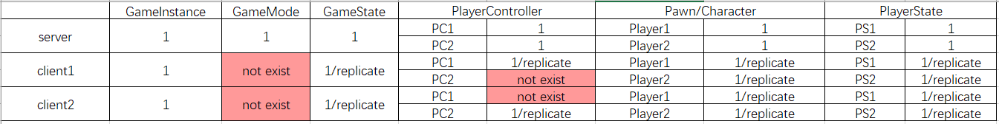
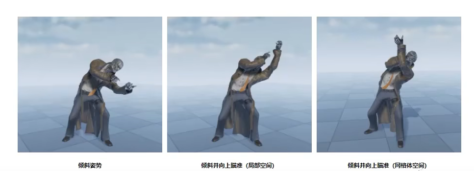

- [unreal](#unreal)
- [编辑器](#编辑器)
- [Gameplay Framework](#gameplay-framework)
  - [Actor](#actor)
  - [ActorComponent](#actorcomponent)
  - [Pawn and Character](#pawn-and-character)
  - [PlayerController and PlayerState](#playercontroller-and-playerstate)
  - [GameMode and GameStateBase](#gamemode-and-gamestatebase)
  - [Static Mesh](#static-mesh)
- [武器系统 Weapon](#武器系统-weapon)
  - [拾取武器](#拾取武器)
  - [伤害系统](#伤害系统)
  - [瞄准](#瞄准)
- [碰撞系统](#碰撞系统)
- [碰撞系统 和 物理模拟](#碰撞系统-和-物理模拟)
- [人物系统 Character](#人物系统-character)
  - [移动](#移动)
  - [伤害系统](#伤害系统-1)
  - [ThirdPersonCharacter （Blueprint Class)](#thirdpersoncharacter-blueprint-class)
  - [人物骨架](#人物骨架)
  - [换装系统](#换装系统)
  - [伤害过程](#伤害过程)
  - [死亡模拟](#死亡模拟)
- [调试](#调试)
  - [Debug Console Variable](#debug-console-variable)
- [c++ 创建actor提供给unreal使用](#c-创建actor提供给unreal使用)
- [unreal engine project](#unreal-engine-project)
- [摄像机](#摄像机)
- [UE4 网络游戏](#ue4-网络游戏)
  - [Actor Replication](#actor-replication)
  - [Variable Replication](#variable-replication)
  - [Event Replication](#event-replication)
  - [RPC](#rpc)
- [动画系统](#动画系统)
  - [动画重定向（retarget）](#动画重定向retarget)
  - [动画混合空间 （Blend Space)](#动画混合空间-blend-space)
  - [动画蒙太奇 （Animation Montage）](#动画蒙太奇-animation-montage)
  - [逆向运动学（Inverse Kinematics）  IK vs FK](#逆向运动学inverse-kinematics--ik-vs-fk)
    - [动画坐标空间](#动画坐标空间)
  - [Aim Offset 瞄准偏移](#aim-offset-瞄准偏移)
  - [additive anim 叠加动画](#additive-anim-叠加动画)
  - [IK](#ik)
  - [two bone IK](#two-bone-ik)
- [UI系统](#ui系统)
- [材质(Materials)](#材质materials)
- [光源(Light) 和 视觉效果（Visual Effects）](#光源light-和-视觉效果visual-effects)
- [蓝图 （blueprint）](#蓝图-blueprint)
- [关卡环境设计](#关卡环境设计)
  - [相关课程](#相关课程)
- [unreal c++ doc](#unreal-c-doc)
- [online subsystem steam](#online-subsystem-steam)
- [游戏分类](#游戏分类)
- [游戏逻辑](#游戏逻辑)
  - [结束逻辑](#结束逻辑)
- [Blueprint 和 c++ 协作](#blueprint-和-c-协作)

# unreal

Unreal Engine 5 Beginner Tutorial - UE5 Starter Course!
https://www.youtube.com/watch?v=gQmiqmxJMtA&list=PLKPWwh_viQMGQkQfKKD5lF96efA3_RWt-

跑酷项目
https://www.youtube.com/watch?v=9qHRQF3YXZs&list=PLX2_v3fTeazrzhJcnEMvgpMPCghfy1H8p&index=3

- location单位是厘米
- scale单位是米

# 编辑器

框选物体：  Ctrl + Alt + 鼠标左键
物体自由下落： End

分组： Ctrl + G， 解组：Shift +G 

# Gameplay Framework

https://www.tomlooman.com/ue4-gameplay-framework/

## Actor

- 骨骼网格物体 Actor
- 静态网格物体 Actor

Actor的Role/RemoteRole属性

服务端：
Role == ROLE_Authority
RemoteRole == ROLE_SimulatedProxy || ROLE_AutonomousProxy

客户端：
Role == ROLE_SimulatedProxy || ROLE_AutonomousProxy
RemoteRole == ROLE_Authority

## ActorComponent

AttachToComponent

UActorComponent

- UActorComponent （无形状）
  - USceneComponent （有位置， 无形状）
    - UPrimitiveComponent

## Pawn and Character

交通工具， 战士，等通常用Pawn进行表示

Character是Pawn的子类， 实现了SkeletalMesh和CharacterMovementComponent

## PlayerController and PlayerState

人物，交通工具等用Pawn来呈现

PlayerController和Pawn为一对多的关系， PlayerController通过Process来绑定需要操作的Pawn

```c++
GetWorld()->GetPlayerControllerIterator() // GetWorld is available in any Actor instance
PlayerState->GetOwner() // owner of playerstate is of type PlayerController, you will need to cast it to PlayerController yourself.
Pawn->GetController() // Only set when the pawn is currently ‘possessed’ (ie. controlled) by a PlayerController.
```

客户端上仅有玩家自身对应的PlayerController， 没有其他玩家对应的PlayerController，因此PlayerController不适合
存储玩家的数据， 当想要访问其他玩家的数据时，可以使用PlayerState进行存储

关卡蓝图中获取对象

- GetPlayerController
- GetPlayerCharacter

关卡蓝图中动态生成对象
Spawn Actor from Class

### Event On Possess
PlayerController的Event On Possess只会在服务器端执行

## GameMode and GameStateBase

- AGameModeBase::PreLogin  是否接受客户端的加入地图
- AGameModeBase::Login 为玩家创建PlayerController
- AGameModeBase::PostLogin

GameModeBase 中的SpawnDefaultPawnAtTransform为玩家创建Pawn

GameMode 仅存在于服务器端

GameState 存储服务端和客户端恭喜的全局信息

- 连接游戏的玩家

## Static Mesh

StaicMesh - UStaticMesh
SkeletalMesh - UPhysicsAsset

# 武器系统 Weapon

Weapon

- AAcotr
  - AWeapon （自定义武器类）
    - USkeletalMeshComponent （武器外形组件） 可以在编辑器中选择skeletal mesh进行绑定
    - GetOwner() 获取武器正在被谁持有
    - 

武器基类
  - 开火功能
    - 射击起点：相机位置GetWorldLocation
    - 射击终点：相机方向某一距离GetFowardVector
    - 检测起点和终点之间发生的碰撞：LineTraceByChannel
  - 总弹药量， 弹匣容量， 当前弹匣量


## 拾取武器

- 构建武器AActor
- 人物skeleton mesh添加插槽, 武器在人物插槽上的位置预览和调整位置
- 在人物（pawn）创建后（AGameMode::RestartPlayer)或者BeginPlay时SpawnActor创建武器，并AttachActorToComponent到人物上, 设置socket name
- 武器添加碰撞
- 人物何时可以捡取武器， 射线碰撞，按键

  - Settings -> Project Settings -> Engine -> Collision -> Trace Channels
  - SphereTraceByChannel 相机发射直线射线， 检测碰撞
- 拾取武器

  - AttachToComponent 武器绑定到人物的skeletal mesh component上
- 扔掉武器

  - DetachFromComponent

## 武器开火
- 人物Character扣动武器扳机， 因此在人物蓝图中设置按键输入事件
- Character蓝图通过set timer by event来模拟扣动扳机过程
  - time 参数可以用来模拟武器射速
  - looping 参数可以用来模拟武器是单点还是全自动

## 武器子弹
- 使用Actor创建实体 or 使用射线

使用结构体保存武器信息
- AmmoRounds 弹匣数
- 

## 伤害系统

- TSubclassOf `<UDamageType>` 伤害类型
- UGameplayStatics::ApplyPointDamage 点伤害

## 瞄准

获取瞄准方向，由pitch和yaw表达
GetAimBaseRotation
GetActorRotation

使用瞄准偏移Aim Offset 1D呈现动画


## 相关教程
https://www.bilibili.com/video/av28206952/
https://www.bilibili.com/video/BV1pb41177pn?p=27&vd_source=05b9e112882cf3fe738863375b088e4c

# 碰撞系统

Trace Channel


## HitResult

https://blog.csdn.net/tkokof1/article/details/118065681

- Trace Start： 碰撞检测的起点位置
- Trace End：碰撞检测的终点位置
- Location：Trace Start与Trace End构成的线段与首次碰撞面的交点
- Impact Point：碰撞接触点

- Impact Normal：碰撞接触点的法线方向

# 碰撞系统 和 物理模拟

- FCollisionQueryParams

  - AddIgnoredActor 碰撞忽略的Actor
  - bTraceComplex = true 碰撞情况捕捉更加精细
- FHitResult 碰撞结果
- GetWorld()->LineTraceSingleByChannel 直线碰撞

# 人物系统 Character

被物理力作用的Static Mesh

- Physics -> Simulate Physics  (true)
- Collision -> Generate Overlay Events (true)

如何施加力

- Add Force
- Add Radial Force

## 移动和坐标系

- 大多数建模软件使用的是right-handed的坐标系统， UE选择的是left-handed坐标系
- unreal的人物模型在local object space一般都是朝向y轴正方向的， 在world space中一般会设置rotation z=270°， 让人物正面面向world space X轴正方向。

鼠标 -> Controller

鼠标移动影响的是Controller的Yaw和Pitch, 在人物Character中进行编程
- mouse turn right/left -> AddControllerYawInput
- mouse look up/down -> AddControllerPitchInput
- Pitch会被限制在[-90, 90], Yaw可以无限转动

Controller -> Camera
- 第三人称的FollowCamera组件通常使用Spring Arm Component
- Spring Arm Component：Use Pawn Control Rotation 可以控制Controller和Camera的旋转变换进行同步
但是当Camera的Forward Direction和人物的Forward Direction不一致时， 

Camera -> Character
Character Class Defaults 中，Pawn是否使用Controller的Roll/Yaw/Pitch
- Use Controller Rotation Yaw 设置后可以让人物和Camera的相机的Yaw进行同步
- 用按键设置Use Controller Rotation Yaw的值可以实现自由转动视角和固定视角的切换
- Character Movement Component的Orient Rotation To Movement设置为True时， 会影响摄像机Camera的旋转


人物移动控制

- 移动方向与controller的roation相关， Get Forward/Right Vector
- Character Movement Component
  - 人物的行走， 跳跃/坠落相关属性设置
- 前后左右移动： AddMovementInput

  - Character->Pawn->Use Controller Rotation


### 8向移动

以摄像机的Forward方向为正北方向， 玩家可以用WASD控制在正北方向相匹配的8个方向上移动


实现方式一：
- Character类的Use Controller Rotation Yaw 设置为true
- Character Movement Component的Orient Rotation To Movement（是否将人物正面朝向移动方向）设置为false

问题： 原地转向没有动画


## 原地转向


## 伤害系统

- TSubclassOf `<UDamageType>` 伤害类型
- UGameplayStatics::ApplyPointDamage 点伤害

## ThirdPersonCharacter （Blueprint Class)

- ThirdPersonCharacter （Blueprint Class)
  - CapsuleComponent
    - SkeletalMeshComponent
      - SkeletalMesh
      - Animation
      - Material

Input -> Bindings -> Action Mappings
PlayerInputCompo

CharacterBP

- CharacterMesh (绑定人物mesh)
- Animation (绑定人物动画蓝图BP)


## 人物骨架

1. mixamo 获取人物（mesh 和 skeleton）
2. mixamo 人物Retarget
   1. select Rig： humanoid
   2. source -> target 骨架映射
3. 已有人物skeleton上 select Rig： humanoid
4. 已有动画蓝图（Animation Blueprint）上 Retarget Anim
5. CharacterBP上绑定迁移好的skeleton 和 动画蓝图
6. 工程设置中， default pawn 使用新的CharacterBP

---
|     |     |
| ------ | ------ |
| pelvis | 骨盆 |
| spine  | 脊柱 |
| thigh  | 大腿 |
| clavicle | 锁骨 |
|   |  |

- pelvis 上有三段spine
- 

## 换装系统

- set master pose component

宏（UHT, Unreal Header Tool进行解析）
UPROPERTY

UFUNCTION

- Client: 函数在Server上调用, 在Client上执行
- Server :  函数在Client上调用, 在Server上执行
- NetMulticast： 函数在Server上调用， 在Server和所有Client上都会执行
- Reliable
- BlueprintCallable

Connection ownership

Actor 拥有Connection，  connection和PlayerController一一对应，一个Actor最外层对应的PlayerController决定了
该Actor的Connection
https://docs.unrealengine.com/en-US/Gameplay/Networking/Actors/OwningConnections/index.html

## 伤害过程

Actor 自定义事件，接收伤害数值

通过碰撞事件获取到处于overlay的Actor， 调用Actor的承伤函数

## 死亡模拟

- CharacterMesh
  - Set Simulate Physics
    - Set Collision Profile Name (Ragdoll)

# AI系统

AIController只存在于服务端

AIController一般在Event On Possess时，通过RunBehaviorTree执行行为树来控制AI Pawn的行为

## Behavior Tree

- selector: 从左到右执行， 


BTTask_BlueprintBase


## 自动寻路

Navmesh

- PathFollowingComponent： 调用AIController::RequestMove来请求PathFollowingComponent执行一次移动

## AI调试

```
p.VisualizeMovement 1
```

# 调试系统

- DrawDebugLine

## Debug Console Variable

```c++
int32 debug_switch=0;
FAutoConsoleVariableRef CVARDebug(TEXT("NameCate.NameVar"), debug_switch, TEXT("help info"), ECVF_Cheat)
```

# c++ 创建actor提供给unreal使用

https://docs.unrealengine.com/en-US/Programming/QuickStart/index.html

# unreal engine project

> 项目入口

Project Settings -> Maps & Modes -> Default Maps 设置游戏启动时的第一个关卡

关卡蓝图的Event BeginPlay事件中， 使用Create Widget创建UI中的Widget Blueprint

Widget Blueprint的Designer界面负责设计UI, Graph界面负责逻辑代码， Button的Events中关联事件，
使用Open Level打开游戏地图关卡

地图关卡设计界面 Window > World Settings 中可以设置每个关卡自己的Game Mode，未设置时使用的是Project Settings中设置的Game Mode
Game Mode 负责处理玩家的生成， 在Player Start出生成玩家(Character)，
AGameMode::RestartPlayer(class AController* NewPlayer)负责玩家的出生过程
https://www.bilibili.com/video/BV1pb41177pn?p=84 （085 Replicate Weapon Code Part 1）

Character的BeginPlay被调用， 在Character中创建武器时， 只需要在服务器端执行SpawnActor的代码， 并把武器类设置为Replicate和
把Character中保存的武器生成后变量设置为replicated。
这样多个客户端都能看到武器并通过变量操作武器

Edit > Project Settings > Input 输入

> GameInstance

全局对象，生存周期为整个进程, 进程启动时蓝图系统会自动生成该对象
Project Settings -> Maps & Modes -> Game Instance Class

> GameMode

只存在于服务器端，
Project Settings -> Maps & Modes -> Default Game Mode

> Package

# 摄像机

set_active

# UE4 网络游戏

https://docs.unrealengine.com/en-US/Gameplay/Networking/Overview/index.html



1. GameInstance各自存在，没有复制
2. GameMode只存在于server上， clent上不存在 (通过AGameModeBase的bNetLoadOnClient = false实现)
3. PlayerController在其他玩家的client上不存在
4. Hud相关API不能再server上调用

例如： PlayerController的BeginPlay事件中调用Add to Viewport会报错
```
Only Local Player Controllers can be assigned to widgets. My_Player_Controller_C_1 is not a Local Player Controller.
```
这是因为Add to Viewport只能在客户端上运行。

解决办法：

方法一： 使用Is Local Player Controller， 当为true时， 才执行UI逻辑代码

方法二：
1. 将UI逻辑相关代码封装在Run On Owning Client类型的事件中， 在PlayerController的BeginPlay中调用该事件
2. 当服务端调用这个事件时， 代码仅仅会运行在该PlayerController所Own的那个客户端上，这样保证了UI只出现在玩家自己的屏幕上
3. 当客户端上运行PlayerController的BeginPlay代码时，调用这个事件的代码什么也不做。

## listen server 和 delicated server


delicated server模式， num_player=2 
服务器日志：
```
LogBlueprintUserMessages: [Player_Controller_C_0] PlayerController BeginPlay
LogBlueprintUserMessages: [Player_Controller_C_1] PlayerController BeginPlay
```
client 1日志：
```
LogBlueprintUserMessages: [Player_Controller_C_0] PlayerController BeginPlay
```
client 2日志
```
LogBlueprintUserMessages: [Player_Controller_C_0] PlayerController BeginPlay
```

listen server模式， num_player=2 

服务器日志：
```
LogBlueprintUserMessages: [Player_Controller_C_0] PlayerController BeginPlay
LogBlueprintUserMessages: [Player_Controller_C_1] PlayerController BeginPlay
```
客户端日志：
```
LogBlueprintUserMessages: [Player_Controller_C_0] PlayerController BeginPlay
```

结论： PlayerController BeginPlay 在server上会执行两次， 在client上会执行一次, 这意味着server上那个玩家的PlayerController只有一份，是比较特殊的存在。

## Actor Replication

1. 在c++ actor类的构造函数中调用

```
SetReplicates(true);
```

2. 在蓝图 actor类的属性设置中勾选Replicates
3. actor 设置为Replicates后， 只需要在服务器上进行spawn(服务器会通过网络的方式告知客户端也spawn相应的actor， 这是由UE4引擎自动完成的)， 可以通过ROLE_Authority来保证代码只运行在服务端

```
if (Role == ROLE_Authority) {
  GetWorld()->SpawnActor<AActor>(AActorClass, ...)
}
```

不设置replication时, spawn生成的actor只有本机可见，其他机器不可见

将spawn的代码逻辑只需要在服务端执行, 可以将代码放置在UFUNCTION中, 客户端调用UFUNCTION包裹的函数时(会进行RPC请求），
代码会在服务器上执行， 服务器自动将数据同步给客户端进行模拟

replicated actor可以通过Role可以判断是否只在服务器端执行

## Variable Replication

应用场景示例： 客户端人物标识是否携带目标的变量， 需要客户端同步该变量到服务器以判断游戏是否结束

1. 头文件中使用UPROPERTY(Replicated)修饰变量
2. 源文件中#include "Net/UnrealNetwork.h"
3. 源文件中GetLifetimeReplicatedProps函数中使用DOREPLIFETIME宏配置变量

控制同步方式， 以节省带宽

- DOREPLIFETIME_CONDITION
  - COND_OwnerOnly

## Event Replication

- Multicast
- Run on Server (replicate event from client to server)
- Run on owning Client （replicate event from server to owning client）

## RPC

UFUNCTION(Client): 函数在客户端执行，在服务端发起调用
UFUNCTION(Server): 函数在服务端执行，在客户端发起调用
UFUNCTION(NetMulticast): 函数在所有端执行， 在服务端发起调用

```
UFUNCTION(Server, Reliable, WithValidation)
```

- Reliable: 可靠调用
- WithValidation： 验证

# 动画系统

## 基础概念

skeleton (骨骼)： Skeleton Tree 树形层级定义

- skeleton tree
  - retarget （迁移动画）

skeletal mesh （网格体）： 可以设置Material， 相当于皮肤

pyhsics asset（人体物理约束）： 可以设置物理约束

PoseAsset
  Curve

同步组： 解决动画时间长度不同， 进行混合时造成的问题
曲线：通过曲线控制动画序列
1. 控制材质和变形
2. AnimGraph中常用曲线控制动画混合
动画通知： 在动画的关键帧上驱动粒子，音效，布料等外部事物的运行

## 动画序列 Animation Sequence
时间序列，每个时间点保存一帧动画，

## additive anim 叠加动画

- zero pose
- additive Anim Type： Mesh space 和 Local Space的区别是什么？(瞄准偏移必须使用Mesh space 确保朝向始终一致)


叠加动画本身也是Animation Sequence， Asset Details -> Additive Anim Type中一般选择为Local Space 或者 Mesh Space， 叠加动画保存的是相对于基础姿势的增量数据，基础动画+叠加动画可以形成动作增量改变。

叠加动画混合节点
- Apply Additive
- Apply Mesh Space Additive

## 动画蓝图 （Animation Blueprint）
Character类 -> CharacterMesh -> Anim Class 给人物选择动画蓝图

- 动画蓝图（Animation Blueprint）
  - Event Graph (蓝图初始化和更新事件， 用于获取人物状态)
  - Anim Graph （Animation State Machine）用于评估当前帧的骨架网格体最终姿势

常用节点

- Apply Additive
  - 使用示例： 瞄准偏移

- make dynamic additive
  - additive pose - base pose
  - mesh space vs local space
  - 输出的pose得到的就是additive动画， 在后续通过apply additive节点来进一步使用

- Inertialization 惯性化
  -

- Modify Curve

- Control Rig

UE5 动画蓝图

设计动画蓝图基类， 不直接包含动画资产，而是用来混合动画（e.g. blending upper and lower body poses together）， 
- Linked Animation Layers
- Montages
优点： 可以实现只加载相关的动画， 例如当持有武器时，才加载武器相关的动画

改变：

- 动画蓝图基类不再使用Event Graph， 而是使用BlueprintThreadsafeUpdateAnimation 和 use the Property Access system to access data

- 动画蓝图基类 -> AnimGraph 定义状态机
- AnimLayerInterface定义状态接口


Lyra示例：

接口工具类
- 创建动画蓝图基类ABP_Mannequin_Base(Animation Blueprint)
- 创建ALI_ItemAnimLayers（AnimLayerInterface）
  - 动画蓝图基类ABP_Mannequin_Base的Class Setting中设置Interface
  - ABP_Mannequin_Base状态机中Interface和状态输出进行绑定

接口实现公共类
- 创建动画蓝图基类ABP_ItemAnimLayersBase(Animation Blueprint)
  - 动画蓝图基类ABP_ItemAnimLayersBase的Class Setting中实现ALI_ItemAnimLayers接口
  - 实现ALI_ItemAnimLayers中定义的接口
    - sequence player
    - set sequence with inertial blending
    - sequence参数设置成变量， 以便子类进行配置

接口实现具体类
- 创建ABP_ItemAnimLayersBase的子类ABP_UnarmedAnimLayers 
  - 可视化配置相应的动画

接口应用过程
- 人物蓝图的Mesh中设置动画蓝图ABP_Mannequin_Base
- 通过Mesh的Link Anim Class Layers绑定接口实现具体类ABP_UnarmedAnimLayers 

接口实现公共类（ABP_ItemAnimLayersBase）如何访问接口工具类（ABP_Mannequin_Base）的数据
- 在接口工具类（ABP_Mannequin_Base）中定义函数， 设置为纯函数（Pure）， 和线程安全
- 返回值设置为ReturnValue（这样才能在属性存取中显示）


Linked Anim Layer 使用流程
1. 约定接口方法
2. 动画蓝图接口工具类的Blueprint Thread Safe Update Animation函数中Property Access获取数据
3. 动画蓝图接口工具类的AnimGraph中使用Linked Anim Layer节点调用接口， 可以向接口传递参数
4. 动画蓝图接口实现公共类中实现约定的接口方法


## 动画重定向（retarget）

使用骨骼自身的平移数据（这样能保障骨骼结构不发生变化）， 仅仅迁移动画中的旋转数据

递归设置平移重定向：
- 骨骼： 表示动画的平移数据从骨骼中获得


重定向过程
- 一个带动画的skeleton A， 一个无动画的skeleton B， 将A的动画迁移到B
- 原理： 将A和B的skeleton 映射对齐， 就能将A的动画自动迁移到B上
- 在A的Retarget Manager界面中， Select Rig -> Select Humanoid Rig,  相当于将A的skeleton和标准skeleton对齐
- 在B的Retarget Manager界面中， Select Rig -> Select Humanoid Rig,  相当于将B的skeleton和标准skeleton对齐
- 在A的动画蓝图（Animation Blueprint）上执行Retarget Anim Blueprints，  选择Target 为B， 就能为B生成动画蓝图了

## 兼容骨骼（Compatible Skeleton）
新角色 -> skeleton窗口 -> 窗口菜单(window) -> 资产详情（Asset Details） -> 添加兼容骨骼 -> 选择SK_Mannequin（UE5 Lyra） 

新角色就可以使用SK_Mannequin（UE5 Lyra） 的动画蓝图了


## 动画混合空间 （Blend Space)

## 动画蒙太奇 （Animation Montage）
- 剪辑： 蒙太奇可以包括多个剪辑片段
- 可以通过程序控制播放哪个片段
- 停止蒙太奇播放

- Animation Sequence 右键可以创建Animation Montage
- Play Montage要借助Anim Slot才能播放， 在Anim Graph中添加Anim Slot， 在Montage中选择Slot后， Montage的pose才会在Anim Graph中生效， 通常还要使用Layered Blend Per Bone对Montage的动画进行混合。


- Play Montage (可以设置多个回调， Notify, Blend事件)
- Play Anim Montage


## AnimNotify 动画通知

- Received_Notify

## 动画修改器 AnimationModifier
帮助生成动画曲线

## 逆向运动学（Inverse Kinematics）  IK vs FK

使用IK调整动画

1. 在character中计算得到末端执行器的位置

### 动画坐标空间

1. 角色动画的计算发生在局部（Local)空间， 相对于骨骼的Root进行计算，
2. Final Animation Pose 也只能接收局部（Local)空间的数据
3. IK的计算

## Aim Offset 瞄准偏移

瞄准偏移使用叠加动画实现，本质上是Blend Space


选择 网格体空间（Mesh Space） ，而非局部空间（Local Space） 的原因在于，选择网格体空间后，可以在 骨骼网格体组件（Skeletal Mesh Component） 的空间中应用其叠加效果。这能确保无论骨骼网格体中前一个骨骼的朝向如何，旋转都朝同一方向移动。这对于瞄准偏移很重要，因为在某些情况下，无论角色的当前基础姿势如何，你可能希望来自混合空间的旋转得到一致的应用。


axis setting： pitch [-90, 90]
aim offset 本质上是asset，
常驻动画（如奔跑， 跳跃） 用状态机进行控制

- play montage （在动画不同时机执行不同程序）
- play anim montage
- paly Animation

1. 人物蓝图， 按键事件， play montage
2. 拔枪动画，创建动画蒙太奇montage，
3. 动画蓝图， 新增Anim slot，
4. 拔枪动画选择3中新增的slot
5. 动画蓝图输出，
6. layered blend per bone 对骨架的不同部分进行动画混合

保存状态机输出pose： default pose -> cached default pose
构建上肢动画： cache default pose -> upper slot -> upper pose
混合： base pose 使用cached default pose， pose 0 使用upper pose, layer setup中对base pose设置过滤条件branch filter（ 设置的bone表示不要修改该bone下对应的动画）


## 骨骼控制

Transform（Modify）Bone


## IK IK骨骼 虚拟骨骼

IK骨骼层级是独立的， 可以让武器位置在动画迁移后位置保持不变

问题： 如果源骨架和目标骨架高度不同， IK骨架只是让武器位置在Mesh Space位置保持不变，重定向后会导致握武器的位置过高（矮角色使用高角色的动画）或者过低（高角色使用低角色的动画）

虚拟骨骼会自动计算目标骨骼和IK骨骼之间的平移偏量， 这样虚拟骨骼挂载在目标骨骼层级下时，可以将武器绑定到虚拟骨骼上。

## 脚部IK

适应场景
- 楼梯平面
  - 计算脚底和碰撞点距离偏差
- 斜面
  - 脚底和碰撞点距离， 脚部旋转量
- 曲面
  - 

何时进行脚部IK
root位置Z轴高度为判断平面T， 检查左脚后跟位置， 右脚后跟位置的地形高度相对于平面T是否有变化

修改骨骼位置Transform（Modify）Bone

缺点： 可能会产生骨骼分离的现象


### two bone IK

IK bone  要控制的目标关节

Effector Location （目标关节想要达到的位置）

Joint Target 限制关节

控制原理： 例如以控制右手（hand_r)位置为目标， 上臂关节（UpperArm_R）和右手（hand_r)的位置是确定的， 人的上臂和下臂距离是确定的， 因此肘关节（lowerarm_r）的位置可以在一个平面上活动， 通过三点共面原理来确定到底要位于哪个平面， 因此存在一个Joint Target Location参数来确定平面

例如：左手臂骨骼结构

- LeftShoulder （左肩膀）
  - LeftArm （左上臂）
    - LeftForeArm （左下臂）
      - LeftHand （左手）
      - 

 选择LeftHand为IK bone
 选择RightHand为Effector Target
 选择LeftForeArm为Joint Target

 ## 相关教程
Animation Essentials - Unreal Engine 4 Course

https://www.youtube.com/playlist?list=PLL0cLF8gjBpqpCGt9ayn4Ip1p6kvgXYi2

动画重定向 retarget
https://www.youtube.com/watch?v=92rag3qStI4

UE5 Lyra动画 https://www.bilibili.com/video/BV1X34y1p76u/?spm_id_from=333.999.0.0&vd_source=05b9e112882cf3fe738863375b088e4c


虚幻4（UE4） 动画技术 深入浅出 高级运动系统 https://www.bilibili.com/video/BV12f4y1r71N?p=17&vd_source=05b9e112882cf3fe738863375b088e4c

# UI系统

- create widget
- add to viewport
- set show mouse cursor

Actor添加Widget组件， 可以将ui和Actor进行绑定
Pawn添加Widget Interaction组件， 通过Get Hit Result Under Cursor by Channel获取用户点击位置，  用Find look at Rotation计算出旋转角度， 调整Widget Interaction组件的旋转来指向点击位置

- Overlay 分层布局， 如在背景图片之上添加新的UI

- TileView 列表视图，平铺相同的元素

# 材质(Materials)

材质编辑器构建材质， 对应High-Level Shading Language(HLSL)代码

Texture Sample

Material Function
Material Blend

- 材质混合
- Use good Texture
- Use Macro Variation (对T_MacroVariation纹理使用多种不同的uv， 控制和改变目标纹理）
- Use Distance Blend （以玩家为中心， startoffset(eg. -2000)， Blend Range（边界模糊 eg：10000）distance blend输出为alpha，  近处使用细节纹理， 远处使用粗糙纹理）
- Use BlendMaterialAttributes(使用Perlin noise纹理作为alpha控制多个纹理的混合， 例如草地和泥土的混合)

# 光源(Light) 和 视觉效果（Visual Effects）

- 点光源 (如灯泡)
- 聚光源
- 定向光源(Directional Ligh)
  - 大气太阳光（Atmosphere Sun Light）
    - SkyAtmosphere (天空半球变蓝)
    - ExponentialHeightFog(使用雾填充天空和地图的黑色间隙)
    - project setting -> support sky atmosphere affecting heightfog (太阳降落后，天空变黑)
    - sky light (天光反射)

# 蓝图 （blueprint）

- 关卡蓝图 （level blueprint）
  - BeginPlay
  - Character (actor blueprint)

# 关卡环境设计

Blockout 草图


landscape

scale: 100 表示100cm即1m
Quad：1个quad表示长宽均为scale的方块， 默认即1平方米
section size： 63*63 quads  （一个section由64个quad构成）
sections per component： 1 * 1 sections
number of components： 8 * 8 （landscape可以看作一个Actor， Actor包含了多少个components）

left mouse： 凸起
shift + left mouse： 凹陷


landmass插件

## 相关课程
环境美术进阶技能 https://learn.unrealengine.com/course/3783977 

# unreal c++

## 官方文档doc
1. 编程和脚本编写 > 编程指南 > 编程快速入门 (C++ Actor)
   https://docs.unrealengine.com/4.27/zh-CN/ProgrammingAndScripting/ProgrammingWithCPP/CPPProgrammingQuickStart/
2. 编程和脚本编写 > 编程指南 > C++ 编程教程 > 游戏控制的摄像机 ()

## delegate

- 蓝图中绑定事件回调时 eg: OnSeePawn， 使用的是delegate
- C++中为`FSeePawnDelegate onSeePawn;`, 使用AddDynamic函数设置绑定

# online subsystem steam

1. Edit->plugins: enable online subsystem steam

2. Config/DefaultEngine.ini 中添加如下内容
```
[/Script/Engine.GameEngine]
+NetDriverDefinitions=(DefName="GameNetDriver",DriverClassName="OnlineSubsystemSteam.SteamNetDriver",DriverClassNameFallback="OnlineSubsystemUtils.IpNetDriver")

[OnlineSubsystem]
DefaultPlatformService=Steam

[OnlineSubsystemSteam]
bEnabled=true
SteamDevAppId=480

; If using Sessions
; bInitServerOnClient=true

[/Script/OnlineSubsystemSteam.SteamNetDriver]
NetConnectionClassName="OnlineSubsystemSteam.SteamNetConnection"
```
3. 打开并登录steam客户端
4. 工程文件夹下， 右击工程文件launch game, 或者使用Standalone Game运行游戏(同时Net Mode选择Play As Standalone和一个玩家， 不要使用Play As Client 或者Play As Listen Server， 因为该模式会导致服务端功能和客户端功能都运行，但online subsystem steam 不支持运行在同一台机器上)


打开online subsystem steam的情况下， Number of Players设置为1

使用Play As Listen Server启动时，出现一个窗口和一个日志文件，日志会出现： 
```
LogNet: GameNetDriver SteamNetDriver_0 IpNetDriver listening on port 17777

LogOnlineSession: Warning: STEAM: No game present to join for session (GameSession)
```

使用Play As Clent启动时，出现两个窗口和两个日志文件（Saved/Logs目录） 
控制台窗口服务端日志文件会出现：
```
LogCsvProfiler: Display: Metadata set : commandline="" E:/workspace/unreal/OpenWorld/OpenWorld.uproject /Game/Maps/MainMap -game -PIEVIACONSOLE -Multiprocess -server -log GameUserSettingsINI=PIEGameUserSettings0 -MultiprocessSaveConfig -forcepassthrough -messaging -SessionName="Play in Standalone Game" -port=17777 -windowed""

LogNet: Created socket for bind address: 0.0.0.0 on port 17777

LogOnline: Warning: STEAM: Failed to initialize Steam, this could be due to a Steam server and client running on the same machine. Try running with -NOSTEAM on the cmdline to disable.

LogSteamShared: Warning: Steam Dedicated Server API failed to initialize.

Login request: ?Name= xxx_name: userId: STEAM:xxx_id platform: STEAM
```
commandline启动带有listen的服务器

客户端日志会出现：
```
LogNet: Game client on port 17777, rate 100000

```


问题： 如何单独对开启online subsystem steam的服务端（Dedicated Server）实现运行和调试呢

## 使用一台电脑对online subsystem steam多人联机进行测试
- 使用hyper-v建立windows虚拟机
  - gpu虚拟化 
  - 网络使用 【外部网路虚拟交换机】，让物理主机和虚拟机处在同一个局域网
  - 网络防火墙关闭
- 使用Use LAN模式， 两个steam账号进行多人联机测试，一台client进行Create Session， 另一台client进行Find Sessions和Join Session是可以测试成功的。
- 非Use LAN模式，可能需要NAT才能完成多人联网


# 游戏分类

- MMO （massively multiplayer online）大型多人在线
- RPG（role-playing game） 角色扮演游戏

# 游戏逻辑

## 结束逻辑

- 通关口与玩家Overlap
  - 判断玩家状态
    - 获取GameMode，调用结束游戏函数（只会在服务器上执行）
      - 通过GameState中的UFUNCTION(NetMulticast)函数让所有客户端执行结束函数功能

## 保存游戏
游戏数据由Save Game类型的对象进行保存和序列化
- 创建游戏存档（Create Save Game）
- 判断游戏存档是否存在（Does Save Game Exist）
- 保存游戏存档（Save Game to Slot）， Run on Server

# Blueprint 和 c++ 协作

- c++ 使用 Blueprint中定义的类型， 在cpp头文件中声明TSubclassOf `<AAtor>`类型变量， 并公开到蓝图进行编辑

# 仓库系统Inventory

- 使用Actor Component实现仓库基类BPC_InventoryBase
  - 创建BPC_InventoryBase(Actor Component)的子类来表达不同类型的仓库系统， 如人物背包系统， 车载系统


# unreal git

.gitignore
```
# unreal
Binaries
DerivedDataCache
Intermediate
Saved
Build
Packaged
```


# Unreal 子系统常用开发

- Enum
- Structure
- DataTable

# Unreal Media

- 创建Media Source，并绑定上视频文件
- 创建Media Player，生成Media Texture， 在Media Texture上创建Material
- 创建Actor蓝图类， 
  - 添加Media Sound Component组件，绑定Media Player
  - 添加Cube组件，绑定Media Texture生成的Material
  - 添加MediaPlayer类型变量，使用Open Source来播放文件 

如何动态根据视频创建Material呢

# Unreal Packaging 打包设置

- 设置要打包的地图 （Project Settings > Packaging > List of maps to include in packaged build), `eg: /Game/Maps/Level1`


# unreal 开发常见问题


网络问题

现象： 不登录steam时，Use LAN可以正常联机； 登录steam后，Use LAN 联机出现UEngine::BroadcastNetworkFailure错误

eg: 服务端Create Session为192.168.0.103:7777
```
LogNet: Warning: UNetConnection::Tick: Connection TIMED OUT. Closing connection.. Elapsed: 20.00, Real: 20.00, Good: 20.00, DriverTime: 20.nection] RemoteAddr: 192.168.0.103:7777, Name: SteamNetConnection_xxxx1, Driver: PendingNetDriver SteamNetDriver_xxxx,  NULL, UniqueId: INVALID
LogNet: Error: UEngine::BroadcastNetworkFailure: FailureType = ConnectionTimeout, ErrorString = UNetConnection::Tick: Connection TIMED sed: 20.00, Real: 20.00, Good: 20.00, DriverTime: 20.02, Threshold: 20.00, [UNetConnection] RemoteAddr: 192.168.0.103:7777, Name:  Driver: PendingNetDriver SteamNetDriver_xxxx, IsServer: NO, PC: NULL, Owner: NULL, UniqueId: INVALID, Driver = PendingNetDriver 
LogNet: Warning: Network Failure: PendingNetDriver[ConnectionTimeout]: UNetConnection::Tick: Connection TIMED OUT. Closing connection.. ood: 20.00, DriverTime: 20.02, Threshold: 20.00, [UNetConnection] RemoteAddr: 192.168.0.103:7777, Name: SteamNetConnection_xxxx1, NetDriver_xxxx, IsServer: NO, PC: NULL, Owner: NULL, UniqueId: INVALID
LogNet: NetworkFailure: ConnectionTimeout, Error: 'UNetConnection::Tick: Connection TIMED OUT. Closing connection.. Elapsed: 20.00, Real: 20.00, Good: 20.00, DriverTime: 20.02, Threshold: 20.00, [UNetConnection] RemoteAddr: 192.168.0.103:7777, Name: SteamNetConnection_xxxx1, Driver: PendingNetDriver SteamNetDriver_xxxx, IsServer: NO, PC: NULL, Owner: NULL, UniqueId: INVALID'
LogNet: UNetConnection::Close: [UNetConnection] RemoteAddr: 192.168.0.103:7777, 
```
原因： 访问steam的网络问题， 如地址解析超时等， Open Level的方式
解决： https://forums.unrealengine.com/t/steam-client-timeout-but-works-with-null/343006/4

create session, open level使用`listen?bIsLanMatch=1`

问题： 局域网联机找不到会话， 多网卡，广播没有在所有网卡上进行探测导致的
解决： 安装WinIPBroadcast服务，https://github.com/dechamps/WinIPBroadcast


# Gameplay Ability System（GAS）

## GameplayTag

GameplayTag独立于GAS插件， 但GAS中使用了GameplayTag
https://zhuanlan.zhihu.com/p/459572003


## AbilitySystemComponent（ASC）

- AbilitySystemComponent
  - InitAbilityActorInfo 通过ASC能找到Owner Actor和AvatarActor
  - ASC的初始化InitAbilityActorInfo位置较为关键

- Owner Actor和Avatar Actor
  - Owner Actor： 当前ASC组件所挂载的Actor
  - Avatar Actor： 物理呈现ASC功能的Actor
  - 示例： PlayerState实现对玩家Character的重生能力， ASC组件挂载到PlayerState上，Owner Actor为PlayerState， Avatar Actor为玩家的Character。 
  - 当Owner Actor 和 Avatar Actor不同时， 两个Actor应该实现IAbilitySystemInterface接口，以让双方进行交互

## GameplayAbility（GA）
- GameplayAbility
  - GiveAbility函数完成能力的赋予
    - ActivatableAbilities： ASC将能力存储在这个变量中
    - GameplayAbilitySpec：服务器将GameplayAbilitySpec赋值给owning client

## AbilityTask

- PlayMontageandWaitForEvent 

Dynamic Multicast Delegate


GAS 执行流程
输入事件 -> Owner Actor call Try Activate Ability

GA技能实现 
Event ActivateAbility -> Play Montage And Wait -> Wait Gameplay Event
(Montage -> AnimNotify -> Received Notify -> Send Gameplay Event to Actor(ASC Owner Actor))

## GameplayEffect(GE)

- ApplyGameplayEffectToTarget (谁（ASC）对谁（ASC）使用了什么样的GE)


## 相关链接

【Unreal】虚幻GAS系统快速入门 https://zhuanlan.zhihu.com/p/486808688

https://nerivec.github.io/old-ue4-wiki/pages/gameplayabilities-and-you.html

GASDocumentation https://github.com/tranek/GASDocumentation


# unreal physics

- simulate physics and collision
  - 开启了模拟物理，模型必须要添加有碰撞器；没有碰撞器，无法开启模拟物理。


StaticMesh自带刚体(RigidBody)，并能执行碰撞(Collision)相关逻辑


Character 模拟物理
- mesh组件设置Simulate Physics为true
- Collision Presets： 可以选择为Ragdoll，确保Collision Enabled为Query and Physics


# unreal Material 材质

- Texture
  - RenderTarget

- Material
  - Material Function （eg: 从 World Position -> UV)
  - Material Parameter Collection (material 和 actor通信通过MPC进行中转)

Material通过TextureSample使用Texture


Mask and Lerp

- Render Target
  - Begin Draw Canvas to Render Target
  - End Draw Canvas to Render Target


- Material Parameter Collection
  - Set Vector Parameter Value


材质Debug
- Shading Model
  - Unlit
  - Emissive Color： green
  - Wireframe： true


# 摄像机系统

## 摄像机
延迟： 位置延迟和旋转延迟

UE会以AGameMode中设置DefaultPawnClass对象中摄影机作为默认摄影机

PlayerController中可以设置PlayerCameraManager


PlayerCameraManager的BlueprintUpdateCamera在每帧运行

优点： 相比在Character蓝图中使用Spring Arm的方式， Camera可以更加通用， 让不同的玩家使用公用的Camera控制逻辑。

想要Camera对不同角色有不同效果怎么办？
1. 可以通过接口来获取玩家数据

- PlayerCameraManager
  - Use Client Side Camera Updates： true表示camera的update由client处理，然后同步给服务器


