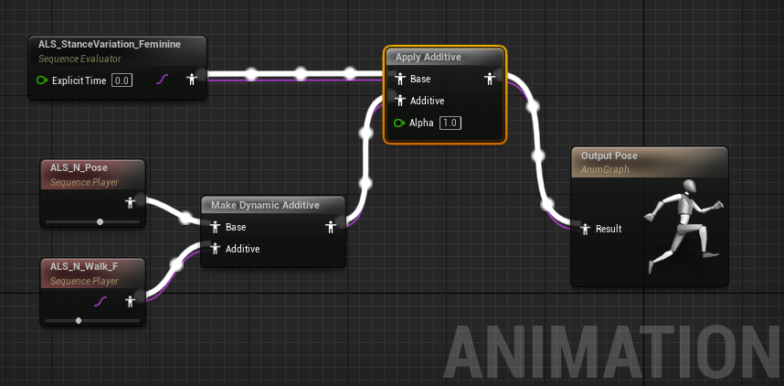

# 布娃娃起身动画

人物蓝图：
Anim Instance -> Save Pose Snapshot 

# OverLay

OverlayLayer

混合节点

- Blend
    - 应用场景
        - 例如走动画和跑动画进行Blend， 可以实现走到跑的过渡动画
    - 特点：混合的姿势介于输入姿势的中间态

- Layered blend per bone
    - 应用场景
        - 例如手臂姿势
    - 特点： 可以完全改变局部骨骼层级的姿势， 但会丢失原有的姿势

男性姿势和女性姿势的区别， 肩宽，甩臂姿势，走路姿势不同

overlay姿势简单实现

将运动系统的姿势处理成叠加动画R， 在女性姿势的动画上应用叠加动画R， 就变成女性运动动画了。

1. 正常Pose 和 正常运动动画 经过 Make Dynamic Additive 节点后得到的叠加动画， 保存了正常运动动画和正常Pose的差量数据
2. 女性Pose 和 叠加动画 经过 Apply Additive 节点后得到的就是女性运动动画

## 弓箭

Overlay State == Bow 进入装备弓箭状态

Bow States 由三种状态构成
- Bow Relaxed 手臂向下， 放松拿弓状态
- Bow Ready 弓箭拿到腹部前方，过渡状态
    - Rotation Mode从Aiming变为其他状态时， 触发一段时间的观察状态
- Bow Aiming 持弓瞄准状态