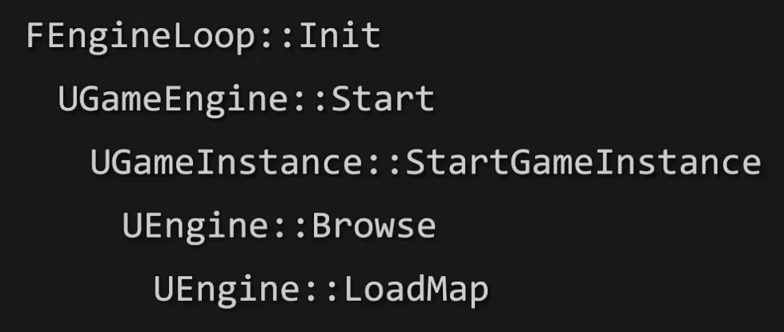

# 启动流程

# UEngine::LoadMap

- UEngine::LoadMap
    - UWorld::InitializeActorsForPlay
        - 服务器和客户端都打印日志： Bringing up level for play took

## 相关链接

UE4游戏框架：从int main()到BeginPlay

https://www.bilibili.com/video/BV1NA411L7x4/?spm_id_from=333.999.0.0&vd_source=05b9e112882cf3fe738863375b088e4c