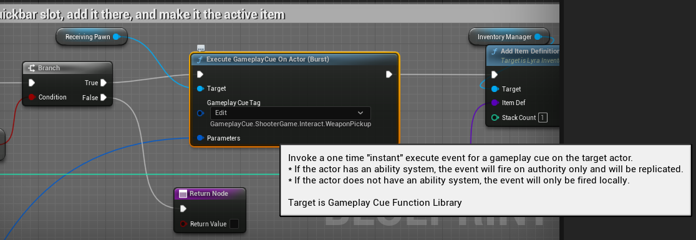
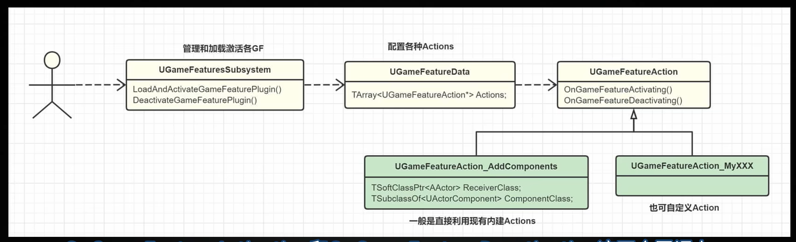

# Lyra运行流程分析

## 游戏入口关卡
Project Settings -> Maps & Modes
B_LyraGameMode 
LyraStarterGame/Content/B_LyraGameMode.uasset

编辑器默认关卡：LyraStarterGame/Content/System/DefaultEditorMap/L_DefaultEditorOverview.umap
游戏默认关卡： LyraStarterGame/Content/System/FrontEnd/Maps/L_LyraFrontEnd.umap

## 关卡绑定的Experience
关卡 World Settings -> 设置关卡要使用的Experience

L_LyraFrontEnd的Experience为B_LyraFrontEnd_Experience

LyraStarterGame/Content/System/FrontEnd/B_LyraFrontEnd_Experience.uasset

- Level
    - LyraExperienceDefinition
        - LyraPawnData（人物配置数据eg: HeroData_ShooterGame)
            - LyraAbilitySet(人物技能eg: AbilitySet_ShooterHero)
                - LyraGameplayAbility(近战技能eg：GA_Melee）


## UI加载
B_LyraFrontEnd_Experience 中通过Add Components Action，在LyraGameState中加载B_LyraFrontendStateComponent组件，该组件设置要加载的UI, 

- B_LyraFrontEnd_Experience 
    - B_LyraFrontendStateComponent 
        - W_LyraStartup （Press Start Screen Class） 游戏开始UI
        - W_LyraFrontEnd

B_LyraFrontendStateComponent位置：
Blueprint'/Game/UI/B_LyraFrontendStateComponent.B_LyraFrontendStateComponent'

ULyraFrontendStateComponent继承自UGameStateComponent

W_LyraFrontEnd位置为： WidgetBlueprint'/Game/UI/Menu/W_LyraFrontEnd.W_LyraFrontEnd'

W_LyraFrontEnd 点击Play Lyra后， 会创建显示experiences的界面

WidgetBlueprint'/Game/UI/Menu/Experiences/W_ExperienceSelectionScreen.W_ExperienceSelectionScreen'

- 显示experiences选择界面
    - 单机玩
    - Host -> W_HostSessionScreen
    - Browse -> W_SessionBrowserScreen


UI切换： 使用Push Content to Layer for Player

- W_HostSessionScreen
    - 位置：WidgetBlueprint'/Game/UI/Menu/Experiences/W_HostSessionScreen.W_HostSessionScreen'
    - ExperienceList 容器
        - 位置：WidgetBlueprint'/Game/UI/Menu/Experiences/W_ExperienceList.W_ExperienceList'
        - Get Primary Asset Id List 获取LyraUserFacingExperienceDefinition数组进行展示
        - 每个LyraUserFacingExperienceDefinition的显示由W_ExperienceTile定义
            - 位置WidgetBlueprint'/Game/UI/Menu/Experiences/W_ExperienceTile.W_ExperienceTile'

LyraUserFacingExperienceDefinition是如何被Get Primary Asset Id List进行收集的？

Project Settings -> Asset Manager -> Primary Asset Types to Scan -> LyraUserFacingExperienceDefinition -> Directories 会定义该类型Asset被收集的位置

Lyra预定义的LyraUserFacingExperienceDefinition：

- LyraUserFacingExperienceDefinition'/ShooterMaps/System/Playlists/DA_Expanse_TDM.DA_Expanse_TDM'
- LyraUserFacingExperienceDefinition'/ShooterMaps/System/Playlists/DA_Convolution_ControlPoint.DA_Convolution_ControlPoint'


W_SessionBrowserScreen
- W_SessionBrowserScreen
    - 位置：WidgetBlueprint'/Game/UI/Menu/Experiences/W_SessionBrowserScreen.W_SessionBrowserScreen'


LyraExperienceDefinition and LyraUserFacingExperienceDefinition
- LyraExperienceDefinition 用于定义游戏模式（GameMode）所需要的操作和数据
- LyraUserFacingExperienceDefinition 用于定义Map和LyraExperienceDefinition的关联，即地图需要使用什么游戏模式


用户操作后会确定LyraUserFacingExperienceDefinition， 根据这个信息有common session subsystem创建游戏会话

## 游戏增强输入 EnhancedInput

Plugins: Enhanced Input

Project Setting -> Input -> 
- Default Player Input Class: EnhancedPlayerInput
- Default Input Component Class: LyraInputComponent

InputMappingContext:  配置按键和InputAction的绑定


InputMappingContext'/Game/Input/Mappings/IMC_Default_KBM.IMC_Default_KBM'


LyraPawnData

- LyraPawnData： HeroData_ShooterGame 
    - 位置：LyraPawnData'/ShooterCore/Game/HeroData_ShooterGame.HeroData_ShooterGame'
    - Input Config配置输入： InputData_Hero
        - 位置：LyraInputConfig'/Game/Input/InputData_Hero.InputData_Hero'
        - 可以设置InputAction和Input Tag的绑定
    - Ability Sets配置能力：AbilitySet_ShooterHero
        - 位置：LyraAbilitySet'/ShooterCore/Game/AbilitySet_ShooterHero.AbilitySet_ShooterHero'
        - Ability 可以设置触发的Input Tag
        - 问题：Input Tag是如何触发Ability的，触发流程是怎样的？

InputAction可以被用于映射到硬件输入
IMC_Default_KBM（InputMappingContext类型） 用于控制映射
InputMappingContext'/Game/Input/Mappings/IMC_Default_KBM.IMC_Default_KBM'

Character -> -> ULyraHeroComponent -> LyraInputComponent -> LyraPawnData


ULyraHeroComponent::InitializePlayerInput负责增强输入的初始化
1. 通过ULyraPawnExtensionComponent组件获取到ULyraPawnData中的ULyraInputConfig
2. ULyraInputComponent负责对UEnhancedInputLocalPlayerSubsystem进行AddInputMappings
3. 调用ULyraInputComponent的BindAbilityActions， 将InputTag和InputAction进行绑定
4. 当有按键按下时会调用ULyraHeroComponent::Input_AbilityInputTagPressed， 当有按键释放时会调用ULyraHeroComponent::Input_AbilityInputTagReleased, 并将FGameplayTag作为函数参数
5. ULyraHeroComponent的按键处理函数会通过ULyraPawnExtensionComponent找到ASC组件，交由ULyraAbilitySystemComponent的AbilityInputTagPressed函数和AbilityInputTagReleased对InputTag进行处理， 如果FGameplayAbilitySpec中的DynamicAbilityTags与输入Tag匹配，

ULyraPawnExtensionComponent的ASC和ALyraPlayerState的ASC是同一个ASC。

```c++
void ULyraHeroComponent::OnPawnReadyToInitialize() {
    // ......
    ALyraPlayerState* LyraPS = GetPlayerState<ALyraPlayerState>();

	if (ULyraPawnExtensionComponent* PawnExtComp = ULyraPawnExtensionComponent::FindPawnExtensionComponent(Pawn))
	{
		PawnData = PawnExtComp->GetPawnData<ULyraPawnData>();

		// The player state holds the persistent data for this player (state that persists across deaths and multiple pawns).
		// The ability system component and attribute sets live on the player state.
		PawnExtComp->InitializeAbilitySystem(LyraPS->GetLyraAbilitySystemComponent(), LyraPS);
	}
}
```

## Lyra 人物系统

人物蓝图 （ShooterCore 插件）
/ShooterCore/Game/B_Hero_ShooterMannequin.B_Hero_ShooterMannequin'

### 能力系统
- 跳跃
- 瞄准ADS
- 扔武器
- 近战 melee

能力描述继承关系
- UPrimaryDataAsset    
    - ULyraAbilitySet（eg：AbilitySet_ShooterHero）

ULyraAbilitySet可以配置人物所具备的GameplayAbility和GameplayEffect，以及AttributeSet

能力赋予过程
- ULyraExperienceDefinition：B_ShooterGame_Elimination
    - Default Pawn Data： HeroData_ShooterGame
        - Ability Sets： AbilitySet_ShooterHero

ULyraExperienceDefinition继承自UPrimaryDataAsset，该资产文件是如何被GameMode加载的呢？

1. ALyraGameState会创建ULyraExperienceManagerComponent组件
2. ULyraExperienceManagerComponent调用StartExperienceLoad，使用ULyraAssetManager来加载ULyraExperienceDefinition
3. ALyraGameMode调用GetPawnDataForController，获取到ULyraExperienceDefinition的Default Pawn Data，进而获得PawnClass
4. ALyraPlayerState的OnExperienceLoaded调用SetPawnData，设置AbilitySets（HeroData_ShooterGame中配置的AbilitySets）
5. 每个配置的AbilitySet使用自身的GiveToAbilitySystem，将能力赋予给了ALyraPlayerState的ASC组件


Source\LyraGame\AbilitySystem\LyraAbilitySet.cpp
```c++
		ULyraGameplayAbility* AbilityCDO = AbilityToGrant.Ability->GetDefaultObject<ULyraGameplayAbility>();

		FGameplayAbilitySpec AbilitySpec(AbilityCDO, AbilityToGrant.AbilityLevel);
		AbilitySpec.SourceObject = SourceObject;
		AbilitySpec.DynamicAbilityTags.AddTag(AbilityToGrant.InputTag);

		const FGameplayAbilitySpecHandle AbilitySpecHandle = LyraASC->GiveAbility(AbilitySpec);
```
GiveAbility会调用OnGiveAbility， 该函数根据FAbilityTriggerData设置能力的触发方式


6. ALyraPlayerState::PostInitializeComponents中设置ASC的OwnerActor(ALyraPlayerState)和AvatarActor(ALyraCharacter)
```
AbilitySystemComponent->InitAbilityActorInfo(this, GetPawn());
```

能力使用过程， 例如近战能力GA_Melee是如何被触发的？
GA_Melee在AbilitySet_ShooterHero中配置为与InputTag.Ability.Melee绑定， 从能力赋予过程分析可知道该技能最终会由ALyraPlayerState的ASC进行管理， 从增强输入过程分析知道Character的组件会接收到输入信息并调用Character的ULyraAbilitySystemComponent的AbilityInputTagPressed函数和AbilityInputTagReleased对InputTag进行处理， 如果FGameplayAbilitySpec中的DynamicAbilityTags与输入Tag匹配，就会将FGameplayAbilitySpecHandle能力Handle存到数组中

```
	// Handles to abilities that had their input pressed this frame.
	TArray<FGameplayAbilitySpecHandle> InputPressedSpecHandles;

	// Handles to abilities that had their input released this frame.
	TArray<FGameplayAbilitySpecHandle> InputReleasedSpecHandles;

	// Handles to abilities that have their input held.
	TArray<FGameplayAbilitySpecHandle> InputHeldSpecHandles;
```

ALyraPlayerController的PostProcessInput函数会每帧调用，
- ALyraPlayerController::PostProcessInput
    - ULyraAbilitySystemComponent::ProcessAbilityInput
        - UAbilitySystemComponent::TryActivateAbility


跳跃能力示例：
AbilitySet_ShooterHero（LyraAbilitySet类型）中将GA_Hero_Jump和InputTag.Jump标签进行绑定
位置： Blueprint'/Game/Characters/Heroes/Abilities/GA_Hero_Jump.GA_Hero_Jump'

TagRelationships_ShooterHero: Tag和能力的对应关系，
LyraAbilityTagRelationshipMapping'/ShooterCore/Game/TagRelationships_ShooterHero.TagRelationships_ShooterHero'


- 继承LyraGameplayAbility
    - Event OnPawnAvatarSet： 可以使用UIExtension Subsystem注册UI组件
    - Event ActivateAbility： 确定能力是否激活


回血技能
Blueprint'/ShooterCore/Blueprint/B_AbilitySpawner.B_AbilitySpawner'

- B_AbilitySpawner
    - Gameplay Effect to Apply选择GE_InstantHeal_Part
        - Blueprint'/ShooterCore/Items/HealthPickup/GE_InstantHeal_Part.GE_InstantHeal_Part'
    - 继承自B_WeaponSpawner
    - 复用了GiveWeapon函数来实现回血
    - 通过ASC组件调用Apply Gameplay Effect to Self

### 近战技能
- GA_Melee
    - Blueprint'/ShooterCore/Game/Melee/GA_Melee.GA_Melee'
    - Event ActivateAbility -> Play Montage and Wait 
        - Has Authority -> Capsule Trace For Objects -> HitActor -> Get Ability System Component -> ApplyGameplayEffectToTarget -> Execute GameplayCueWithParams On Owner -> (Multicast)Play Sound at Location
        - End Ability

- GE_Damage_Melee
    - Blueprint'/ShooterCore/Weapons/GE_Damage_Melee.GE_Damage_Melee'
    - Display -> Gameplay Cues

## Lyra 武器系统

武器出生点
Blueprint'/ShooterCore/Blueprint/B_WeaponSpawner.B_WeaponSpawner'
- 通过配置选择Weapon Definition（LyraWeaponPickupDefinition），定义出现武器类型
- 通过父类（ALyraWeaponSpawner）碰撞检测
- 通过GiveWeapon函数实现武器绑定到Pawn身上
    - 调用execute GameplayCue on Actor
    - 触发Gameplay Tag: GameplayCue.ShooterGame.Interact.WeaponPickup



LyraWeaponPickupDefinition定义了拾取声音，冷却时间，武器Mesh
- WeaponPickupData_Shotgun
LyraWeaponPickupDefinition'/ShooterCore/Weapons/Shotgun/WeaponPickupData_Shotgun.WeaponPickupData_Shotgun'

- 武器mesh  SM_Shotgun
    - StaticMesh'/Game/Weapons/Shotgun/Mesh/SM_Shotgun.SM_Shotgun'

- Inventory Item Definition
    - Blueprint'/ShooterCore/Weapons/Shotgun/ID_Shotgun.ID_Shotgun'

B_AbilitySpawner继承自B_WeaponSpawner
Blueprint'/ShooterCore/Blueprint/B_AbilitySpawner.B_AbilitySpawner'

捡起武器效果
- GCN_InteractPickUp
    - Blueprint'/ShooterCore/GameplayCues/GCN_InteractPickUp.GCN_InteractPickUp'

- B_WeaponInstance_Pistol（LyraRangedWeaponInstance）
    - Blueprint'/ShooterCore/Weapons/Pistol/B_WeaponInstance_Pistol.B_WeaponInstance_Pistol'
    - 定义武器人物动画， 拿起武器后的动画集，移除武器后的动画集
    - 定义武器射击距离

B_Pistol（父类B_Weapon)
    - Blueprint'/ShooterCore/Weapons/Pistol/B_Pistol.B_Pistol'
    - 定义了拿在手上的武器模型（SkeletalMesh）
    - 定义了抛弹壳相关

- B_Hero_ShooterMannequin人物蓝图
    - WeaponID（LyraEquipmentDefinition）
        - DefaultValue：Blueprint'/ShooterCore/Weapons/Pistol/WID_Pistol.WID_Pistol'
        - 定义了武器蓝图实例
        - attach Socket等信息

### 武器开火

LyraAbilityTagRelationshipMapping'/ShooterCore/Game/TagRelationships_ShooterHero.TagRelationships_ShooterHero'

TagRelationships_ShooterHero中定义了GA_Weapon_Fire技能相关的GameplayTag

当Fire时会阻止和取消带有Emote和Reload的标签的技能

GA_Weapon_Fire 继承关系
- ULyraGameplayAbility
    - ULyraGameplayAbility_FromEquipment
        - ULyraGameplayAbility_RangedWeapon
            - GA_Weapon_Fire
Blueprint'/Game/Weapons/GA_Weapon_Fire.GA_Weapon_Fire'


设置开火按键

1. 创建InputAction IA_Weapon_Fire, eg: InputAction'/Game/Input/Actions/IA_Weapon_Fire.IA_Weapon_Fire'
2. 设置输入映射

InputMappingContext'/Game/Input/Mappings/IMC_Default_KBM.IMC_Default_KBM'

将Left Mouse Button绑定到InputAction： IA_Weapon_Fire

3. 配置输入产生的GameplayTag
LyraInputConfig'/Game/Input/InputData_Hero.InputData_Hero'

InputData_Hero 中设置开火输入按键InputAction和触发的GameplayTag
- InputData_Hero
    - Input Action: 
    - Input TAg: 选择InputTag.Weapon.Fire


设置能力触发
- GA_Weapon_Fire
    - ClassDefaults ->
        -   Triggers -> 
            - AbilityTriggers
                - Trigger TAg: InputTag.Weapon.Fire
                - Trigger Source: Gameplay Event

当按下鼠标左键时，将触发能力GA_Weapon_Fire

- ActivateAbility
    - Is Locally Controlled -> 检测射击对象
        - GA->AvatarPawn-> Controller -> GetPlayerViewPoint 获取射击起点和射击方向
    - 播放fire montage
    -

## 冲刺技能

1. InputAction'/Game/Input/Actions/IA_Ability_Dash.IA_Ability_Dash'

2. InputMappingContext'/Game/Input/Mappings/IMC_Default_KBM.IMC_Default_KBM'

IMC_Default_KBM中将IA_Ability_Dash和Left Shift按键绑定

3. LyraInputConfig'/Game/Input/InputData_Hero.InputData_Hero'

InputData_Hero中将IA_Ability_Dash和InputTag.Ability.Dash进行绑定


4. Blueprint'/ShooterCore/Game/Dash/GA_Hero_Dash.GA_Hero_Dash'

GA_Hero_Dash技能设置Trigger Tag为InputTag.Ability.Dash

GA_Hero_Dash 继承自GA_AbilityWithWidget， 触发技能时可以显示UI效果

Blueprint'/Game/Characters/Heroes/Abilities/GA_AbilityWithWidget.GA_AbilityWithWidget'

    
## GameplayCue

- UGameplayCueNotify_Burst
    - 立即效果， 不支持 delays and time lines


背景加载：
LyraStarterGame/Content/Environments/B_LoadRandomLobbyBackground.uasset


- LyraExperienceDefinition
    - 示例： Blueprint'/ShooterCore/Experiences/B_ShooterGame_Elimination.B_ShooterGame_Elimination'
    - 设置Pawn Data： LyraPawnData'/ShooterCore/Game/HeroData_ShooterGame.HeroData_ShooterGame'
        - 设置Pawn Class: Blueprint'/ShooterCore/Game/B_Hero_ShooterMannequin.B_Hero_ShooterMannequin'
        - 设置Ability Sets： LyraAbilitySet'/ShooterCore/Game/AbilitySet_ShooterHero.AbilitySet_ShooterHero'
        - 设置输入
        - 设置Camera Mode
    - 执行的Actions
        - Abilities
        - Components
        - UI

LyraPawnData'/ShooterCore/Game/HeroData_ShooterGame.HeroData_ShooterGame'


# Lyra Animation


## State Machine 状态机

状态机节点播放动画的方式

1. Sequence Player
2. Linked Anim Layer （本质上最后还是调用的Sequence Player）
3. Sequence Evaluator（Anim Node Function）

按照Sequence Player的使用方式进行区分
- bind方式设置sequence， 直接选取动画序列资产即可
- dynamic方式， 通过函数动态决定要使用的动画资产


Lyra Idle状态实现
- idle状态
    - FullBody_IdleState 接口（Linked Anim Layer）
        - Idle State Machine 
            - Idle
            - IdleBreak
            - 
    - Ouput Animation Pose
        - Update Idle State

## Control Rig

Anim Graph 中使用 Control Rig节点

- Alpha Input Type 控制是否使用Control Rig

Control Rig Class


# Lyra Game Feature
https://dev.epicgames.com/community/learning/tutorials/rdW2/unreal-engine-how-to-create-a-new-game-feature-plugin-and-experience-in-lyra

## LyraPawnData 
LyraPawnData'/ShooterCore/Game/HeroData_ShooterGame.HeroData_ShooterGame'

- 定义使用的人物蓝图
    - Blueprint'/ShooterCore/Game/B_Hero_ShooterMannequin.B_Hero_ShooterMannequin'
- 定义能力系统
    - LyraAbilityTagRelationshipMapping'/ShooterCore/Game/TagRelationships_ShooterHero.TagRelationships_ShooterHero'
- 定义输入配置
    - LyraInputConfig'/Game/Input/InputData_Hero.InputData_Hero'
- 定义Camera Mode
    - Blueprint'/Game/Characters/Cameras/CM_ThirdPerson.CM_ThirdPerson'


## LyraExperienceDefinition

Blueprint'/ShooterCore/Experiences/B_LyraShooterGame_ControlPoints.B_LyraShooterGame_ControlPoints'

## LyraUserFacingExperienceDefinition

- Set Map ID
- Set Experience ID
- 

API
- Create Hosting Request 返回UCommonSession_HostSessionRequest， 创建游戏时使用


# Lyra Bot AI系统

AIController

Blueprint'/ShooterCore/Bot/B_AI_Controller_LyraShooter.B_AI_Controller_LyraShooter'

行为树

BehaviorTree'/ShooterCore/Bot/BT/BT_Lyra_Shooter_Bot.BT_Lyra_Shooter_Bot'


# 使用Lyra资源

自定义Character使用ShooterCore的Animation Blueprint时， 需要在Project Setting -> Game -> Asset Referencing Policy -> Project Content -> Can Reference These Domains -> 添加ShooterCore


# Lyra 动画系统

## 自定义Property Access

动画蓝图中创建纯函数， 返回值名称为ReturnValue才能识别


## Lyra动画迁移
https://www.bilibili.com/video/BV1dT41157pS/?p=1&vd_source=05b9e112882cf3fe738863375b088e4c

https://www.bilibili.com/video/BV1Da411n71c/?spm_id_from=333.999.0.0&vd_source=05b9e112882cf3fe738863375b088e4c

- RootMotion
  - 不开启RootMotion： 人物会叠加actor的移动和动画的移动，导致人物和Camera不是固定距离
  - 开启RootMotion：实现原地奔跑的状态
  - 造成的问题： 奔跑速度和人物步幅不匹配
- Distance Matching （距离匹配）
    - 基于距离数据来播放动画， 而非线性时间播放动画。
    - https://docs.unrealengine.com/5.0/zh-CN/distance-matching-in-unreal-engine/
    - 将人物速度调低， 动画是否会播放小碎步姿态
    - Animation Locomotion Library插件
    - 动画蓝图基类中计算人物当前帧和上一帧的移动距离，并导出到属性存取系统
    - 动画序列通过Animation Locomotion Library插件的DistanceCurveModifier修饰符生成动画曲线（计算出动画本身的位移数据）

    - 两种方式实现距离匹配
        - 通过位移速度调整动画播放速率实现， 如奔跑循环动画。
            - set playrate to match speed
        - 通过位移来调整动画显示时间实现
            -启动奔跑的加速过程。
                - 使用序列求值器计算动画帧，通过Advance Time by Distance Matching计算位移到动画序列显示时间的映射
            - 停止运动过程
                - Distance Match to Target


### 姿势扭曲

https://docs.unrealengine.com/5.0/zh-CN/pose-warping-in-unreal-engine/

方向扭曲（Orientation Warping）： 下半身的朝向和运动方向一致

步幅扭曲（Stride Warping）： 动态调整角色的动画步幅来匹配胶囊体移动速度

斜面扭曲（Slope Warping）： 让斜坡和楼梯上的移动动画的更平滑地过渡


- 步幅适配
    - 人物速度和动画的脚步跨距是否匹配
    - 插件： Animation Warping


起跑姿势
    - 是否蹲伏
    - 是否瞄准
    - 与 Local Velocity Direction有关


## 回转运动 （pivot）

突然转向时的过度动画， 例如向左走时， 突然向右走


# GameFeatures

[UOD2021]虚怀若谷-模块化游戏功能框架 | Epic Games 大钊(官方字幕)

https://www.bilibili.com/video/BV1j34y1B7Nf/?spm_id_from=333.337.search-card.all.click&vd_source=05b9e112882cf3fe738863375b088e4c


插件：
- ModularGameplay 实现AddComponent等功能
- GameFeatures

GameFeature必须放在/Game/Plugins/GameFeatures目录下


开启GameFeature插件
- 时机： 如进入传送门
- 方法： Toggle Game Feature Plugin


GameFeature Actions
- Add Components
    - Actor要支持Add Component操作， 需要调用Game Framework Component Manager -> Add Receiver
- 

GameFeature 状态
- Loaded
- Registered
- Active
- 

激活GameFeature的方法
1. GameFeaturesSubsystem c++
2. 控制台命令
    - ListGameFeaturePlugins
    - LoadGameFeaturePlugin <name>
    - DeactiveGameFeaturePlugin <name>

控制台通过ListGameFeaturePlugins查看GameFeature的当前状态

Lyra何时激活ShooterCore， ShooterMaps这两个GameFeature？


框架原理

- UGameFeatureSubsystem 管理插件的加载，激活等
- Policy 哪些GameFeature加载，哪些忽略


ULyraGameFeaturePolicy

Source\LyraGame\GameFeatures\LyraGameFeaturePolicy.h


# CommonUserSubsystem

数据对象
- UCommonSession_HostSessionRequest： MapID/OnlineMode/MaxPlayerCount/ExtraArgs

API
- Login for Online Play 打开地图时需要用户登录
- Host Session ： 创建游戏
    - ECommonSessionOnlineMode::Offline 如果是创建离线模式， 通过ServerTravel方式打开地图
    - online模式，通过CreateSession来打开地图


# Lyra 启动分析


- ULyraExperienceManagerComponent::OnExperienceLoadComplete
    - ULyraExperienceManagerComponent::OnExperienceFullLoadCompleted


- ALyraPlayerState::OnExperienceLoaded
    - ALyraGameMode::GetPawnDataForController