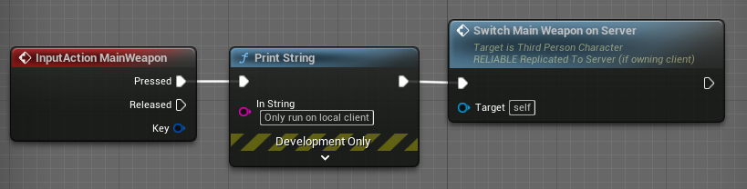
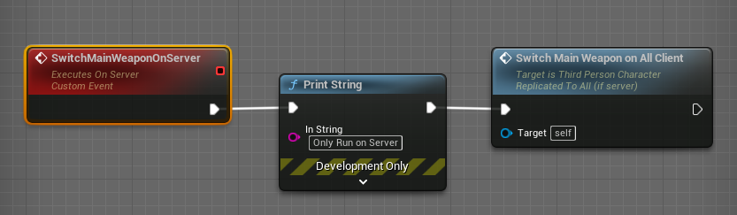
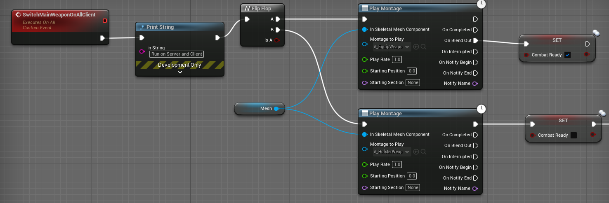

# unreal 服务器模式

- Listen Server(服务器在某个玩家的客户端上创建)
- Delicated Server


## Delicated Server（专用服务器打包）
https://docs.unrealengine.com/4.27/zh-CN/InteractiveExperiences/Networking/HowTo/DedicatedServers/

- 需要从源码编译得到UnrealEngine，才能编译出Delicated Server

使用ue4_ds服务器实现房间功能(一个delicated server进程相当于一个Room)
http://www.imrcao.com/2021/12/30/%e4%bd%bf%e7%94%a8ue4_ds%e6%9c%8d%e5%8a%a1%e5%99%a8%e5%ae%9e%e7%8e%b0%e6%88%bf%e9%97%b4%e5%8a%9f%e8%83%bd/


# 游戏开发

- GameInstance （每个游戏客户端和服务器都会有这个对象）
  - client 调用创建初始化UI，让玩家能够选择创建游戏，或者加入游戏
    - Create Widget
    - Add to Viewport
    - Set Show Mouse Cursor
  - 创建游戏房间功能 （ UI可以通过事件调用该功能）
    - Create Session
    - Open Level
  - 刷新游戏房间功能
    - Find Session
    - 
  - 加入游戏房间功能
    - Join Session

Session的Server Name， LAN局域网时为计算机名， online subsystem steam联网时为Steam ID

`注意`： online subsystem steam在同一台电脑上无法启动两个Player client, 需要使用两台不同的电脑和两个不同的steam账号

- Use LAN 时， 两台计算机需要处在相同的局域网。
- No Use LAN时， Create Session的主机需要位于公网， 或者对局域网的端口进行NAT。


# 多关卡切换
GameInstance 负责ui界面的创建和变量保存

Open Level 时， 调用GameInstance的方法来初始化UI

Execute console cmd
servertravel /Game/Maps/MapName

class setting -> use seamless travel

通过使用travel level作为缓冲， 可以立即回收内存， 减少内存消耗
```
old big level -> travel level -> new big level
```

# 网络系统

## 运行网络模式
- Net Mode
  - Play As Listen Server （其中一个client会作为服务器）
  - Play As Client (会自动启动一个无UI的服务器， client会连接到该服务器)
  - Play Standalone (多个standalone没有网络通信)


## 网络数据同步

- 要同步的Actor，在Details面板设置`Replicates`为true， `Replicate Movement`为true
- 涉及到同步Actor的代码，要确保在服务器上执行， 通过`UFUNCTION(Server, Reliable, WithValidation)`将代码变成RPC调用

- Events Replicates
  - Not Replicated：默认值，只会在当前调用的客户端或服务器上执行
  - Multicast：如果在服务器上调用，会同步调用所有连接的客户端；如果客户端调用，将会视为 Not Replicated，只会在当前客户端上执行
  - Run On Server：如果在服务端调用，只会在服务端上执行；如果在客户端调用，将会远程调用到服务器上的这个方法，这是比较基础的向服务器发送数据的方法。
  - Run On Owning Client：如果在服务端调用，会在拥有该Actor的客户端上调用；如果在客户端调用，将会视为 Not Replicated，只会在当前客户端上执行

`注意`：客户端如果想调用一个方法然后同步调用其他所有客户端和服务器，不能直接调用一个 Multicast 方法，必须先调用一个服务器上的方法 Run On Server，然后在调用 Multicast 方法

## Run On Server + Multicast
示例：  按住数字键1，切换到主武器功能， 并让动画在所有服务器上同步。

1. 人物蓝图捕获按键1（MainWeapon）事件后， 调用Switch Main Weapon On Server这个RPC之前，逻辑都是仅仅运行在本地client上的

2. Switch Main Weapon On Server事件Replicates设置为Run on Server， 在调用Switch Main Weapon on All Client之前的逻辑都只会运行在服务器上

3. Switch Main Weapon on All Client事件Replicates设置为Multicast, 该事件的逻辑会运行在server上和所有client上


## Run On Server + 变量Replicated


## 

## ROLE_Authority 运行在服务器上 +  OnRep_xxx 通知客户端

例如Pawn和Actor碰撞的OnOverlapBegin函数中， 通过判断`GetLocalRole() == ROLE_Authority`为真来保障碰撞之后的逻辑只运行在服务器上

```c++
// OnOverlapBegin函数
if (GetLocalRole() == ROLE_Authority && bIsWeaponAvailable && OverlappingPawn != nullptr)
{
  AttemptPickUpWeapon(OverlappingPawn);
}
```

bIsWeaponAvailable变量的replicated设置为OnRep方式
```
	UPROPERTY(EditDefaultsOnly, BlueprintReadWrite, ReplicatedUsing = OnRep_WeaponAvailability, Category = "Lyra|WeaponPickup")
	bool bIsWeaponAvailable;
```
当服务器修改了bIsWeaponAvailable变量后， 通过网络同步给客户端，客户端上会调用
OnRep_WeaponAvailability函数处理相应的效果

```
void ALyraWeaponSpawner::OnRep_WeaponAvailability()
{
	if (bIsWeaponAvailable)
	{
		PlayRespawnEffects();
		SetWeaponPickupVisibility(true);
	}
	else
	{
		SetWeaponPickupVisibility(false);
		StartCoolDown();
		PlayPickupEffects();
	}	
}
```


## Switch Has Authority

- GameMode的运行
  - Play As Client 运行时， 命令行控制台窗口（delicated server）会运行GameMode的逻辑， client默认不会运行GameMode的逻辑。 如果有client选择Create Session， Open Level时则会在该client上，运行该Level设置的GameMode。 


- Switch Has Authority
  - 服务端（执行Authorith路线）
    1. Play As Client 中的dedicated server 
    2. Play As Client 但是client使用了Create Session后从client变成了client and server同时具备的角色
    3. Play As Listen Server中的server

## Replicating Actors

## Replicating Variables
> Variables that are important to gameplay should only be modified on the Network Authority (Server) and then replicated to Remote Machines (Clients) on a need-to-know basis
- replicated Variable的修改需要在Server上进行，然后同步到客户端
- Switch Has Authority 可以选择让代码只运行在服务器上或者只运行在客户端上
- replicated Variable所在的Actor是否需要Replicated呢？

- Replication 方式
  - Replicated
  - RepNotify （会创建一个函数， 当变量改变时调用这个函数）

网络连接
- 服务端
  - 创建服务 -> Create Session -> Open Level
- 客户端
  - 搜索服务 -> Session Result -> 加入服务 ->  Join Session

Create Session
    - 设置玩家数量
    - 设置PlayerController

Open Level
    - Options 设置为listen （ Listen Server模式下， 以listen方式打开服务器地图）


## 网路错误处理
- Event NetworkError
- Event TravelError

# 数据持久化
- SaveGame 类
  - 保存
    - create SaveGame Object
    - 保存信息到SaveGame对象中
    - save game to slot （对象会被保存到工程目录Saved/SaveGame目录下）
  - 恢复
    - load game from slot

# 角色系统

- 角色基类，继承关系
- 动画重定向
    - 播放动画PlayAnimation

BP Structure 维护玩家信息
- PlayerName Text 玩家名称
- PlayerImage Texture2D 玩家头像
- PlayerCharacter ClassReference 玩家角色


## 不同的玩家角色

https://www.cnblogs.com/AnKen/p/7897076.html

- GameModeBase
  - override GetDefaultPawnClassForController
  -

  
## AI角色
- 继承Character类， 使用AI感知组件
  - Pawn Sensing 组件
    - 视觉 （On Seen Pawn)
      - 感知视角（Peripheral Vision Angle)
      - 
    - 听觉 (On Hear Noise)
      - 听觉（有遮挡距离） Hearing Threshold
      - 听觉（无遮挡距离） LOSHearing Threshold
      - 被感知的对象需要设置PawnNoiseEmitterComponent， 和调用Pawn Make Noise
    - 当On Seen Pawn工作时， unreal的优化机制不再继续调用On Hear Noise
- AI 逻辑运行在服务器上， 通过GetLocalRole()是否等于ROLE_Authority判断是否位于服务器上

- <project>.Build.cs 文件PublicDependency添加"AIModule"

- Make Noise的使用
  - Make Noise需要依赖一个Pawn来负责制造Noise， 人拿武器开火击中地面， 一般让人（Pawn）作为Noise Instigator，而且人必须拥有PawnNoiseEmitterComponent， 击中的地方Hit Actor作为Make Noise函数的Target

# 聊天系统


