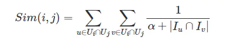

# recall

# 规则召回
- 类别匹配
- 标签匹配
- 地域匹配
- 事件兴趣匹配

运营投放


> Sampling-Bias-Corrected Neural Modeling for Large Corpus Item Recommendations

https://zhuanlan.zhihu.com/p/137538147

1.  损失函数： tf.keras.losses.CategoricalCrossentropy -> tf.nn.softmax_cross_entropy_with_logits

Measures the probability error in discrete classification tasks in which the classes are mutually exclusive

```
# y : (batch_size, num_class)
# y_pred: (batch_size, num_class) after softmax

loss = -np.sum(y * np.log(y_pred), -1)
```


理论建模：输入为用户x向量，候选集合为M个item的向量， 最大化用户向量x检索到item向量y的概率， 使用softmax建模, 然后使用CategoricalCrossentropy计算损失


softmax的问题： 一般M很大（几百万item）， 分母无法进行计算

解决方案： 使用batch-softmax简化计算


batch-softmax的问题： batch-softmax期望分母中的item是均匀分布采样得到的， 但实际batch样本中， 热门item出现次数较多，batch-softmax公式需要进行修正。

解决方案： $s(x, y)$ 修正为$s^c(x, y)$, 其中$p_j$ 为item $y_j$出现中batch样本的概率

$$ s^c(x_i, y_i) = s(x_i, y_i) - log(p_j)$$


```python
class SamplingProbablityCorrection(tf.keras.layers.Layer):
  """Sampling probability correction."""

  def __call__(self, logits: tf.Tensor,
               candidate_sampling_probability: tf.Tensor) -> tf.Tensor:
    """Corrects the input logits to account for candidate sampling probability."""

    return logits - tf.math.log(candidate_sampling_probability)
```

```python
# scores 为(batch_size, batch_size)
if candidate_sampling_probability is not None:
    scores = layers.loss.SamplingProbablityCorrection()(
        scores, candidate_sampling_probability)
```


Streaming Frequency Estimation

模拟程序
```
item_size = 1000000
alpha = 0.01
batch_size = 1024
num_batch = 10

print("expect prob:", batch_size / item_size)

b = np.array([item_size/batch_size] * item_size)  # b[i]: 估计item[i]被采样到的间隔步数
a = np.array([0] * item_size)  # a[i]: 上次采样到item[i]的步数

print("====== start ======")
print("b:", b)
print("a:", a)

for t in range(num_batch):
    # item出现次数为均匀分布
    idx = np.random.randint(0, item_size, batch_size)
    
    b[idx] = (1 - alpha) * b[idx] + alpha * (t - a[idx])
    a[idx] = t
    
print("====== end =======")
print("b:", b)
print("a:", a)
print("prob:", 1 / b)
```

# swing



- sim(i, j) -  item i 和 j 的相似度
- $U_i$ - 喜欢item i和用户集合，  $U_j$ 喜欢item j的用户集合
- u, v - 同时喜欢item i 和 j的用户u 和 v
- $I_u$ - 用户u喜欢的物品集合， $I_v$ - 用户v喜欢的物品集合


实现

user2items_dict, key为用户id， value为用户喜欢的物品集合
item2users_dict, key为物品id， value为喜欢物品的用户集合

for i, j in item2users_dict.keys()