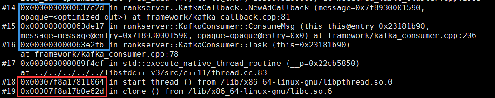

symbol table
============

\-g set are debugging symbols ELF linking symbols

\# core debug -g build 

# boost backtrace
使用boost， 记录core时的堆栈
```c++
void RegisterBoostBacktrace() {
  ::signal(SIGSEGV, &BoostBacktraceHandler);
  ::signal(SIGABRT, &BoostBacktraceHandler);
}

void BoostBacktraceHandler(int signum) {
  boost::stacktrace::safe_dump_to("./backtrace.dump");
  ::signal(signum, SIG_DFL);
}
```

```
bin/rankserver -s| eval 'while read -r line || [[ -n "$line" ]]; do ADDR=${line/*[}; ADDR=${ADDR%]*}; echo "${line}"; echo "    $(addr2line -Cfpe bin/rankserver $ADDR)"; done'

```


# gdb 命令

https://www.gdbgui.com/

```
# 调试正在运行的进程
gdb -p <pid> 

# 查看当前程序停留位置， 列出源码
frame
list

```

断点和运行，监测
```
# 查看所有断点
info break

# 设置断点
break function_name
break linenum #在当前源文件的第linenum行处设置breakpoint
break filename:linenum  #在名为filename的源文件的第linenum行处设置breakpoint
break filename:function #在名为filename的源文件中的function函数入口处设置breakpoint
break … if cond #条件断点
break ... thread thread-id #线程相关的断点
rbreak regex #在所有符合正则表达式regex的函数处设置breakpoint

# 删除断点
delete [breakpoints num] [range…]

# 继续运行
continue

# 单步执行
step # 进入函数
next # 不进入函数

# 查看所有监测
info watchpoints

# 设置监测表达式
rwatch <expr>
当表达式（变量）expr被读时，停住程序。

awatch <expr>
当表达式（变量）的值被读或被写时，停住程序。
```

commands
```
break func
commands
  watch var
  continue
end
```


```
backtrace(bt) 查看调用栈信息 
frame 查看栈帧
```

```
# 打印变量或类型的大小
print sizeof(var)
print sizeof(Type)

# gdb 打印智能指针
# eg: std::shared_ptr<AdAccount> ad_account;
print ((AdAccount*)ad_account)->cache_flag
```

```
# 查看共享链接库是否有符号表
info sharedlibrary

~/.gdbinit中设置 set verbose on， 当启动gdb时输出信息会打印是否找到了共享库的符号表
Reading symbols from /lib/x86_64-linux-gnu/libc.so.6...(no debugging symbols found)...done
```

查看分离符号表加载路径
```
show debug-file-directory
set debug-file-directory <dir>
```

# 查看libc版本
ls -l /lib/x86_64-linux-gnu/libc.so.6

多线程
======

info threads thread 切换到目标线程

调试信息输出到文件
==================

set logging file thread.txt

set logging on

thread apply all bt

set logging off

# 打印内存
x/6000sb <addr>
打印6000字节， s表示按字符串打印， b表示字节


# Debugging Information in Separate Files
/usr/lib/debug

# Pretty printing


(gdb) python execfile("printers.py")

Python scripting is not supported in this copy of GDB
重新编译gdb http://tromey.com/blog/?p=494

part1 http://tromey.com/blog/?p=524
part2 http://tromey.com/blog/?p=546

# Libheap
https://github.com/cloudburst/libheap/blob/master/docs/UserGuide.md

# chap
https://github.com/vmware/chap/blob/master/USERGUIDE.md

# 性能分析
## gnu Gprof
https://sourceware.org/binutils/docs/gprof/index.html
## google gperftools

# bin
objdump

```
# 查看符号表
objdump -t <bin>

SYMBOL TABLE:
0000000000400238 l    d  .interp	0000000000000000              .interp
0000000000400254 l    d  .note.ABI-tag	0000000000000000              .note.ABI-tag
0000000000400278 l    d  .hash	0000000000000000              .hash
0000000000409208 l    d  .dynsym	0000000000000000              .dynsym
0000000000426ef0 l    d  .dynstr	0000000000000000              .dynstr
00000000004673ea l    d  .gnu.version	0000000000000000              .gnu.version

# 第一个域为符号地址, eg: 0000000000400238
# 第二个域为符号的flag，用多个字符表示，eg: l    d
# 第三个域为符号所在的section, eg: .interp
# 第四个域为符号的对齐或者大小
# 第五个域为符号的名称
```

readelf

addr2line

代码段位于低地址内存，

.so共享链接库位于高地址内存， 共享库代码在物理内存中只会被装载一次， 不同进程将虚拟地址映射到相同的物理地址实现共享，
共享库中存在全局变量时，通过copy on write模式拷贝受影响的页面到新的物理内存，将虚拟地址重新映射到新的物理地址上



# nm

- symbol value
- symbol type
  - lowercase => local
  - uppercase => global(external)
    - "T" 符号在代码段
    - 
- symbol name

valgrind
========

Invalid read of size 1 表明非法内存访问

Address 0xf5bc3f0 is 0 bytes inside a block of size 33 free'd
表明内存之前是如何被释放的

Block was alloc'd at 表明内存之前是如何被分配的


Warning: set address range perms:

触发示例： mprotect， mmap， munmap

undefined – most likely a new allocation

noaccess – relates to deallocation

# AddressSanitizer 


# 内存泄露

https://unix.stackexchange.com/questions/36450/how-can-i-find-a-memory-leak-of-a-running-process

1 Find out the PID of the process which causing memory leak.

2 capture the /proc/PID/smaps and save into some file like BeforeMemInc.txt.

3 wait till memory gets increased.

4 capture again /proc/PID/smaps and save it has afterMemInc.txt

5 find the difference between first smaps and 2nd smaps, e. g. with

```diff -u beforeMemInc.txt afterMemInc.txt```

6 note down the address range where memory got increased, for example:

```
  beforeMemInc.txt            afterMemInc.txt
---------------------------------------------------
2b3289290000-2b3289343000   2b3289290000-2b3289343000  #ADDRESS
Shared_Clean:    0 kB       Shared_Clean:    0 kB          
Shared_Dirty:    0 kB       Shared_Dirty:    0 kB
Private_Clean:   0 kB       Private_Clean:   0 kB
Private_Dirty:  28 kB       Private_Dirty:  36 kB  
Referenced:     28 kB       Referenced:     36 kB
Anonymous:      28 kB       Anonymous:      36 kB  #INCREASE MEM
AnonHugePages:   0 kB       AnonHugePages:   0 kB
Swap:            0 kB       Swap:            0 kB
KernelPageSize:  4 kB       KernelPageSize:  4 kB
MMUPageSize:     4 kB       MMUPageSize:     4 kB
Locked:          0 kB       Locked:          0 kB
VmFlags: rd wr mr mw me ac  VmFlags: rd wr mr mw me ac
```

7 use GDB to dump memory on running process or get the coredump using gcore -o process

8 I used gdb on running process to dump the memory to some file.
```
gdb -p PID
dump memory ./dump_outputfile.dump 0x2b3289290000 0x2b3289343000
```

9 now, use strings command or hexdump -C to print the dump_outputfile.dump

10 You get readable form where you can locate those strings into your source code.