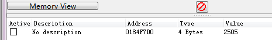
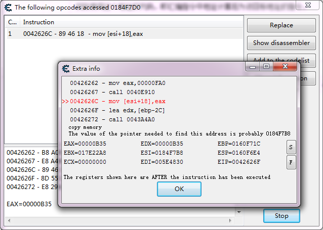
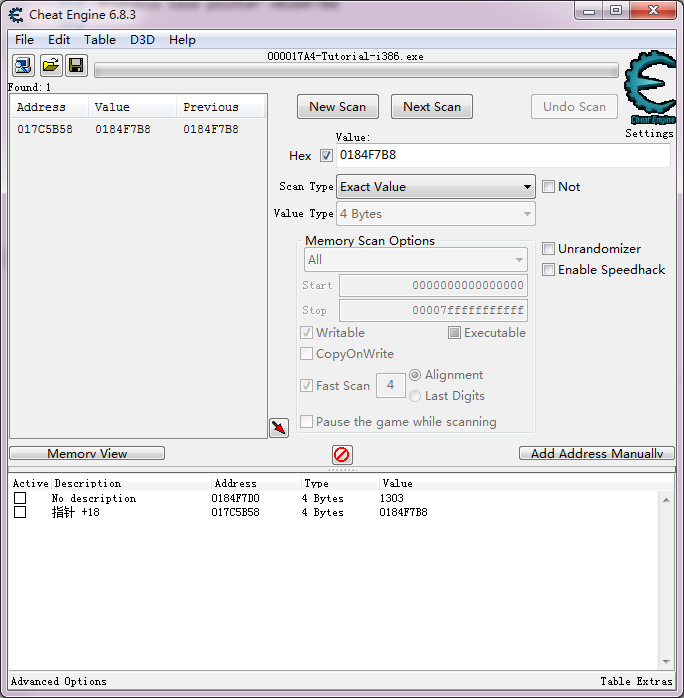
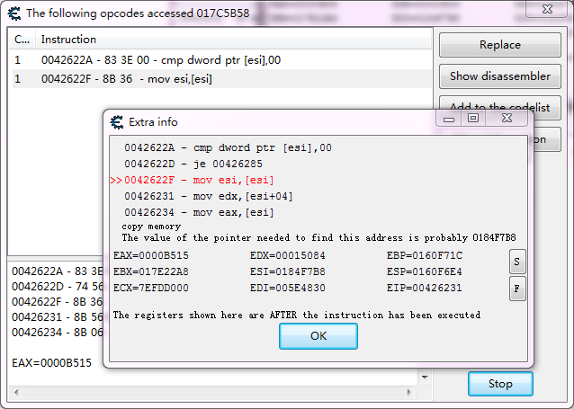
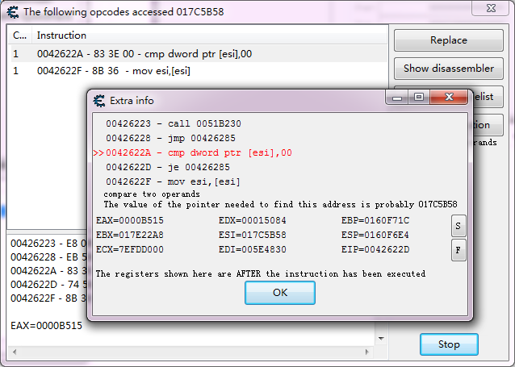
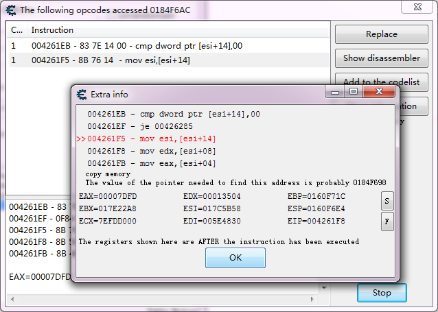
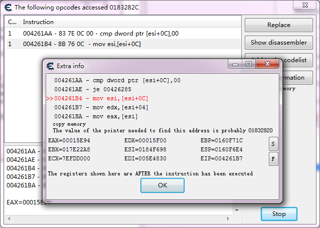
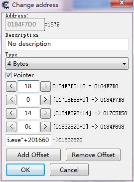
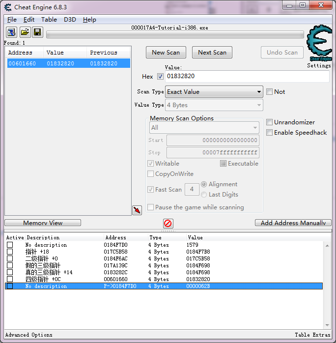

- [Inject DLL](#inject-dll)
	- [获取基址 base addr](#获取基址-base-addr)
- [相关软件](#相关软件)
	- [Cheat Engine](#cheat-engine)
	- [IDA PRO](#ida-pro)
	- [spy++](#spy)
	- [Process Monitor](#process-monitor)
	- [Process Explorer](#process-explorer)
- [Cheat Engine](#cheat-engine-1)
	- [Find what accesses this address](#find-what-accesses-this-address)
- [detour](#detour)
	- [功能](#功能)
- [detour Trampoline](#detour-trampoline)
- [AssaultCube](#assaultcube)
	- [main](#main)
- [API HOOK D3D12 HOOK](#api-hook-d3d12-hook)
	- [Pointer-to-Member Function](#pointer-to-member-function)
	- [获取全局对象地址](#获取全局对象地址)
	- [获取虚函数地址](#获取虚函数地址)
	- [获取dll导出函数接口](#获取dll导出函数接口)
- [entity](#entity)
- [CSGO hack](#csgo-hack)
- [Debug 调试](#debug-调试)

# Inject DLL
- OpenProcess
- VirtualAllocEx
- WriteProcessMemory
- GetProcAddress
- CreateRemoteThread


manual mapping injector
实现dll的隐藏加载，下述方式无法检测到这种方式加载的dll
- ToolHelp32Snapshot() 
- walking the module linked list in the PEB 
- using NtQueryVirtualMemory.


https://guidedhacking.com/threads/manual-mapping-dll-injection-tutorial-how-to-manual-map.10009/
https://guidedhacking.com/threads/memanualmapper-bypass-hooks-allocation-detections.14567/


## 获取基址 base addr

# 相关软件
## Cheat Engine

	- https://cheatengine.org/
	- https://duvf52y7btwne.cloudfront.net/9h66m-xfg2auo/CheatEngine71.exe
  
## IDA PRO
	- https://www.hex-rays.com/products/ida/support/download_freeware/
	- https://out7.hex-rays.com/files/idafree70_windows.exe

反汇编

## spy++
visual studio -> Tool -> spy++


## Process Monitor


## Process Explorer
https://docs.microsoft.com/en-us/sysinternals/downloads/process-explorer


# Cheat Engine

- scan type 和 value type 需要匹配， 例如扫描decreased value时，double类型的不能选择float类型
- Code finder， Find what accesses this address
- Code Injection

多级指针扫描
1. value_address : value 通过值扫描找到存储value的地址value_address
2. 寻找一级指针
   1. 在value_address上使用Find what accesses this address, 通过代码找到偏移量offset1
   2. ptr1_address -> ptr1_value + offset1 = value_address 使用value_address - offset1 得到ptr1_value
   3. 通过值扫描找到存储ptr1_value的地址ptr1_address
3. 寻找二级指针
   1. 在ptr1_address上使用Find what accesses this address, 通过代码找到偏移量offset2
   2. ptr2_address -> ptr2_value + offset2 = ptr1_address, 使用ptr1_address - offset1 得到ptr2_value
   3. 通过值扫描找到存储ptr1_value的地址ptr2_address
4. 重复上述过程， 直到地址ptrn_address变绿(由module的基址 + 偏移量进行表示)


## Find what accesses this address

CE 默认使用硬件断点的方式，断点只能停在指令执行之后

> 1. 通过值扫描， 找到变量的地址为：0x0184F7D0



> 2. 一级指针，寻找指向0x0184F7D0地址的指针

Find what accesses this address，调试器附加到进程上，

找到使用这个地址的汇编指令，即汇编指令中地址计算后为0x0184F7D0的指令，



图片显示的是mov [esi+18],eax 指令刚执行结束时的信息， esi寄存器的值为0x0184F7B8， 加上偏移量18后为地址0x0184F7D0，这说明存储0x0184F7B8这个值的地址处是个指针， 因此需要扫描0x0184F7B8这个值，获得一级指针
```
0042626C - mov [esi+18],eax

Probable base pointer =0184F7B8

ESI=0184F7B8
```
获得一级指针地址为0x017C5B58， 该地址处的value为0x0184F7B8加上偏移量18后，就得到变量0x0184F7D0



> 3. 二级指针， 寻找指向0x017C5B58地址的指针

在地址0x017C5B58上，Find what accesses this address



此时mov esi,[esi]指令执行结束，esi寄存器存储的是0x0184F7B8，可以查看在其之前的cmp dword ptr [esi],00指令，获得mov esi,[esi]指令运行之前esi寄存器的值为0x017C5B58，因此可以通过扫描0x017C5B58获得二级指针



```
ESI=017C5B58

Probable base pointer =017C5B58

0042622A - cmp dword ptr [esi],00
0042622D - je 00426285
0042622F - mov esi,[esi]
```

二级指针为0x0184F6AC，该地址处value为0x017C5B58，加上偏移量0，就得到一级指针地址0x017C5B58
> 3. 三级指针, 寻找指向0x0184F6AC地址的指针



mov esi, [esi+14]该指令中的esi+14为地址0x0184F6AC， 故该指令执行前esi为0x0184F698，扫描这个值可获得三级指针的地址， 这里扫描这个值会得到两个地址都存储这个值， 分别在这两个地址上使用what accesses this address，哪个地址有相应的汇编代码，哪个地址就为真正的三级指针，这里最后确认为0x017A139C

三级指针为0x0183282C， 该地址处value为0x0184F698，加上偏移量14，就得到二级指针地址0x0184F6AC

> 4. 四级指针，寻找指向0x0183282C地址的指针



mov esi,[esi+0C] 指令中的esi+0C计算后为0x0183282C（只有计算后为这个地址才会定位到这个指令)，故esi的值为0x01832820， 扫描这个值可获得四级指针的地址为"Tutorial-i386.exe"+201660 = 00601660






# detour
https://github.com/microsoft/detours

编译工具： 
- visual studio 2017

编译方法：
- File -> New -> Project From existing Code
- 选择extern build
- build cmd： nmake
- clean cmd： nmake clean

编译结果：
- include目录为头文件
- lib.X86目录为dll文件

## 功能
- Aimbot 自动瞄准
- Voice Spam 
- Quick Grenade 快速手雷
- Mass Kill 大规模杀伤
- Entity Magnet
- Player ESP 人物感知（透视）

# detour Trampoline
jmp指令的二进制指令位0xe9

nop指令为0x90

- 分配内存VirtualAlloc 
- 拷贝原函数到新分配的内存上memcpy， 制作跳板程序
- 修改原函数所在内存为可写，VirtualProtect

`detour函数`:  实施hook过程的函数或对象， 
	1. 需要知道被hook的函数地址， 
	2. hook之后执行的函数地址， 
	3. stolen byte长度， 被hook函数头部需要保存的长度

`Trampoline`: 用于实现执行原来被hook的函数
	1. 将被hook函数的stolen byte拷贝到Trampoline处
	2. 紧随其后为5字节的jmp指令，跳转回原来被hook函数的地址之后继续执行


```c++
// pLocation - 需要被hook的函数的地址
// pDetour - hook之后执行的函数的地址(用户自定义函数)
// dwLength - Target函数的备份长度（需要大于等于5字节，且构成完整的汇编指令长度)
void *DetourFunction( void *pLocation, void *pDetour, DWORD dwLength ) {
	// 构造Trampoline程序 
	// 构造Trampoline程序，1. 分配内存， 大小为Target函数的备份长度, 加上5字节的jmp指令用于跳转回Target函数
	void *pTrampoline = VirtualAlloc( NULL, dwLength + 5, MEM_COMMIT | MEM_RESERVE, PAGE_EXECUTE_READWRITE );
	// 构造Trampoline程序，2. 拷贝Target函数的备份长度到Trampoline程序
	memcpy( pTrampoline, pLocation, dwLength );
	// 构造Trampoline程序，3. 设置5字节的jmp跳转指令， 用于跳转回Target函数未备份的指令
	*reinterpret_cast< BYTE* >( reinterpret_cast< DWORD >( pTrampoline ) + dwLength ) = 0xE9;
	*reinterpret_cast< DWORD* >( reinterpret_cast< DWORD >( pTrampoline ) + dwLength + 1 ) = reinterpret_cast< DWORD >( pLocation ) - ( reinterpret_cast< DWORD >( pTrampoline ) + dwLength );

	// 修改Target函数
	// 修改Target函数, 1. 设置修改Target函数的备份长度所在内存为可读写
	DWORD dwOldProtection = NULL;
	VirtualProtect( pLocation, dwLength, PAGE_EXECUTE_READWRITE, &dwOldProtection );
	// 修改Target函数, 2. 设置修改Target函数的前5字节为jmp指令， 跳转到Detour函数
	*reinterpret_cast< BYTE* >( reinterpret_cast< DWORD >( pLocation ) ) = 0xE9;
	*reinterpret_cast< DWORD* >( reinterpret_cast< DWORD >( pLocation ) + 1 ) = reinterpret_cast< DWORD >( pDetour ) - ( reinterpret_cast< DWORD >( pLocation ) + 5 );
	// 修改Target函数, 3. 设置修改Target函数的其余备份长度为Nop指令
	for( size_t i = 5; i < dwLength; i++ )
		*reinterpret_cast< BYTE* >( reinterpret_cast< DWORD >( pLocation ) + i ) = 0x90;
	// 修改Target函数, 3. 设置修改Target函数的其余备份长度为Nop指令
	VirtualProtect( pLocation, dwLength, dwOldProtection, NULL );

	// 返回Trampoline程序的地址，可以记录到全局变量中，给Detour函数进行调用
	return pTrampoline;
}
```

# AssaultCube 

## main
入口函数DllMain

AssaultCube Hack\Main.cpp
```c++
DWORD WINAPI MainThread( LPVOID lpParameter ) {
	//Hook an ingame function so we won't get conflicts with differnt opengl.dll versions, I used to hook wglSwapBuffers before

    // 初始化菜单
	OnInitialize( );

    // 
	dwDrawHudJmpBack = reinterpret_cast< DWORD >( Utils::DetourFunction( reinterpret_cast< void* >( OFFSET_GL_DRAWHUD_MIDFUNC ), gl_DrawHud, 13 ) );

	return EXIT_SUCCESS;
}

//Dll Entry Point
BOOL WINAPI DllMain( HMODULE hModule, DWORD dwReason, LPVOID lpReserved ) {
	if( dwReason == DLL_PROCESS_ATTACH ) {
		CreateThread( 0, 0, MainThread, 0, 0, 0 );
	}

	return TRUE;
}
```

hook函数， 如何获得被hook函数的地址， hook的函数如何编写

AssaultCube Hack\Hooks.cpp
```c++
#include "Hooks.h"
#include "HackMain.h"

#include <GL/GL.h>
#pragma comment( lib, "OPENGL32.lib" )

void PreRenderFrame( )
{
	glPushMatrix( );

	glEnable( GL_BLEND );
	glBlendFunc( GL_SRC_ALPHA, GL_ONE_MINUS_SRC_ALPHA );

	GLint viewport[4];
	glGetIntegerv( GL_VIEWPORT, viewport );

	glLoadIdentity( );
	glOrtho( 0, viewport[2], viewport[3], 0, 0, 1 );

	OnRenderFrame( );

	glPopMatrix( );

}

DWORD dwDrawHudJmpBack = NULL;

__declspec( naked ) void gl_DrawHud( ) //Mid-Function Hook, right at the end of the drawhud function
{
	__asm
	{
		call PreRenderFrame;

		//Original Code
		mov esi, glDisable;
		push GL_BLEND;
		call esi;

		jmp[dwDrawHudJmpBack];
	}
}
```
PreRenderFrame 函数调用GL库的函数进行绘制


`#pragma comment( lib, "OPENGL32.lib" )` 链接OPENGL32.lib库文件


# API HOOK D3D12 HOOK

http://jbremer.org/x86-api-hooking-demystified/

x86 变长指令集

`stolen bytes`:  需要被覆写的长度， 需要和指令长度进行对齐
`trampoline`: 


> 在哪里进行hook(每帧绘制处)

- D3D12 HOOK
  - BeginScene
  - EndScene
  - Present (切换双buffer)
- openGL HOOK
  - DrawHud

> 如何进行hook(detour， minihook)

> hook处插入代码
绘制GUI


## Pointer-to-Member Function

Pointer-to-Member Function 
https://www.codeguru.com/cplusplus/c-tutorial-pointer-to-member-function/


```
Return_Type (Class_Name::* pointer_name) (Argument_List);

Return_Type:   member function return type.
Class_Name:    name of the class in which the member function is declared.
Argument_List: member function argument list.
pointer_name:  a name we'd like to call the pointer variable.
```
成员函数指针和普通指针不能相互转换


## 获取全局对象地址
获取d3d devecie, 通过代码扫描定位地址
CSGOSimple/valve_sdk/sdk.cpp
```c++
IDirect3DDevice9*     g_D3DDevice9     = nullptr;

auto dx9api = GetModuleHandleW(L"shaderapidx9.dll");
g_D3DDevice9 = **(IDirect3DDevice9***)(Utils::PatternScan(dx9api, "A1 ? ? ? ? 50 8B 08 FF 51 0C") + 1);
```

Utils::PatternScan 代码扫描获取到的地址为三级指针，  `**(IDirect3DDevice9***)`解析得到`IDirect3DDevice9*`指针

`PatternScan`: 在某个模块代码中搜索匹配的模式字节码， 模块地址通过`GetModuleHandleW`获取， 模式字节码一般通过IDA等工具定位获取到
```c++
    /*
     * @brief Scan for a given byte pattern on a module
     *
     * @param module    Base of the module to search
     * @param signature IDA-style byte array pattern
     *
     * @returns Address of the first occurence
     */
    std::uint8_t* PatternScan(void* module, const char* signature)
    {
        static auto pattern_to_byte = [](const char* pattern) {
            auto bytes = std::vector<int>{};
            auto start = const_cast<char*>(pattern);
            auto end = const_cast<char*>(pattern) + strlen(pattern);

            for(auto current = start; current < end; ++current) {
                if(*current == '?') {
                    ++current;
                    if(*current == '?')
                        ++current;
                    bytes.push_back(-1);
                } else {
                    bytes.push_back(strtoul(current, &current, 16));
                }
            }
            return bytes;
        };

        auto dosHeader = (PIMAGE_DOS_HEADER)module;
        auto ntHeaders = (PIMAGE_NT_HEADERS)((std::uint8_t*)module + dosHeader->e_lfanew);

        auto sizeOfImage = ntHeaders->OptionalHeader.SizeOfImage;
        auto patternBytes = pattern_to_byte(signature);
        auto scanBytes = reinterpret_cast<std::uint8_t*>(module);

        auto s = patternBytes.size();
        auto d = patternBytes.data();

        for(auto i = 0ul; i < sizeOfImage - s; ++i) {
            bool found = true;
            for(auto j = 0ul; j < s; ++j) {
                if(scanBytes[i + j] != d[j] && d[j] != -1) {
                    found = false;
                    break;
                }
            }
            if(found) {
                return &scanBytes[i];
            }
        }
        return nullptr;
    }
```

## 获取虚函数地址

vfunc_hook

CSGOSimple/hooks.hpp
```c++
namespace Hooks
{
	inline vfunc_hook direct3d_hook;
}
```

CSGOSimple/hooks.cpp
```c++
direct3d_hook.setup(g_D3DDevice9);

direct3d_hook.hook_index(index::EndScene, hkEndScene);
direct3d_hook.hook_index(index::Reset, hkReset);
```

```c++
long __stdcall hkEndScene(IDirect3DDevice9* pDevice)
{
	static auto oEndScene = direct3d_hook.get_original<decltype(&hkEndScene)>(index::EndScene);
	// your code
	return oEndScene(pDevice);
}
```

vfunc_hook 为class

- setup方法的参数为void*指针， 接受一个类对象的地址， 找到该对象的虚表地址和虚表大小
并拷贝虚表到新分配的内存上， 将该对象的虚表指针指向新的虚表地址
- hook_index方法第一个参数为虚函数在虚表中的索引， 第二个参数为hook之后的函数
- vfunc_hook类中保存了旧虚表的地址和新虚表的地址，在hook之后的新函数中通过get_original方法得到原来函数的地址


## 获取dll导出函数接口

csgo的engine.dll， client.dll等模块均导出了"CreateInterface"函数， 该函数可以用来获取对象

https://guidedhacking.com/threads/csgo-createinterface-tutorial-how-to-get-interfaces.14701/


# entity


```
HMODULE module = GetModuleHandleW(L"engine.dll");
void* func_ptr = GetProcAddress(module, "CreateInterface");
```

`GetProcAddress`: Retrieves the address of an exported function or variable from the specified dynamic-link library (DLL).


# CSGO hack

csgo反作弊
- anti-loadlibrary protection： 使用LoadLibraryW注入csgo失败， CS:GO hooks NtOpenFile (ntdll.dll) from within csgo.exe.
- Thread creation detection： DllMain function of client.dll contains code that on DLL_THREAD_ATTACH calls NtQueryInformationThread function from ntdll.dll to get start address of newly created thread
  - DisableThreadLibraryCalls


vac bypass https://github.com/zyhp/vac3_inhibitor


# Debug 调试

如何调试dll

1. Debug编译dll， 并准备好dll注入工具
2. Debug->Attach to Process 选择dll准备注入的目标进程，例如csgo.exe
3. 在dll源码上设置断点
4. 启动dll注入工具，将dll注入到目标进程
5. 如果dll源码有设置断点，且注入dll成功，程序会自动停在断点上