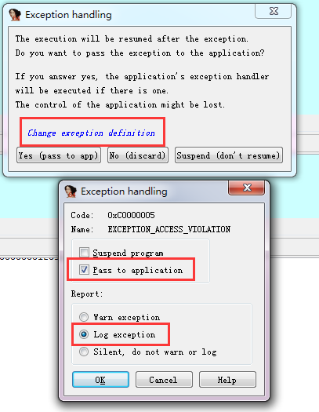

软件中断和硬件中断

中断：有硬件保存和恢复现场

- 软件中断， int 3 指令触发

# ida

字符串视图 view -> open subviews -> strings
1. 搜索常用的字符串， 如血量health， 弹药armor

## Exception handling

# ollydbg
- Open
- Attach
- Just-in-time debugging