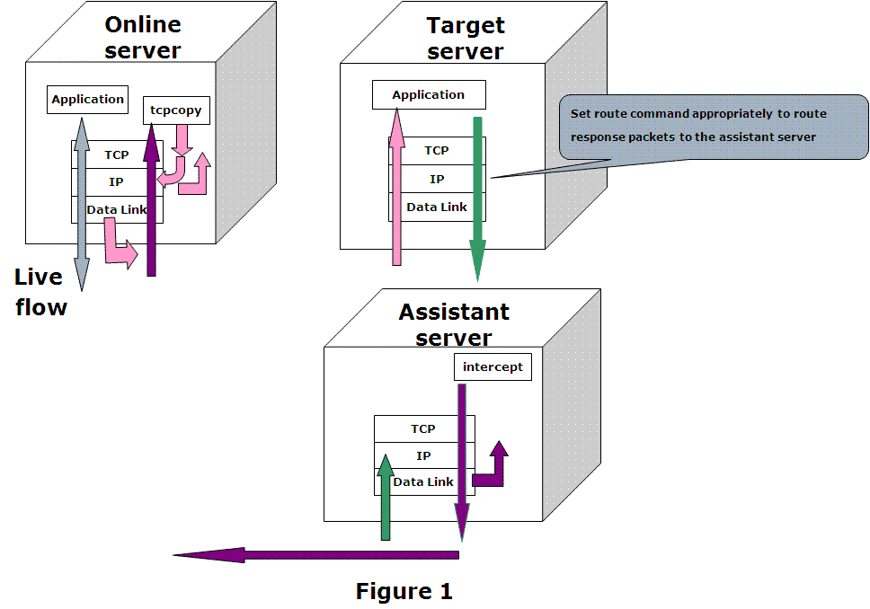

https://github.com/wangbin579/tcpcopy

# 线上服务器(online server)
- 运行TCPCopy Client(tcpcopy)， 负责转发线上真实请求流量

```
./tcpcopy -x 10000-10.120.180.213:10000 -s 10.120.180.214 -c 162.135.200.x -d

# 参数说明
-x <port>-<target ip>:<target port> 指定要拷贝本机的端口和测试服务器的ip和端口
-s intercept进程所在的助理服务器ip， tcpcopy从这里接收响应头
-c tcpcopy转发数据包时，修改数据包的源地址为该参数指定的ip，在测试服务器上可以配置路由表，来控制响应包的返回路径
-d 以daemon形式运行
```


# 测试服务器 (target server)
- 运行带测试的application，负责接收tcpcopy转发的线上真实请求流量，处理请求后将响应发送给助理服务器

配置路由表
```
route add -net 62.135.200.0 netmask 255.255.255.0 gw 61.135.233.161

# 参数说明
-net 后跟的地址， 需要与tcpcopy命令中-c参数地址匹配

```


# 助理服务器(assistant)
- 运行TCPCopy Server(intercept), 负责接收测试服务器的响应，和转发响应头给线上服务器的tcpcopy

```
./intercept -i bond0 -F tcp and src port 10000 -d

# 参数说明
-i 监控网卡接口
-l 记录日志
-F 监控的协议和端口
-d 以daemon形式运行
```