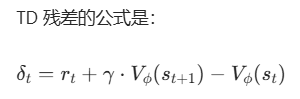

# 人形机器人行业

figure.ai  Helix

## 国内外研究团队


## 公司 

硬件运动控制

- 宇树
- 众擎： https://www.engineai.com.cn/
- 智元：https://www.zhiyuan-robot.com/


## 模型

vla 模型


-  英伟达
    - SONIC，
    - DreamZero： https://dreamzero0.github.io/
- Physical Intelligence (π)

## 国内外研究团队


## 公司 

硬件运动控制

- 宇树
- 众擎： https://www.engineai.com.cn/
- 智元：https://www.zhiyuan-robot.com/


## 模型

vla 模型


-  英伟达
    - SONIC，
    - DreamZero： https://dreamzero0.github.io/
- Physical Intelligence (π)

# 关节电机

关节电机（一体化关节模组）： 电机 + 减速器 + 编码器

减速器： 降低电机转速，提高力矩。 杠杆原理，通过齿轮减速，力矩直接放大 50～100 倍

机器人关节里最常用的减速器：谐波减速器

谐波减速器特点：
- 体积小
- 减速比巨大（50～100 倍）
- 精度极高
- 适合机器人手臂、腿、手腕


谐波减速机原理:  https://v.douyin.com/mTmxb2wNKjo/ 

谐波减速器： 波发生器（内侧） + 柔轮（中间） + 钢轮（外侧） 

波发生器：椭圆形

柔轮比钢轮少两个齿， 柔轮可以弹性形变

# 零件 和 材料

动力系统：是机器人的 “肌肉”，负责运动，价值量占比最高，约 50%。主要由谐波减速器、伺服电机、编码器、轴承等构成。其中，谐波减速器的全球潜在龙头是日本哈默纳科，国产替代领军者为绿的谐波、双环传动；伺服电机的全球潜在龙头是日本电产，国产替代领军者有汇川技术、步科股份等。

传感系统：作为机器人的 “眼睛” 和 “耳朵”，负责感知环境。视觉传感器方面，全球潜在龙头是特斯拉，国产替代领军者为奥比中光；惯性测量单元（IMU）的全球龙头是博世，国产替代领军者是华依科技。
控制系统：相当于机器人的 “小脑”，负责运动控制和协调。全球潜在龙头是特斯拉，其通过自研芯片 + 算法实现控制，国产替代领军者为汇川技术，在运动控制方面具有优势。

灵巧手：是实现精细操作的关键。全球潜在龙头有特斯拉、德国 SCHUNK，国产替代领军者为鸣志电器，其在空心杯电机领域有优势。

热管理系统：用于保证电机等部件不过热。全球龙头是三花智控和日本电产，三花智控也是国产替代的领军者，在全球热管理领域占据重要地位。

身体结构：即机器人的 “骨骼”，要求轻且坚固。全球范围内压铸技术领先企业处于优势地位，国产替代领军者为拓普集团、广东鸿图，它们在一体化压铸方面技术实力雄厚。


电机是实现动力输出的 “硬件核心”

伺服是围绕电机构建的 “智能控制体系”

`步进电机`：将电脉冲信号转换成步进电机的角位移或线位移，每输入一个脉冲信号，步进电机就转动一个固定的角度（步距角）。通过控制脉冲的数量、频率和顺序，可以精确控制步进电机的转动角度、速度和方向。

`滚柱丝杠`和`减速器`在人形机器人中承担不同的传动功能，分别适配直线运动和旋转运动场景

- 全网最简单清晰！20分钟硬核拆解人型机器人核心零部件，伺服电机、减速器、空心杯、丝杠一网打尽！机器人专题研究之运动系统【深度报告】( https://www.bilibili.com/video/BV1b64y1L73j/?spm_id_from=333.337.search-card.all.click&vd_source=05b9e112882cf3fe738863375b088e4c )


硅胶

TPE（热塑性弹性体）是一种兼具橡胶弹性和塑料加工性能的高分子材料


材料属性： 毒性， 硬度


# 仿真

`Mujoco`

关节角度 / 速度的单位都是弧度（rad） 或 弧度 / 秒（rad/s）

| 数组索引范围                                             | 字段名称                | 物理含义                    | 预处理方式                            |
|----------------------------------------------------|---------------------|-------------------------|----------------------------------|
| obs[:3]                                            | omega               | 机器人基座的角速度（绕 x/y/z 轴）    | 乘以 ang_vel_scale 缩放              |
| obs[3:6]                                           | gravity_orientation | 由基座四元数计算出的重力方向（表征机器人姿态） | 无额外缩放，直接使用四元数转换结果                |
| obs[6:9]                                           | cmd                 | 机器人的控制指令（如速度指令等）        | 乘以 cmd_scale 缩放                  |
| obs[9 : 9 + num_actions]                           | qj                  | 关节位置（实际值 - 默认值）         | 乘以 dof_pos_scale 缩放              |
| obs[9 + num_actions : 9 + 2 * num_actions]         | dqj                 | 关节速度                    | 乘以 dof_vel_scale 缩放              |
| obs[9 + 2 * num_actions : 9 + 3 * num_actions]     | action              | 上一时刻策略输出的动作             | 无额外缩放，直接使用                       |
| obs[9 + 3 * num_actions : 9 + 3 * num_actions + 2] | sin_phase/cos_phase | 周期相位信号（正弦 / 余弦）         | 由 counter * simulation_dt 计算周期相位 |


dof_pos_scale=1.0 是因为机器人关节角度物理限位本身接近 [-1, 1] rad，无需额外缩放；

dof_vel_scale=0.05 是将约 ±20 rad/s 的原始关节速度缩放到 ±1 区间的理论值，也是工程验证后的经验最优值；

调整这两个参数时，需以机器人实际物理限位为基础，结合训练稳定性验证，核心目标是让缩放后的关节状态落在 [-1, 1] 区间。


```py
def quat_rotate_inverse(quat, vec_world):
    """
    核心函数：将世界坐标系的向量转换为本体坐标系的向量
    :param quat: 单位四元数 (qw, qx, qy, qz)，描述本体相对于世界的旋转
    :param vec_world: 世界坐标系中的3维向量
    :return: 本体坐标系中的3维向量
    """
    # 步骤1：计算四元数的共轭（逆）
    q_inv = quat_conjugate(quat)
    # 步骤2：把世界向量转成纯四元数
    v_quat = vec_to_quat(vec_world)
    # 步骤3：执行逆旋转公式：v_body = q_inv × v_world × q
    v_body_quat = quat_multiply(quat_multiply(q_inv, v_quat), quat)
    # 步骤4：转回3维向量
    return quat_to_vec(v_body_quat)
```


# LLM


当你看到 “苹果”（视觉输入）、听到 “苹果”（听觉输入）、说出 “苹果”（语言输出）、想到 “苹果”（思维输出）时，激活的是大脑颞叶、额叶、顶叶中同一组神经集群（分布式表征）

语言输出（说话 / 写字）：大脑的布洛卡区（语言生成中枢）接收来自韦尼克区（语义理解中枢）的分布式神经信号，激活运动皮层中控制声带 / 手部肌肉的神经，生成连续的语音或文字 —— 没有 “词表” 概念，而是通过神经信号的强度、时序动态组合出 “苹果”“红色” 等语义，再转化为具体动作。

图像输出（想象 / 绘画）: 视觉皮层的神经集群激活后，通过顶叶 - 枕叶环路动态组合出 “圆形 + 红色 + 凹陷” 等特征，形成 “苹果” 的心理表象，再通过运动皮层转化为绘画动作。

“反馈校准”: 生成第一个 token 后，通过 “语义连贯性检测模块”（如判断该 token 与前文的语义相似度）给出反馈，调整下一个 token 的生成概率（如生成 “苹果” 后，增强 “红色”“甜” 等相关 token 的权重，削弱 “汽车”“石头” 等无关 token 的权重）。


用扩散模型作为统一输出模块：文本、图像的输出均为 “语义向量→模态数据” 的生成过程（文本是离散序列扩散，图像是像素扩散），共享语义表征和生成逻辑。
优势：无需针对不同模态调整输出头结构，实现真正的多模态统一输出。


## 神经环路功能抽象级模拟

忽略生物细节，用简化规则模拟神经环路的功能（如模式识别、记忆存储），用于 AI 或认知科学建模。

主流观点是：意识不是单一脑区的产物，而是大脑多个区域通过动态网络协同工作，涌现出的一种整体功能状态—— 就像一首曲子不是某一个乐器单独奏出的，而是所有乐器配合的结果。

一、与意识密切相关的核心脑区（无 “唯一载体”，是 “协同网络”）

1. 前额叶皮层：意识的 “指挥中心”
负责高级意识功能，比如自我认知（知道 “我是谁”）、决策（选 A 还是选 B）、计划（明天要做什么）、注意力调控（专注看书不被噪音干扰）。如果前额叶受损，人可能会失去 “自我感”，或无法控制注意力，意识变得混乱。
2. 丘脑：意识的 “信息中转站”
丘脑像大脑的 “总交换机”，几乎所有感官信息（看、听、摸等）都要先经过丘脑，再投射到大脑皮层。它和皮层之间的 “丘脑 - 皮层回路” 持续放电，是维持 “清醒意识”（区别于睡眠、昏迷）的关键 —— 如果这个回路被抑制，人就会陷入无意识状态（比如深度麻醉）。
3. 顶叶（尤其是角回、楔前叶）：意识的 “整合器”
负责整合来自不同感官的信息（比如把 “苹果的形状、味道、触感” 整合成一个完整的 “苹果” 意识），还参与 “身体存在感”（知道手脚是自己的）、空间意识（知道自己在房间里的位置）的形成。顶叶受损可能出现 “异手综合征”—— 觉得自己的手不是自己的，不受控制。
4. 默认模式网络（DMN）：“静息时的意识” 核心
当人不专注于外部任务（比如发呆、走神、想心事）时，默认模式网络会活跃起来，负责产生 “内心思绪”（比如回忆过去、想象未来、琢磨别人的想法）—— 这部分也是 “自我意识” 的重要来源，是我们 “不做事时也有意识” 的基础。


从高级皮层到低级皮层的 “反馈解码”（比如你预期看到 “猫”，大脑会提前激活相关神经元，强化猫的特征识别）


# 脑海

Chain-of-Thought

语言是图像操纵的 “指挥系统”


## 图像生成 <-> 图像理解

语言规划图片布局，图片元素和排布顺序


## 视觉目标的运动控制


# 运动控制


正向动力学（FD）模型： 输入当前关节状态（关节位置，速度）和拟施加的扭矩τ ，预测未来关节加速度

 


$x_k+1 = f(x_k,τ_k) $，其中f为正向动力学（FD）模型（输入状态 + 扭矩，输出下一状态）

状态： 关节位置， 关节速度， 转矩 -> 关节加速度


逆向动力学（ID）模型 ：：输入上层规划的「期望关节状态」（关节位置， 速度，加速度），输出精准的关节扭矩指令


## PPO（Proximal Policy Optimization，近端策略优化）

Actor-Critic（演员 - 评论家）是强化学习中一类算法的通用框架，而 PPO（近端策略优化）是针对该框架中 “策略更新不稳定、步长难控制” 问题提出的具体优化算法


时序差分残差（TD 残差）和 优势函数（Advantage）



δ >0的含义是：“当前动作带来的实际收益（即时奖励 + 未来预期），比 Critic 原本预估的更好” —— 简单说，这个动作 “超预期”，是个好动作。

“残差” 本质是 “实际值 - 预估値”：

TD 残差是 “单步好坏”，优势函数是 “综合多步的好坏”——Critic 先通过 TD 残差判断每一步的动作好不好，再汇总成优势函数告诉 Actor。


# 多模态层级对比

| 维度 | 文本层级(NLP) | 视觉层级(CV) | 核心特征 |
|------|--------------|-----------|---------|
| 基础单元 | 字/字符 | 像素/补丁(Patch) | 原始数据，无独立语义 |
| 局部语义 | 词/短语 | 纹理/零部件 | 识别出具体的"物"或"意" |
| 完整陈述 | 句子 | 单张图像(静止场景) | 描述一个瞬间的状态 |
| 逻辑流 | 段落 | 短视频序列(动作) | 加入了时序或逻辑的连贯性 |
| 宏观叙事 | 文章/篇章 | 长视频/电影 | 复杂的上下文、情感与主题 |
