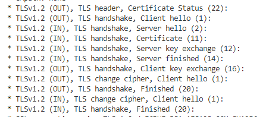

# wireshark

# SSL/TLS
- 客户端通过数字证书获取服务端的公钥
- 公钥加密耗时，获取对此加密的会话秘钥(session key)

TLS handshake


curl -v <url> 输出的handshake握手信息



# HSTS
浏览器内置列表记录需要https链接的域名，强制浏览器发起https访问，如果服务器返回的TLS证书无效，用户不能忽略浏览器警告继续访问网站

chrome://net-internals/#hsts

# curl
```
# 只显示响应的头部信息
curl.exe -I <ulr> 

# 显示详细信息，如url为https时，显示TLS handshake过程
curl.exe -v <ulr> 
```

# openvpn

openvpn驱动部分实现了虚拟网卡和字符设备。虚拟网卡配合路由表接收网络数据，openvpn应用层通过字符设备获取虚拟网卡捕获的网络数据，然后将数据传输到真正的物理网卡

发送数据
-------
1. 应用程序发送网络数据
2. 网络数据根据修改后的路由表把数据路由到虚拟网卡
3. 虚拟网卡把数据放到数据队列中
4. 字符设备从数据队列中取数据，然后送给应用层
5. 应用层把数据转发给物理网卡
6. 物理网卡发送数据

接收数据
-------
1. 物理网卡接受到数据，并传到应用空间
2. 应用守护程序通过字符设备，把数据传给驱动网卡
3. 数据通过虚拟网卡重新进入网络堆栈
4. 网络堆栈把数据传给上层真实的应用程序。