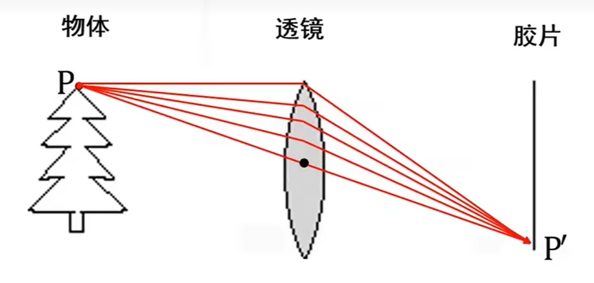

基础知识

# 小孔成像

- 小孔
    - 焦距：像平面到小孔的距离
    - 光圈对应小孔的大小， 光圈越小，图像越清晰， 但进光越少，亮度越小
    - 视野：连接像平面的边缘和小孔所得到的圆锥的形状；

- 透镜
    - 透镜焦距：透镜中心到透镜焦点的距离
    - 透镜焦距由透镜球面半径R和透镜折射系数n决定
    - 透镜中心相当于小孔
        - 好处：
            同时让更多的光线聚焦到同一个成像点，增加亮度， 未改变小孔成像模型
        - 副作用： 
            1. 物体聚焦要求像平面和透镜中心为特定距离， 景深会影响清晰度
            2. 由于镜头制作工艺， 径向畸变

- 摄像机坐标系
    - 小孔（透镜中心）为原点， 横向向右为x轴， 纵向向上为y轴， 深度向里为z轴
- 虚像平面坐标系
    - 像平面中间为原点， 横向向右为x轴， 纵向向上为y轴

- 像素坐标系
    - 照片左下角为原点， 向右为X轴，向上为Y轴
    - 像平面通过平移和缩放映射到像素坐标系， 缩放参数（pixel/m)

## 摄像机坐标系 -> 像素坐标系

$$ 
\left(
    \begin{array}
    {}
    x' \\
    y' \\
    z  \\
    \end{array}
\right)

=

\left(
    \begin{matrix}
    {}
    \alpha & -\alpha cot(\theta) & width/2 & 0 \\
    0 & \beta/sin(\theta) & height/2 & 0 \\
    0 & 0 & 1 & 0 \\
    \end{matrix}
\right)

\left(
    \begin{array}
    {}
    x \\
    y \\
    z \\
    1
    \end{array}
\right)

$$

摄像机内参数矩阵 （ 3 * 3）

$$
\begin{aligned} 
K =

\left(
    \begin{matrix}
    {}
    \alpha & -\alpha cot(\theta) & width/2 \\
    0 & \beta/sin(\theta) & height/2 \\
    0 & 0 & 1 \\
    \end{matrix}
\right)

\end{aligned}
$$

$\alpha = f * k$, 其中f为摄像机的焦距， k为摄像机的横向像素密度

$\beta = f * l$，其中f为摄像机的焦距， l为摄像机的横向像素密度

## 世界坐标系 -> 像素坐标系

透视投影矩阵 （3 * 4）

M = K [R T]

摄像机外参数矩阵：[R T] 

- 给定一个矩阵，如何判断这个矩阵能否成为一个投影矩阵

# 三角测量

# 本征矩阵(Essential matrix)

- Essential matrix
    - 3 ×3 matrix 
    - captures the geometric relationship between two calibrated cameras or between two locations of a single moving camera.