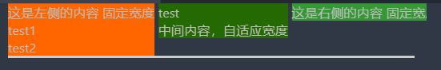

# css

## 选择器

基础选择器
- id选择器 `#id_name{}`
- class选择器 `.class_name{}`
- 标签选择器（元素选择器）`p {}`
- 通配符选择器 `*{}`

组合选择器
- 群组选择器`` (逗号分割, 选择器的样式均相同) 
- 嵌套选择器
  - 后代选择器（空格分割）
  - 子元素选择器(以大于 > 号分隔）
  - 相邻兄弟选择器（以加号 + 分隔）

选择器的优先级
1. 基础选择器优先级
   1. `!important` > style内联样式 > ID选择器 > 类选择器 > 标签选择器 > 通配符选择器
   2. 同一级别中后写的会覆盖先写的样式
   3. 同一级别css引入方式不同，优先级不同
   4. 总结排序：内联(行内)样式 > 内部样式表 > 外部样式表 > 导入样式(@import)。

2. 嵌套选择器， 选择器个数越多，优先级越高


id 选择器: html使用id属性， css使用id对应的名称进行选择

```html
<p id="para1">Hello World!</p>

<style>
#para1 {
	text-align:center;
	color:red;
}
</style>
```

class 选择器
```html
<p class="center">段落居中。</p> 


<style>
.center {
	text-align:center;
}
</style>

```

# 文档流和文本流
文档流是指“Normal flow”，文本流是指“Text flow”

文档流是html元素的流式呈现，文本流是文字的流式呈现， html元素设置float属性后，会脱离文档流， 但是其中的文字并未脱离文本流（文字显示不会发生重叠）


```
<!DOCTYPE html>
<html>
    <head>
        <style>
            .test {
                float: left;
                /* position: fixed; */
                background-color: red;
            }

            .t3 {
                height: 100px;
                background-color: blue;
            }

        </style>
    </head>
    <body>
        <div> 文本11111111 </div>
        <div class="test"> 文本22222 </div>
        <div class="t3"> 文本333 </div>
    </body>
</html>
```
`float: left`时`文本22222`和`文本333`不会发生覆盖， 未脱离文本流


# css 布局技巧

块元素 `display:block`: 独占一行，有宽高属性
- div （默认为 `display:block`）


行内元素`display:inline`: 不会独占一行， 没有宽高属性
- span （默认为`display:inline`）

行内块元素`display:inline-block`: 不会独占一行， 有宽高属性

## 盒子模型
- margin 外间距
- border 边框
- padding 内边距
- content

外边距合并
- 块元素之间的margin取最大值
- float元素的外间距不会合并

## 布局方式
- float布局
- position布局
- display布局

## float布局
```
float:left | right
```

float属性对元素的影响
- 元素排除在普通流之外
- 元素不在页面占据空间
- 元素保持在父容器内

float元素之间的关系
- 元素之间不会重叠
- 元素不会独占一行， 并且可以设置width和height
- div设置float后只对自身有效， 子元素需要设置float才能跟随布局

使用float对header进行左右布局
```
<style>
    .header {
        overflow: auto;
    }

    .header_left, .header_left > * {
        float: left;
    }

    .header_right, .header_right > * {
        background-color: blue;
        float: right;
    }
</style>

<body>
    <div class="header">
        <div class="header_left">
            <div>
                <span> 公司名称 </span>
                <span> 公司链接 </span>
            </div>
            
            <div>公司简介</div>
            <div>招聘英才</div>
        </div>
        
        <div class="header_right">
            <div>
                <span> 帮助 </span>
            </div>

            <div>
                <span> 登录 </span>
                <span> 注册 </span>
            </div>
        </div>
    </div>
</body>

```

实现效果


## position布局
- `position:static`: 默认值
- `position:relative`: 元素相对没有该属性之前的位置进行定位, 并且原来的空间还会保留，不会影响后续其他元素的位置
- `position:absolute`: 元素相对最近父元素（需要满足非position:static)进行定位，并且原来的空间不会保留，会影响后续其他元素的位置
- `position:fixed`: 元素进行固定定位, 相对于浏览器窗口进行定位，原来的空间不会保留
- `z-index`: 可以用来调整重叠元素的覆盖顺序， 只能在非position:static的元素上生效


## flex布局（伸缩盒，响应式布局）
`display:flex`

父容器
- `display:flex`: 声明父容器为伸缩盒
- `justify-content`: 盒子内元素在主轴上的对齐方式
  - `flex-start`
  - `flex-end`
  - `center`
  - `space-between`: 两端没有空白，松散对齐
  - `space-around`: 两端有空白，松散对齐
- `align-items`: 盒子内元素在侧轴上的对齐方式
  - `flex-start`
  - `flex-end`
  - `center`
  - `stretch`

## grid布局
`display:grid`: 声明父容器为grid布局， 默认父容器为块元素
`display:inline-grid`: 声明父容器为grid布局， 父容器为行内元素
声明父容器为grid布局后，容器内元素（项目）的float，display，vertical-align, column-*等属性将失效


# 行布局

父元素设置`white-space: nowrap` 后，控制同一行的子元素不会自动换行
```
<div style="width: 100%; overflow:auto; white-space: nowrap ">
    <div style=" background:#F60; display:inline-block">这是左侧的内容 固定宽度</div>
    <div style=" background:#6C3; display:inline-block;">中间内容，自适应宽度</div>
    <div style=" background:#393; display:inline-block"> 这是右侧的内容 固定宽度</div>
</div>
```

-  `vertical-align:top`:  display:inline-block设置后可以设置该元素控制竖直对齐方式

```
<div class="test" style="width: 100%; overflow:auto; white-space: nowrap ">
    <div style=" background:#F60; display:inline-block; vertical-align:top">这是左侧的内容 固定宽度
        <div>
            test1
        </div>

        <div>
            test2
        </div>
    </div>
    <div style=" background:rgb(36, 105, 1); display:inline-block; vertical-align:top">
        <div>
            test
        </div>
        中间内容，自适应宽度
    </div>
    <div style=" background:#393; display:inline-block; vertical-align:top"> 这是右侧的内容 固定宽度</div>
</div>
```

显示效果：



# 分界线


# 滚动视口