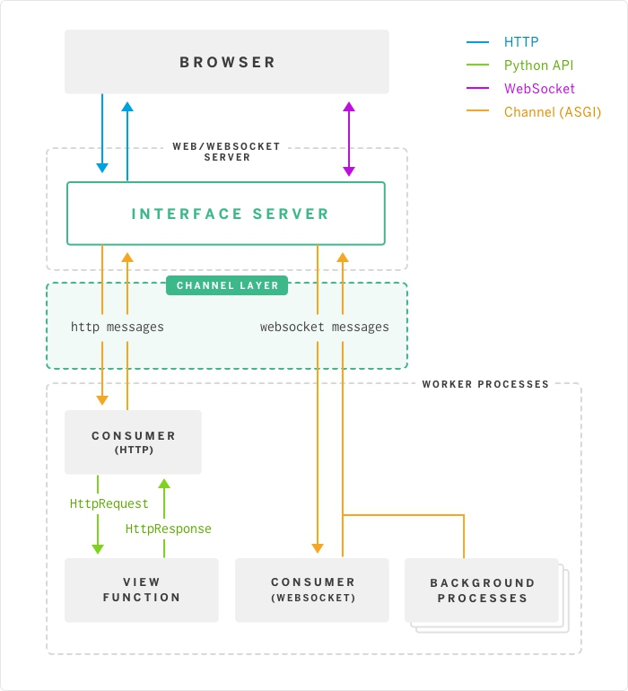

# django

## django CORS 

用户可以访问网站A和网站B， 网站B的页面上有javascript向网站A发起http请求， 如果网站A没有开启CORS（返回给浏览器的header未设置字段Access-Control-Allow-Origin）， 浏览器会拒绝将网站A的响应内容返回给网站B的请求，从而保护用户在网站A的响应不被网站B窃取

django开启CORS

```
pip install django-cors-headers
```

settings.py 
```
INSTALLED_APPS = [
   ...
   'corsheaders',
   ...
]

MIDDLEWARE = [
  'corsheaders.middleware.CorsMiddleware',
  'django.middleware.common.CommonMiddleware',
  #'django.middleware.csrf.CsrfViewMiddleware',
]

CORS_ORIGIN_ALLOW_ALL = True
```

'django.middleware.common.CommonMiddleware'之前添加'corsheaders.middleware.CorsMiddleware',
注释掉'django.middleware.csrf.CsrfViewMiddleware'


# ASGI vs WSGI
- CGI:（通用网关接口， Common Gateway Interface）
- WSGI: (Web服务器网关接口, Web Server Gateway Interface)
- ASGI: (异步网关协议接口) 支持HTTP, HTTP2, Websocket等协议

django框架为了同时支持HTTP协议和Websocket协议，引入了ASGI， ASGI分为三层， 第一层根据请求的url（http:// or ws://)解析协议，第二层为Channel，通过队列缓存消息， 第三层为Consumer消费消息

