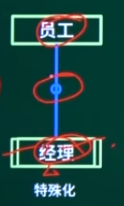

# 职称资格 职务聘任

《关于实行专业技术职务聘任制度的规定》
https://www.gov.cn/zhengce/202203/content_3338049.htm


# 全国计算机技术与软件专业资格（水平）考试

软考， 软设

官网： https://www.ruankao.org.cn/


# 考试时间

https://www.ruankao.org.cn/article/content/100002230207144833542290


### 校检码

- 奇偶校验码
- 海明码
- 循环冗余校检码


奇偶校验码是一种简单的错误检测和校验方法，用于确保数据传输的完整性。奇偶校验码有两种主要类型：奇校验和偶校验。奇校验要求总共有奇数个1，而偶校验要求总共有偶数个1。奇偶校验码通常在数据传输中使用，如ASCII码，其中最高位用作奇偶校验位。

以下是一个简单的奇偶校验码示例，展示了如何计算和验证奇偶校验码：

### 计算奇偶校验码

假设我们有一个ASCII码字符，例如大写字母A，它的二进制表示为`11000001`。

- 奇校验：计算二进制数中1的个数，如果是奇数，则校验位为0，否则为1。
- 偶校验：计算二进制数中1的个数，如果是偶数，则校验位为0，否则为1。

### 示例

对于字符A的二进制表示`11000001`，我们可以计算奇偶校验位：

- 奇校验：计算1的个数（总共有4个1），因为是偶数，所以校验位为1。最终的ASCII码为`11000001`。
- 偶校验：同样计算1的个数（总共有4个1），因为是偶数，所以校验位为0。最终的ASCII码为`11000000`。

### 错误检测能力

奇偶校验码只能检测出奇数个错误。如果数据传输中发生一个错误，奇偶校验码可以检测到，因为错误会改变1的个数，使得总数变为奇数或偶数。如果发生两个错误，奇偶校验码将无法检测到错误，因为两个错误的总和仍然可能是奇数或偶数。

### 选择奇校验还是偶校验

在实际应用中，选择奇校验还是偶校验取决于具体需求和环境。奇校验的一个重要特性是它不能产生全0的代码，这在某些应用中是有优势的。

总的来说，奇偶校验码是一种简单而有效的错误检测和校验方法，特别适用于需要快速检测错误的场景，但其错误检测能力有限，不能检测出偶数个错误 [Source 0].

# 计算题

流水线周期： 流水线中执行时间最长的一段

吞吐率 = 执行指令数 / 执行时间， 其中执行时间 = 一条指令的时间 + （指令条数 - 1） * 流水线周期


系统可靠度：

串联: R = R1 + R2 + ... + Rn
并联: R = 1 - (1 - R1) * (1 - R2) * ... * (1 - Rn)


# 安全

### 加密

对称加密： DES / AES / 3DES / RC-5 / IDEA  3S结尾 + 51
非对称加密： RSA / DSA / ECC


### 


## 数据库


实体

联系类型: 1:n, 1: 1


关系模式: 


函数依赖集

传递依赖

关系代数表达式

### 候选关键字

### 关系模式R规范化程度

- 候选关键字
- 主属性， 非主属性
- 1NF: 属性是否原子不可分， 否： 不满足1NF,  是： 满足1NF
- 2NF: 非主属性都完全依赖于候选键, 是否存在部分依赖， 是： 不满足2NF, 否： 满足2NF
- 3NF: 非主属性是否传递依赖于候选键， 是： 不满足3NF， 否： 满足3NF
- BCNF: 属性不传递依赖于候选键

部分依赖：  非主属性不是由所有主属性共同决定


E-R图

矩形框：实体
椭圆框：属性
菱形框：联系


三元联系(n, m, r) 例如：实体为 供应商，车型，零件， 联系为采购
二元联系() 例如：实体为 球队， 联系为比赛，  球队分为主队和客队

```
弱实体：两个嵌套矩形
弱联系：两个嵌套菱形
例如： 职工与家属
```

### 特殊化 

例如： 实体为员工， 经理是特殊的员工，  中间不需要联系，而是通过圆圈来表示




### 聚集


参考资料：

https://www.bilibili.com/video/BV13U4y1E7oA?p=59&vd_source=05b9e112882cf3fe738863375b088e4c


## 关系模式存在的问题
存在冗余、修改操作的不一致性、插入和删除异常


## UML图  用例图


## 设计模式

### 创建型


### 抽象工厂模式


# 开发过程模型

- 瀑布模型适用于项目规模大、开发小组对项目需求理解并了解相关领域。
- 原型模型从初始的原型逐步演化成最终软件产品，特别适用于对软件需求缺乏准确认识的情况
- 演化模式适用于对软件需求缺乏准确认识的情况。
- 螺旋模型在开发过程中加入风险分析。
- 喷泉模型适合于面向对象的开发方法。