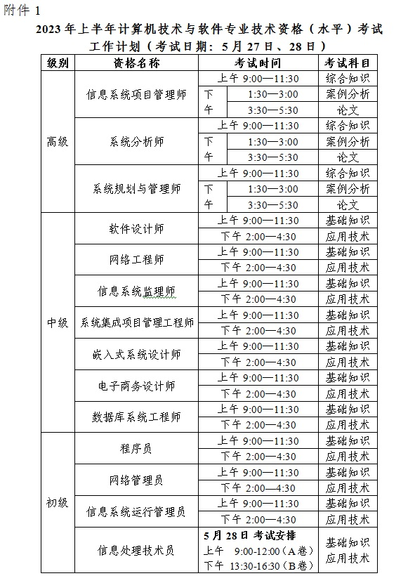
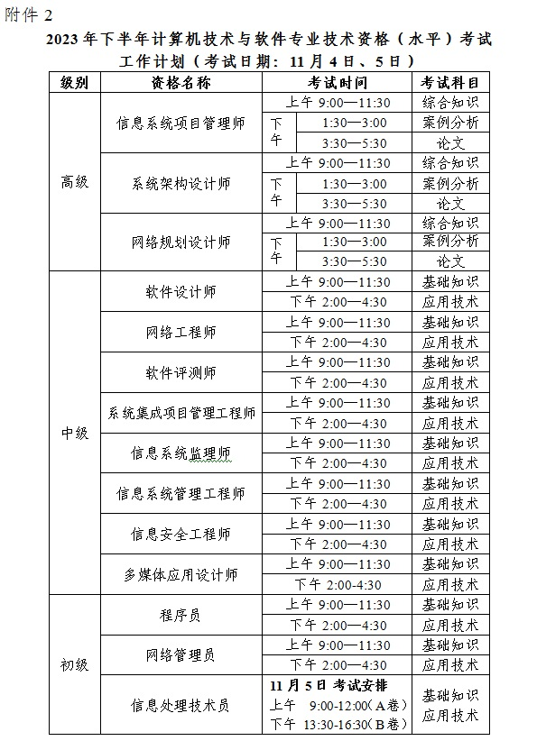

# 职称资格 职务聘任

《关于实行专业技术职务聘任制度的规定》
https://www.gov.cn/zhengce/202203/content_3338049.htm

# 全国计算机技术与软件专业资格（水平）考试

软考

官网： https://www.ruankao.org.cn/

# 考试时间

https://www.ruankao.org.cn/article/content/100002230207144833542290

## 数据库

实体

联系类型: 1:n, 1: 1

关系模式: 

函数依赖集

传递依赖

关系代数表达式

## UML图  用例图

## 设计模式

### 创建型

### 抽象工厂模式